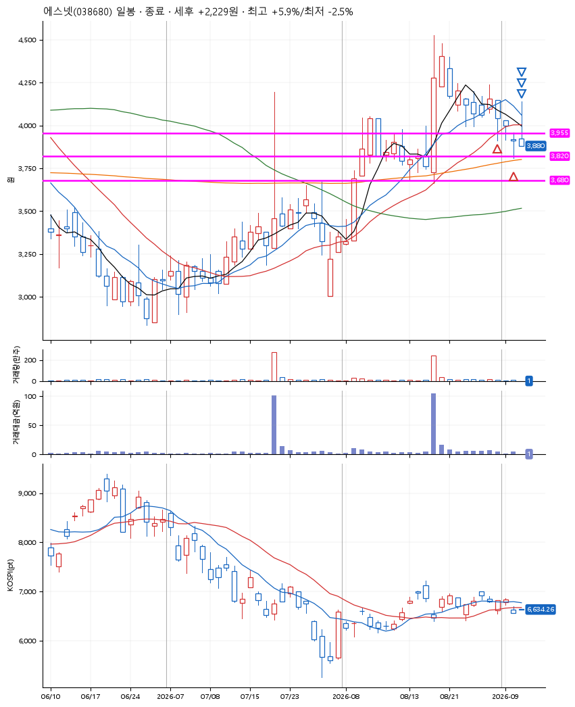
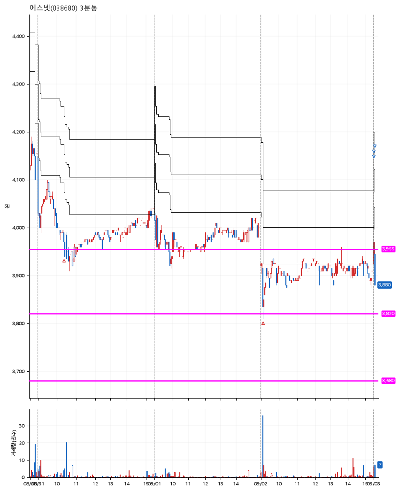

# 에스넷(038680) · 2026-09-03

**2차 매수 → 3% 익절 → 5% 익절 → 본절 이탈**

진입 2026-08-31 10:22 (D+8) · 청산 2026-09-03 09:05 (D+11) · 보유 4일차

| | |
|---|---|
| 결과 | 익절 |
| 평단 / 수량 | 3,908원 · 70주 |
| 투입 | 273,580원 |
| 세후 손익 | +2,189원 (+0.80%) |
| 최고 / 최저 | +5.9% / -2.5% |
| 당일 등락 | +0.38% |
| 보유기간 | 4일차 |

## 3선

| | |
|---|---|
| 1선 | 3,955원 |
| 2선 | 3,820원 |
| 3선 | 3,680원 |

기준봉 2026-08-19 (D+11)

`#KOSPI하락횡보장` `#시장을이기는종목`

## 차트

**일봉**

**3분봉**

## 체결

| 시각 | 구분 | 수량 | 판정가 | 체결가 | 오차 |
|---|---|---|---|---|---|
| 10:22 | 매수 | 34주 | 3,955 | 3,970 | +0.38% |
| 09:07 | 매수 | 36주 | 3,820 | 3,850 | +0.79% |
| 09:01 | 매도 | 28주 | 4,035 | 3,954 | -2.01% |
| 09:01 | 매도 | 35주 | 4,135 | 3,958 | -4.28% |
| 09:05 | 매도 | 7주 | 3,900 | 3,880 | -0.51% |

## 잘한 점

보수적인 3선

## 아쉬운 점

기준봉 이후 첫번째 자리가 아님. 너무 보수적으로 잡은 기준인듯.
