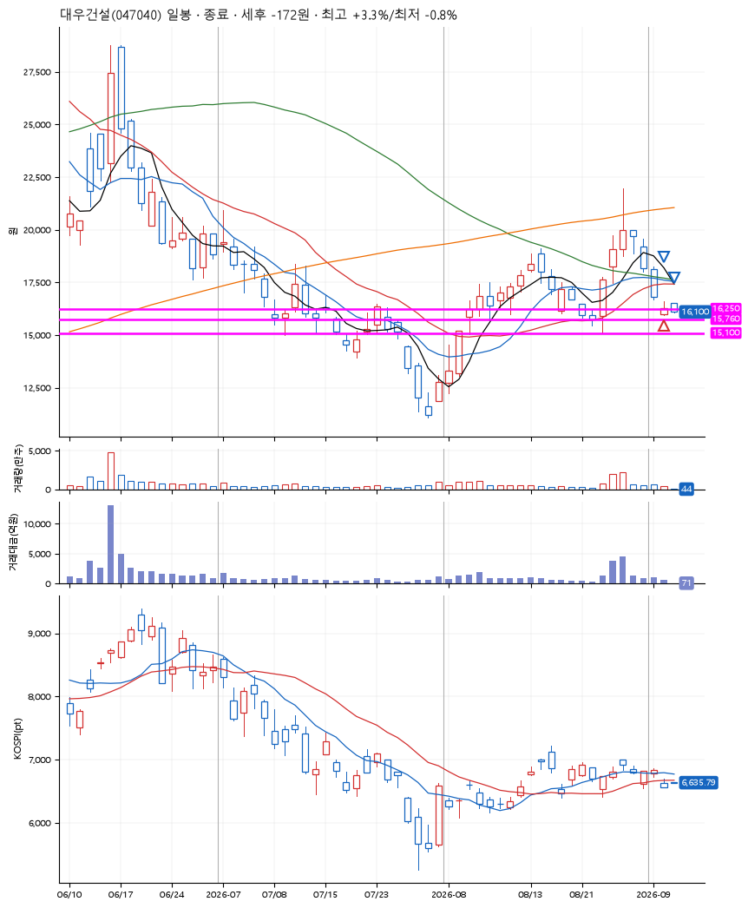
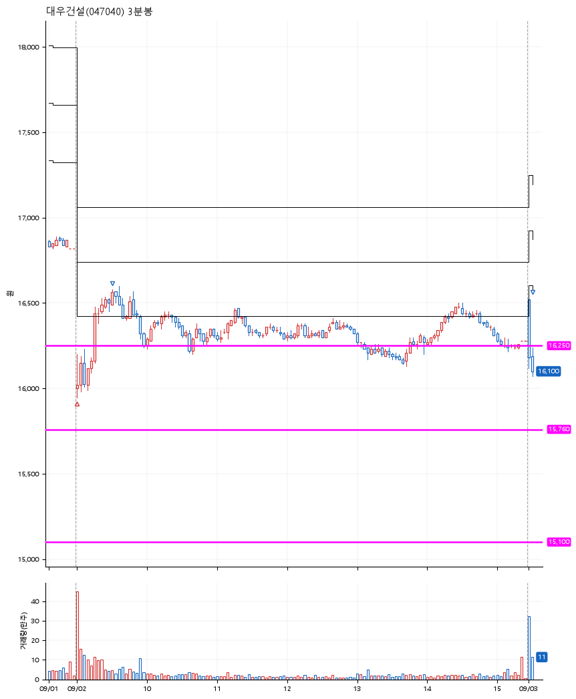

# 대우건설(047040) · 2026-09-03

**1차 매수 → 3% 익절 → 본절 이탈**

진입 2026-09-02 09:00 (D+5) · 청산 2026-09-03 09:04 (D+6) · 보유 2일차

| | |
|---|---|
| 결과 | 익절 |
| 평단 / 수량 | 16,070원 · 8주 |
| 투입 | 128,560원 |
| 세후 손익 | +1,113원 (+0.87%) |
| 최고 / 최저 | +3.3% / -0.8% |
| 당일 등락 | +1.39% |
| 보유기간 | 2일차 |

## 3선

| | |
|---|---|
| 1선 | 16,250원 |
| 2선 | 15,760원 |
| 3선 | 15,100원 |

기준봉 2026-08-26 (D+6)

`#KOSPI하락횡보장` `#시장을이기는종목` `#테마주`

> 재건

## 차트

**일봉**

**3분봉**

## 체결

| 시각 | 구분 | 수량 | 판정가 | 체결가 | 오차 |
|---|---|---|---|---|---|
| 09:00 | 매수 | 8주 | 16,000 | 16,070 | +0.44% |
| 09:31 | 매도 | 3주 | 16,560 | 16,540 | -0.12% |
| 09:04 | 매도 | 5주 | 16,070 | 16,070 | +0.00% |

## 잘한 점

보수적인 3선

## 아쉬운 점

.
