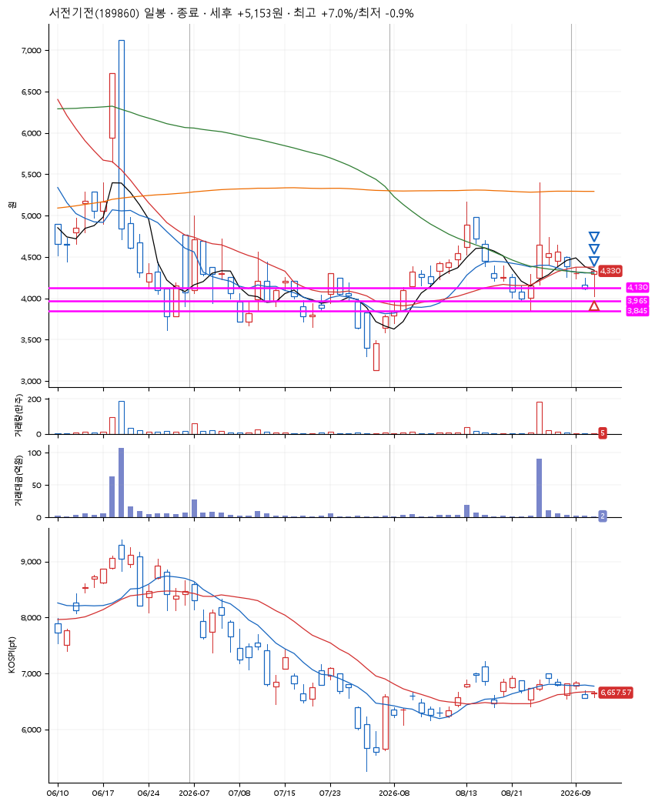
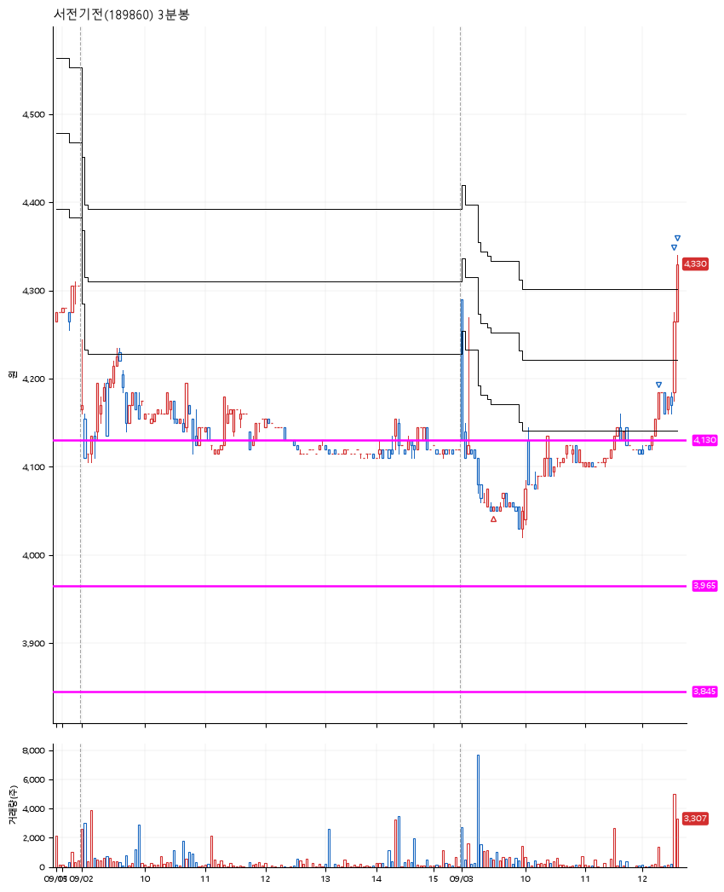

# 서전기전(189860) · 2026-09-03

**1차 매수 → 3% 익절 → 5% 익절 → 7% 익절**

진입 2026-09-03 09:31 (D+6) · 청산 2026-09-03 12:39 (D+6) · 보유 3시간 8분

| | |
|---|---|
| 결과 | 익절 |
| 평단 / 수량 | 4,055원 · 33주 |
| 투입 | 133,815원 |
| 세후 손익 | +5,153원 (+3.85%) |
| 최고 / 최저 | +7.0% / -0.9% |
| 당일 등락 | -3.03% |
| 보유기간 | 3시간 8분 |

## 3선

| | |
|---|---|
| 1선 | 4,130원 |
| 2선 | 3,965원 |
| 3선 | 3,845원 |

기준봉 2026-08-26 (D+6)

`#KOSPI하락횡보장` `#시장을이기는종목` `#테마주`

> 원자력발전

## 차트

**일봉**

**3분봉**

## 체결

| 시각 | 구분 | 수량 | 판정가 | 체결가 | 오차 |
|---|---|---|---|---|---|
| 09:31 | 매수 | 33주 | 4,055 | 4,055 | +0.00% |
| 12:19 | 매도 | 13주 | 4,185 | 4,185 | +0.00% |
| 12:38 | 매도 | 16주 | 4,265 | 4,235 | -0.70% |
| 12:39 | 매도 | 4주 | 4,340 | 4,280 | -1.38% |

## 잘한 점

박스라하기 애매하긴 하지만 이전의 박스들에서 지지를 받은 듯

## 아쉬운 점

.
