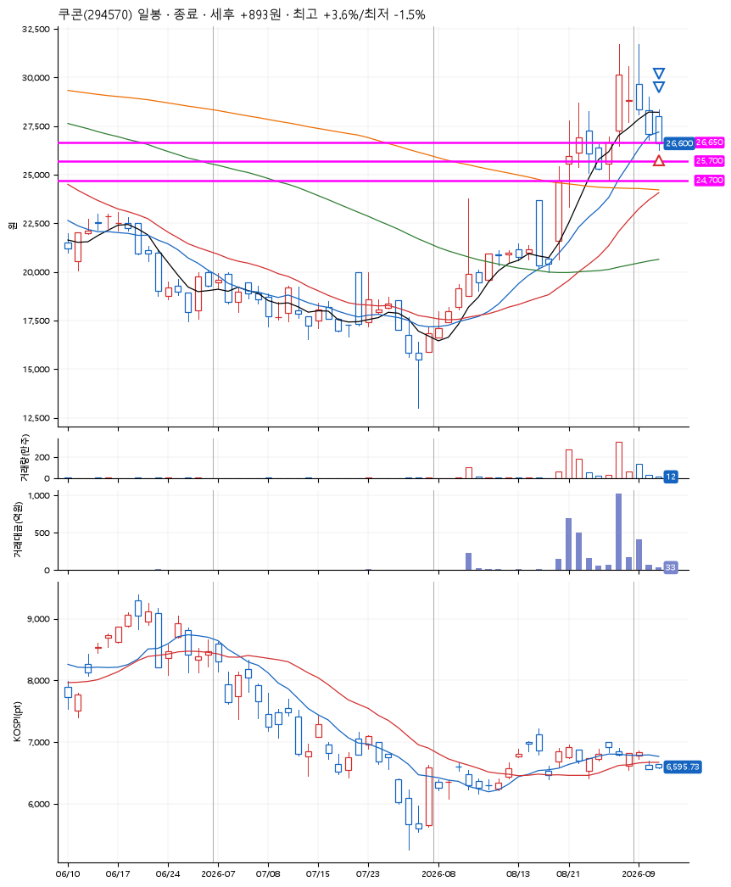
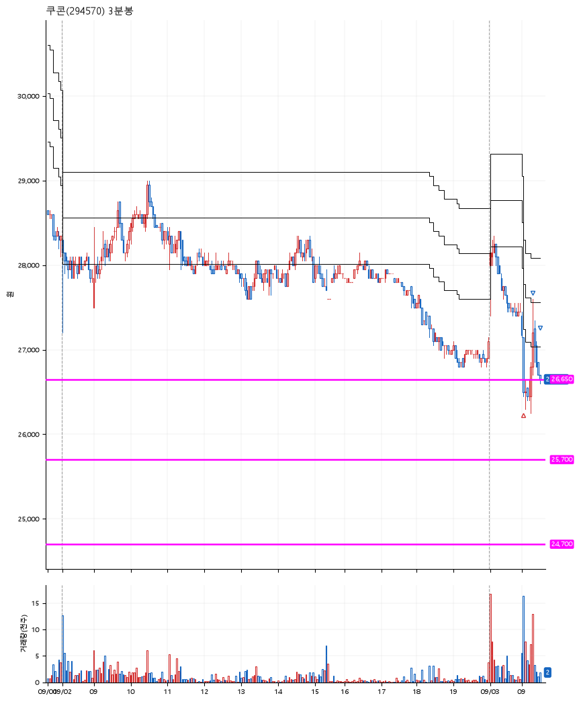

# 쿠콘(294570) · 2026-09-03

**1차 매수 → 3% 익절 → 본절 이탈**

진입 2026-09-03 09:05 (D+4) · 청산 2026-09-03 09:30 (D+4) · 보유 25분

| | |
|---|---|
| 결과 | 익절 |
| 평단 / 수량 | 26,640원 · 5주 |
| 투입 | 133,200원 |
| 세후 손익 | +893원 (+0.67%) |
| 최고 / 최저 | +3.6% / -1.5% |
| 당일 등락 | -2.37% |
| 보유기간 | 25분 |

## 3선

| | |
|---|---|
| 1선 | 26,650원 |
| 2선 | 25,700원 |
| 3선 | 24,700원 |

기준봉 2026-08-28 (D+4)

`#KOSPI하락횡보장` `#시장을이기는종목` `#테마주`

> 스테이블코인 전자화폐

## 차트

**일봉**

**3분봉**

## 체결

| 시각 | 구분 | 수량 | 판정가 | 체결가 | 오차 |
|---|---|---|---|---|---|
| 09:05 | 매수 | 5주 | 26,600 | 26,640 | +0.15% |
| 09:18 | 매도 | 2주 | 27,450 | 27,300 | -0.55% |
| 09:30 | 매도 | 3주 | 26,600 | 26,600 | +0.00% |

## 잘한 점

단기매매의 정석같은 느낌

## 아쉬운 점

.
