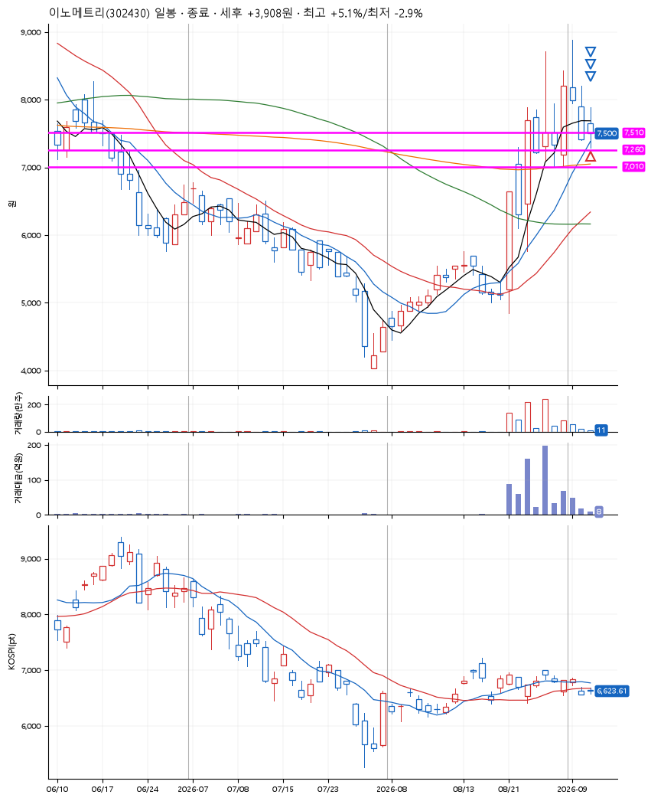
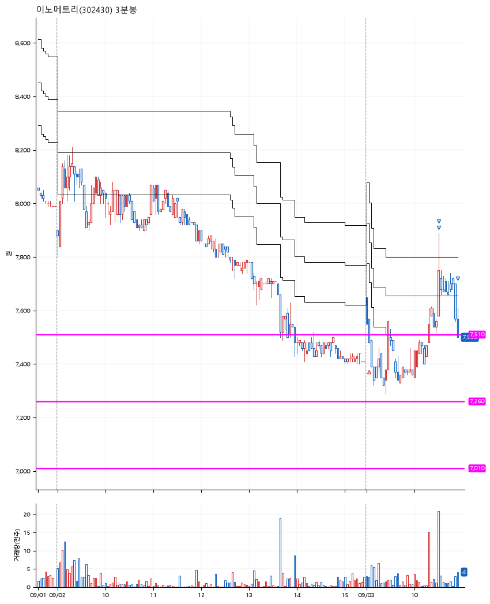

# 이노메트리(302430) · 2026-09-03

**1차 매수 → 3% 익절 → 5% 익절 → 본절 이탈**

진입 2026-09-03 09:04 (D+3) · 청산 2026-09-03 10:56 (D+3) · 보유 1시간 51분

| | |
|---|---|
| 결과 | 익절 |
| 평단 / 수량 | 7,510원 · 18주 |
| 투입 | 135,180원 |
| 세후 손익 | +3,908원 (+2.89%) |
| 최고 / 최저 | +5.1% / -2.9% |
| 당일 등락 | -5.75% |
| 보유기간 | 1시간 51분 |

## 3선

| | |
|---|---|
| 1선 | 7,510원 |
| 2선 | 7,260원 |
| 3선 | 7,010원 |

기준봉 2026-08-31 (D+3)

`#KOSPI하락횡보장` `#시장을이기는종목` `#테마주`

> 배터리 2차전지

## 차트

**일봉**

**3분봉**

## 체결

| 시각 | 구분 | 수량 | 판정가 | 체결가 | 오차 |
|---|---|---|---|---|---|
| 09:04 | 매수 | 18주 | 7,510 | 7,510 | +0.00% |
| 10:30 | 매도 | 7주 | 7,740 | 7,700 | -0.52% |
| 10:30 | 매도 | 9주 | 7,890 | 7,834 | -0.71% |
| 10:56 | 매도 | 2주 | 7,510 | 7,500 | -0.13% |

## 잘한 점

안정적인 3선

## 아쉬운 점

.
