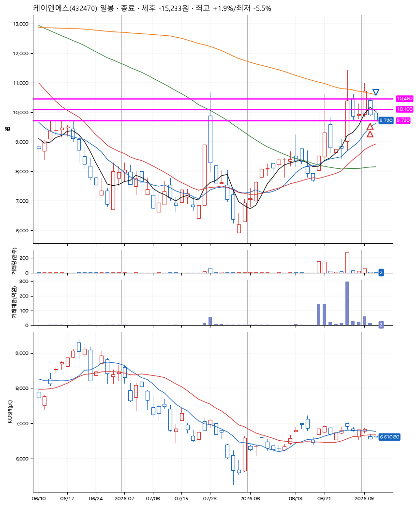
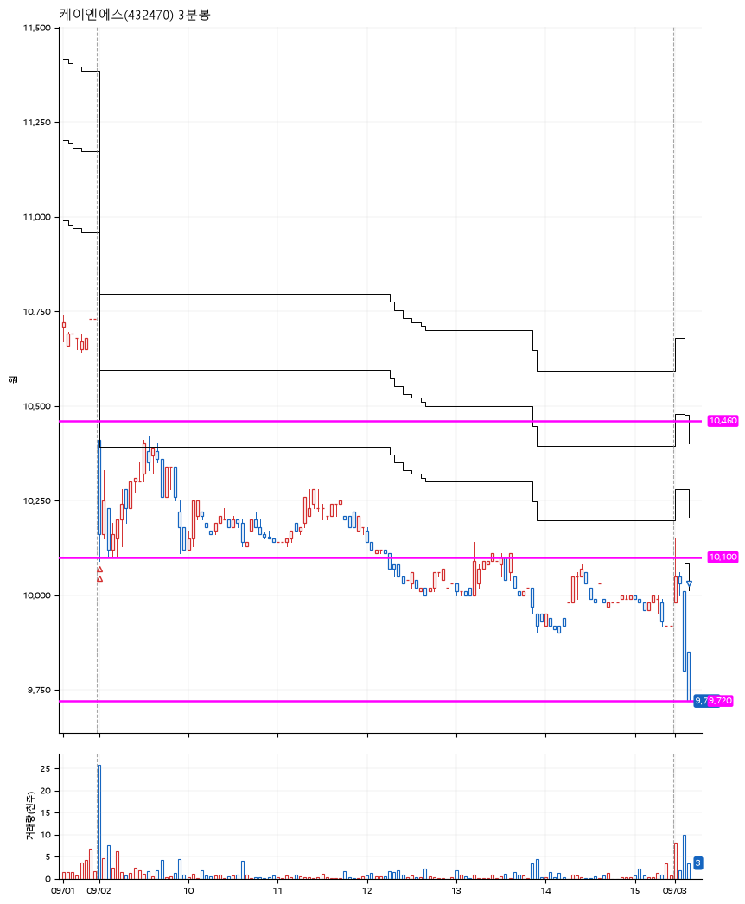

# 케이엔에스(432470) · 2026-09-03

**2차 매수 → 손절**

진입 2026-09-02 09:00 (D+1) · 청산 2026-09-03 09:10 (D+2) · 보유 2일차

| | |
|---|---|
| 결과 | 손절 |
| 평단 / 수량 | 10,285원 · 26주 |
| 투입 | 267,410원 |
| 세후 손익 | -15,272원 (-5.71%) |
| 최고 / 최저 | +1.9% / -5.5% |
| 당일 등락 | +0.00% |
| 보유기간 | 2일차 |

## 3선

| | |
|---|---|
| 1선 | 10,460원 |
| 2선 | 10,100원 |
| 3선 | 9,720원 |

기준봉 2026-09-01 (D+2)

`#KOSPI하락횡보장` `#시장을이기는종목`

> 바이오 2차전지

## 차트

**일봉**

**3분봉**

## 체결

| 시각 | 구분 | 수량 | 판정가 | 체결가 | 오차 |
|---|---|---|---|---|---|
| 09:00 | 매수 | 13주 | 10,410 | 10,410 | +0.00% |
| 09:02 | 매수 | 13주 | 10,100 | 10,160 | +0.59% |
| 09:10 | 매도 | 26주 | 9,720 | 9,720 | +0.00% |

## 잘한 점

.

## 아쉬운 점

너무 공격적으로 잡은 3선. 이격의 법칙 생각 필요
