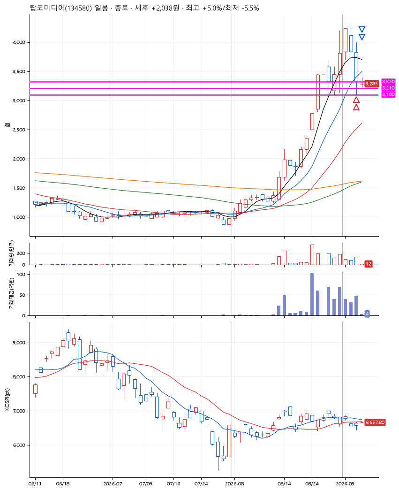
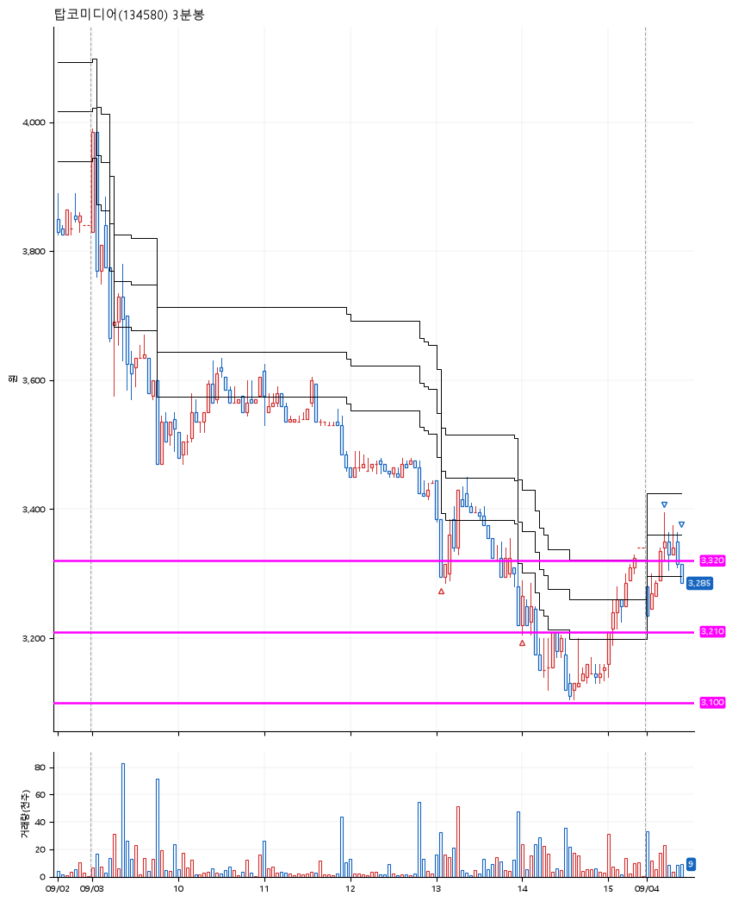

# 탑코미디어(134580) · 2026-09-04

**2차 매수 → 3% 익절 → 본절 이탈**

진입 2026-09-03 13:03 (D+2) · 청산 2026-09-04 09:26 (D+3) · 보유 2일차

| | |
|---|---|
| 결과 | 익절 |
| 평단 / 수량 | 3,287원 · 83주 |
| 투입 | 272,790원 |
| 세후 손익 | +2,038원 (+0.75%) |
| 최고 / 최저 | +5.0% / -5.5% |
| 당일 등락 | +8.54% |
| 보유기간 | 2일차 |

## 3선

| | |
|---|---|
| 1선 | 3,320원 |
| 2선 | 3,210원 |
| 3선 | 3,100원 |

기준봉 2026-09-01 (D+3)

`#KOSPI하락횡보장` `#시장을이기는종목`

> 탑툰챗

## 차트

**일봉**

**3분봉**

## 체결

| 시각 | 구분 | 수량 | 판정가 | 체결가 | 오차 |
|---|---|---|---|---|---|
| 13:03 | 매수 | 41주 | 3,320 | 3,360 | +1.20% |
| 14:00 | 매수 | 42주 | 3,210 | 3,215 | +0.16% |
| 09:13 | 매도 | 33주 | 3,390 | 3,370 | -0.59% |
| 09:26 | 매도 | 50주 | 3,285 | 3,285 | +0.00% |

## 잘한 점

급등 이후에 아주 살짝 생긴 박스를 잘 찾음

## 아쉬운 점

운이 좋게도 1틱 차이로 간신히 손절을 면했다. 그렇다고해도 난 이 이상으로 손절을 길게 잡진 못할듯..
