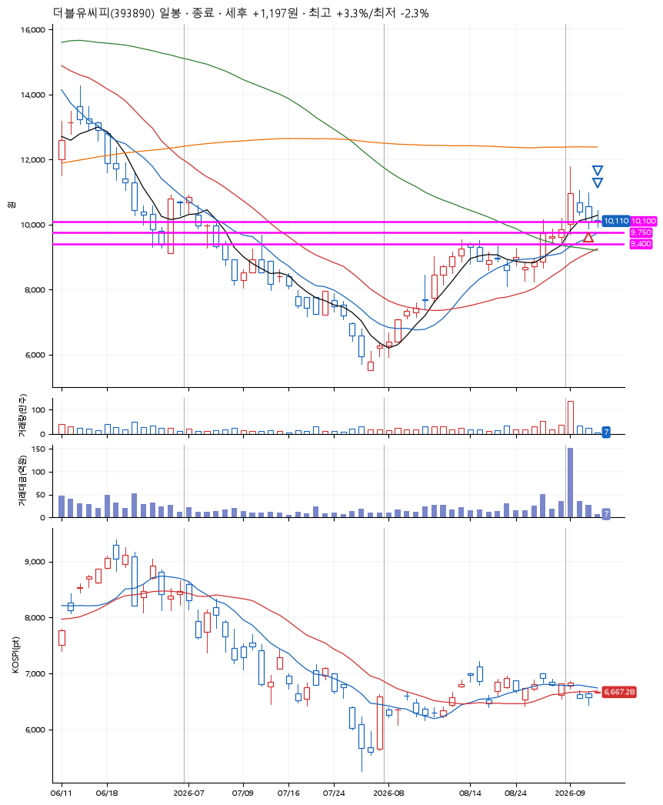
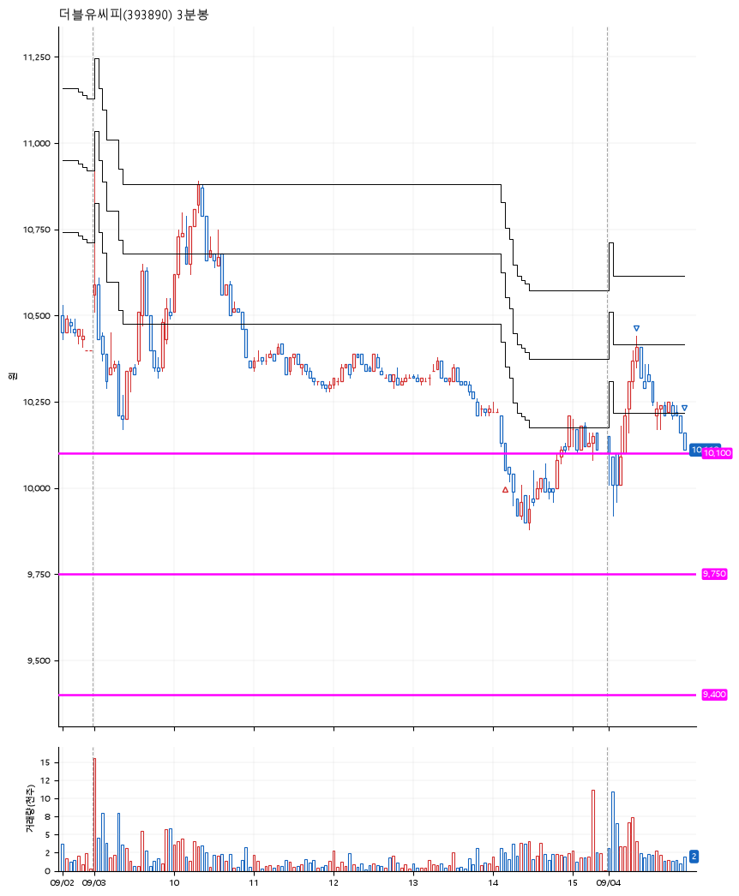

# 더블유씨피(393890) · 2026-09-04

**1차 매수 → 3% 익절 → 본절 이탈**

진입 2026-09-03 14:10 (D+2) · 청산 2026-09-04 09:58 (D+3) · 보유 2일차

| | |
|---|---|
| 결과 | 익절 |
| 평단 / 수량 | 10,110원 · 13주 |
| 투입 | 131,430원 |
| 세후 손익 | +1,197원 (+0.91%) |
| 최고 / 최저 | +3.3% / -2.3% |
| 당일 등락 | -0.79% |
| 보유기간 | 2일차 |

## 3선

| | |
|---|---|
| 1선 | 10,100원 |
| 2선 | 9,750원 |
| 3선 | 9,400원 |

기준봉 2026-09-01 (D+3)

`#KOSPI하락횡보장` `#시장을이기는종목` `#테마주`

> 2차전지 ESS

## 차트

**일봉**

**3분봉**

## 체결

| 시각 | 구분 | 수량 | 판정가 | 체결가 | 오차 |
|---|---|---|---|---|---|
| 14:10 | 매수 | 13주 | 10,100 | 10,110 | +0.10% |
| 09:22 | 매도 | 5주 | 10,420 | 10,410 | -0.10% |
| 09:58 | 매도 | 8주 | 10,110 | 10,110 | +0.00% |

## 잘한 점

안정적인 3선이 아닌 약간 공격적이고 애매했던 3선. 그래도 기준봉 이후 첫 자리 반등이라 나쁘지 않았던 자리였던 듯.

## 아쉬운 점

.
