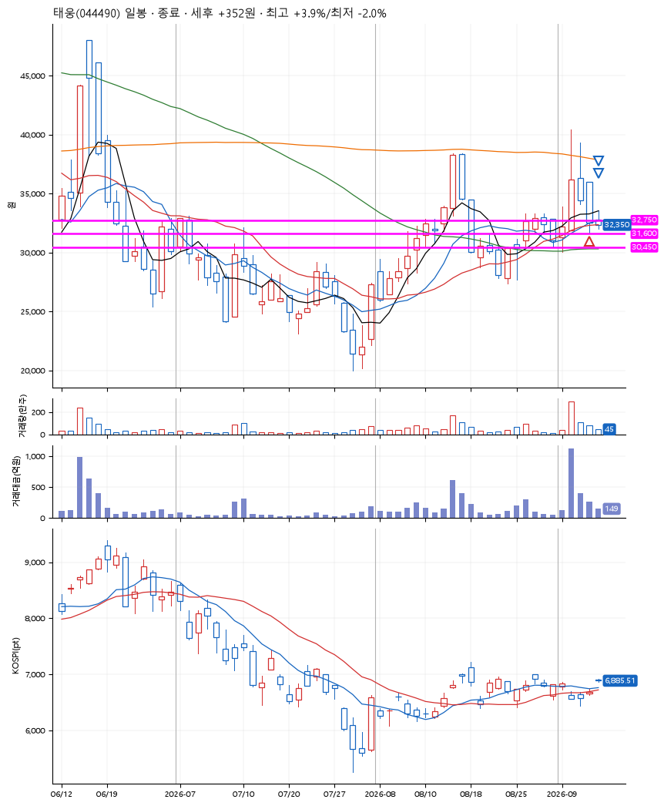
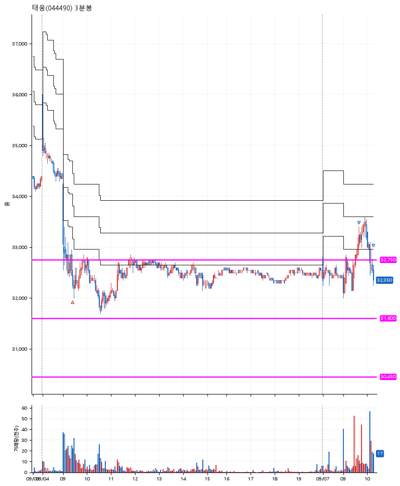

# 태웅(044490) · 2026-09-07

**1차 매수 → 3% 익절 → 본절 이탈**

진입 2026-09-04 09:26 (D+2) · 청산 2026-09-07 10:16 (D+3) · 보유 2일차

| | |
|---|---|
| 결과 | 익절 |
| 평단 / 수량 | 32,350원 · 4주 |
| 투입 | 129,400원 |
| 세후 손익 | +352원 (+0.27%) |
| 최고 / 최저 | +3.9% / -2.0% |
| 당일 등락 | +1.23% |
| 보유기간 | 4일차 |

## 3선

| | |
|---|---|
| 1선 | 32,750원 |
| 2선 | 31,600원 |
| 3선 | 30,450원 |

기준봉 2026-09-02 (D+3)

`#KOSPI하락횡보장` `#시장을이기는종목`

## 차트

**일봉**

**3분봉**

## 체결

| 시각 | 구분 | 수량 | 판정가 | 체결가 | 오차 |
|---|---|---|---|---|---|
| 09:26 | 매수 | 4주 | 32,350 | 32,350 | +0.00% |
| 09:40 | 매도 | 1주 | 33,350 | 33,300 | -0.15% |
| 10:16 | 매도 | 3주 | 32,350 | 32,250 | -0.31% |

## 잘한 점

기준봉이 만들어지기 직전 박스를 찾아 합리적인 3선 선택을 함

## 아쉬운 점

슬리피지 문제가 커서 익절을 했어도 수익금액은 굉장히 적음.
