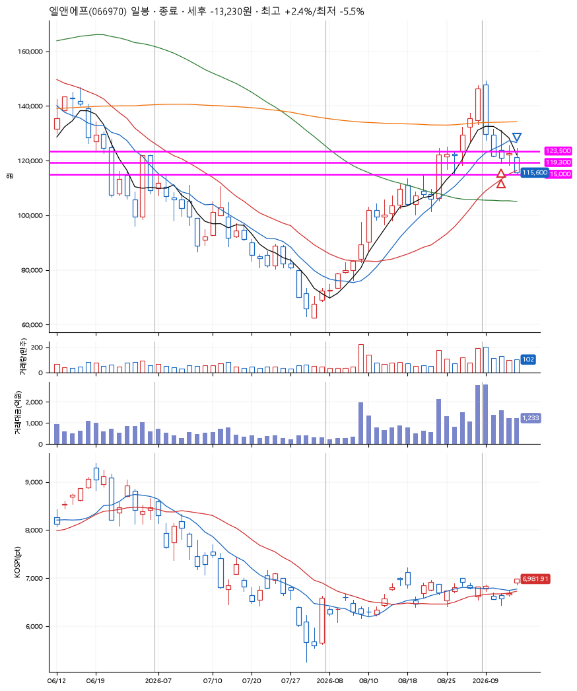
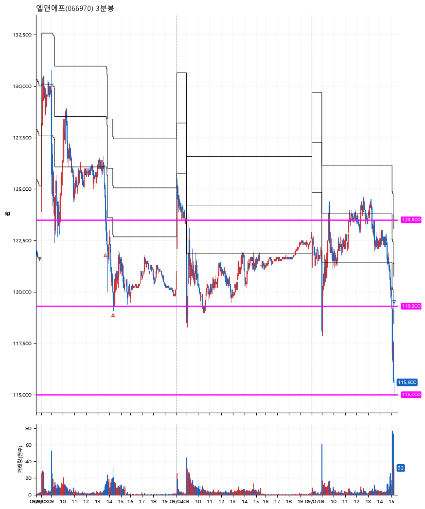

# 엘앤에프(066970) · 2026-09-07

**2차 매수 → 손절**

진입 2026-09-03 13:41 (D+3) · 청산 2026-09-07 15:12 (D+5) · 보유 3일차

| | |
|---|---|
| 결과 | 손절 |
| 평단 / 수량 | 121,650원 · 2주 |
| 투입 | 243,300원 |
| 세후 손익 | -13,230원 (-5.44%) |
| 최고 / 최저 | +2.4% / -5.5% |
| 당일 등락 | -5.99% |
| 보유기간 | 5일차 |

## 3선

| | |
|---|---|
| 1선 | 123,500원 |
| 2선 | 119,300원 |
| 3선 | 115,000원 |

기준봉 2026-08-31 (D+5)

`#KOSPI하락횡보장` `#시장을이기는종목` `#테마주`

> 2차전지

## 차트

**일봉**

**3분봉**

## 체결

| 시각 | 구분 | 수량 | 판정가 | 체결가 | 오차 |
|---|---|---|---|---|---|
| 13:41 | 매수 | 1주 | 123,500 | 123,800 | +0.24% |
| 14:19 | 매수 | 1주 | 119,300 | 119,500 | +0.17% |
| 15:12 | 매도 | 2주 | 115,000 | 115,300 | +0.26% |

## 잘한 점

_(미작성)_

## 아쉬운 점

_(미작성)_
