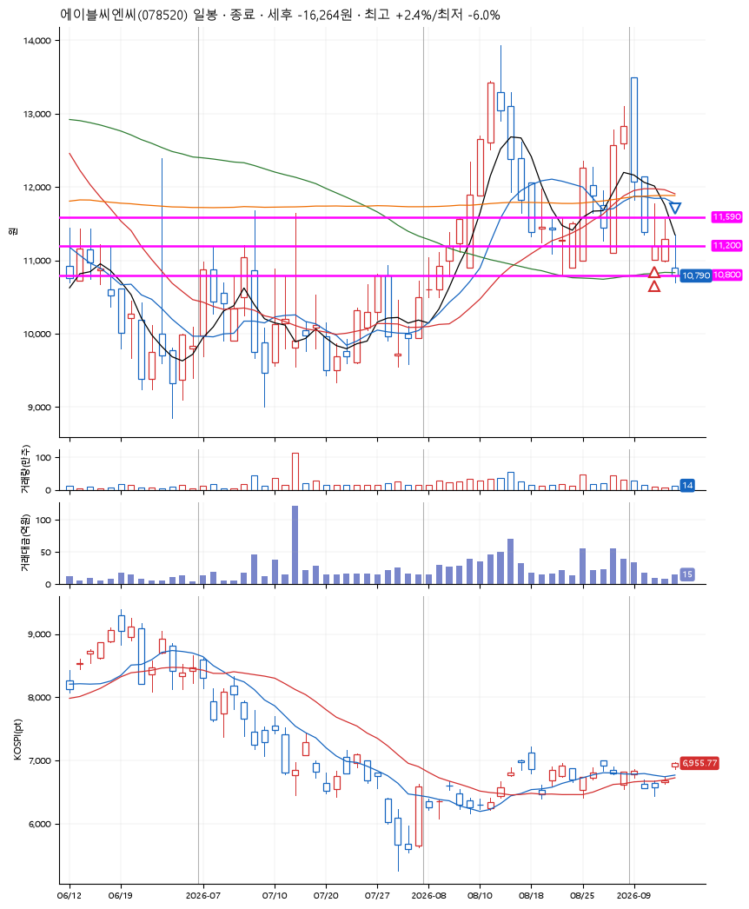
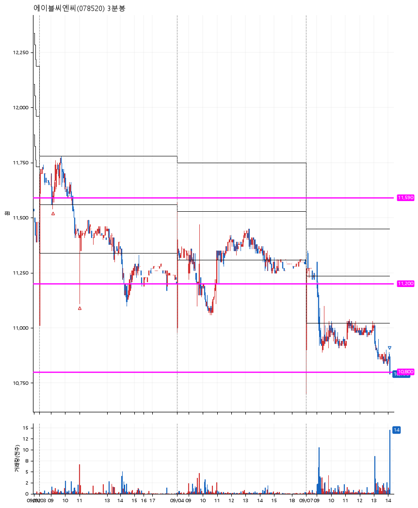

# 에이블씨엔씨(078520) · 2026-09-07

**2차 매수 → 손절**

진입 2026-09-03 09:10 (D+4) · 청산 2026-09-07 14:06 (D+6) · 보유 3일차

| | |
|---|---|
| 결과 | 손절 |
| 평단 / 수량 | 11,492원 · 23주 |
| 투입 | 264,321원 |
| 세후 손익 | -16,264원 (-6.15%) |
| 최고 / 최저 | +2.4% / -6.0% |
| 당일 등락 | -3.81% |
| 보유기간 | 5일차 |

## 3선

| | |
|---|---|
| 1선 | 11,590원 |
| 2선 | 11,200원 |
| 3선 | 10,800원 |

기준봉 2026-08-28 (D+6)

`#KOSPI하락횡보장` `#시장을이기는종목` `#테마주`

> 화장품

## 차트

**일봉**

**3분봉**

## 체결

| 시각 | 구분 | 수량 | 판정가 | 체결가 | 오차 |
|---|---|---|---|---|---|
| 09:10 | 매수 | 11주 | 11,580 | 11,595 | +0.13% |
| 11:00 | 매수 | 12주 | 11,200 | 11,398 | +1.77% |
| 14:06 | 매도 | 23주 | 10,800 | 10,810 | +0.09% |

## 잘한 점

_(미작성)_

## 아쉬운 점

_(미작성)_
