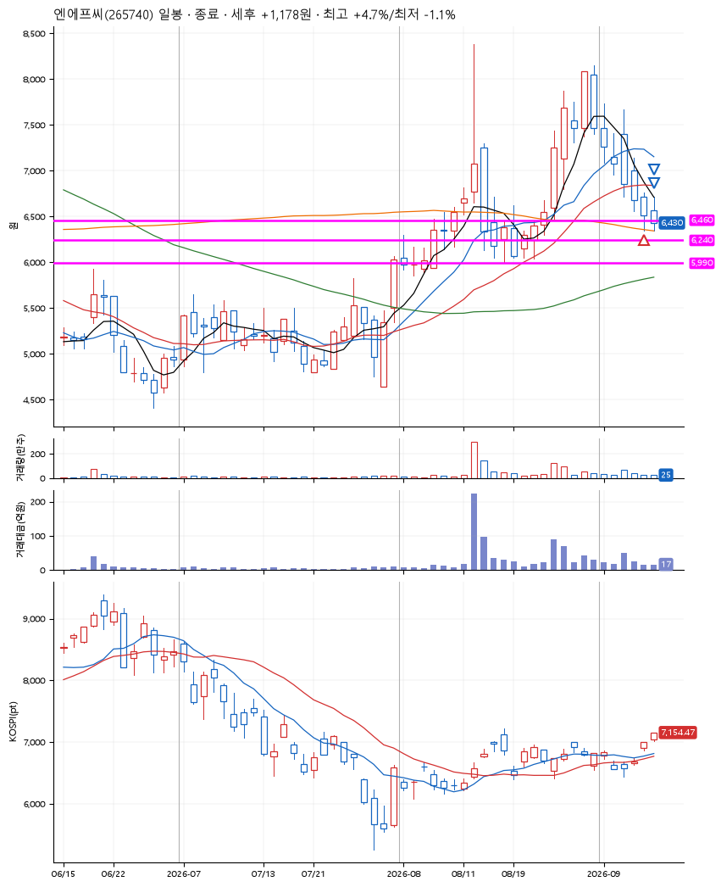
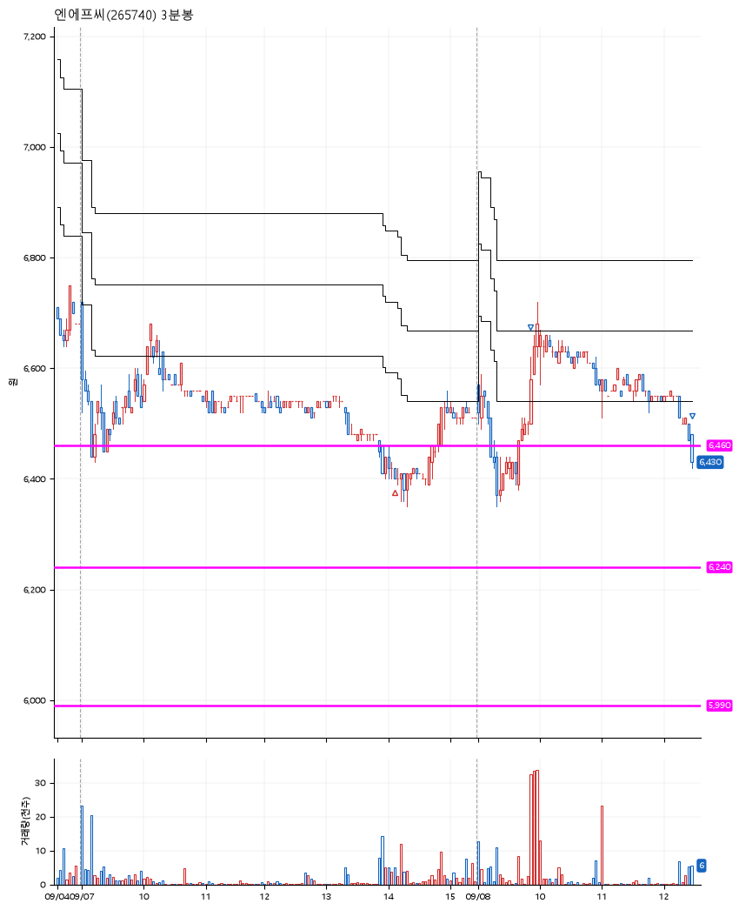

# 엔에프씨(265740) · 2026-09-08

**1차 매수 → 3% 익절 → 본절 이탈**

진입 2026-09-07 14:06 (D+9) · 청산 2026-09-08 12:28 (D+10) · 보유 2일차

| | |
|---|---|
| 결과 | 익절 |
| 평단 / 수량 | 6,420원 · 21주 |
| 투입 | 134,820원 |
| 세후 손익 | +1,178원 (+0.87%) |
| 최고 / 최저 | +4.7% / -1.1% |
| 당일 등락 | +4.87% |
| 보유기간 | 2일차 |

## 3선

| | |
|---|---|
| 1선 | 6,460원 |
| 2선 | 6,240원 |
| 3선 | 5,990원 |

기준봉 2026-08-25 (D+10)

`#KOSPI하락횡보장` `#시장을이기는종목`

## 차트

**일봉**

**3분봉**

## 체결

| 시각 | 구분 | 수량 | 판정가 | 체결가 | 오차 |
|---|---|---|---|---|---|
| 14:06 | 매수 | 21주 | 6,420 | 6,420 | +0.00% |
| 09:52 | 매도 | 8주 | 6,620 | 6,590 | -0.45% |
| 12:28 | 매도 | 13주 | 6,420 | 6,430 | +0.16% |

## 잘한 점

보수적으로 접근한 3선. 물론 기준봉 직후에 조금 공격적으로 할 수도 있었지만, 나에게 맞는 성향은 이런 약간은 보수적인 듯.

## 아쉬운 점

.
