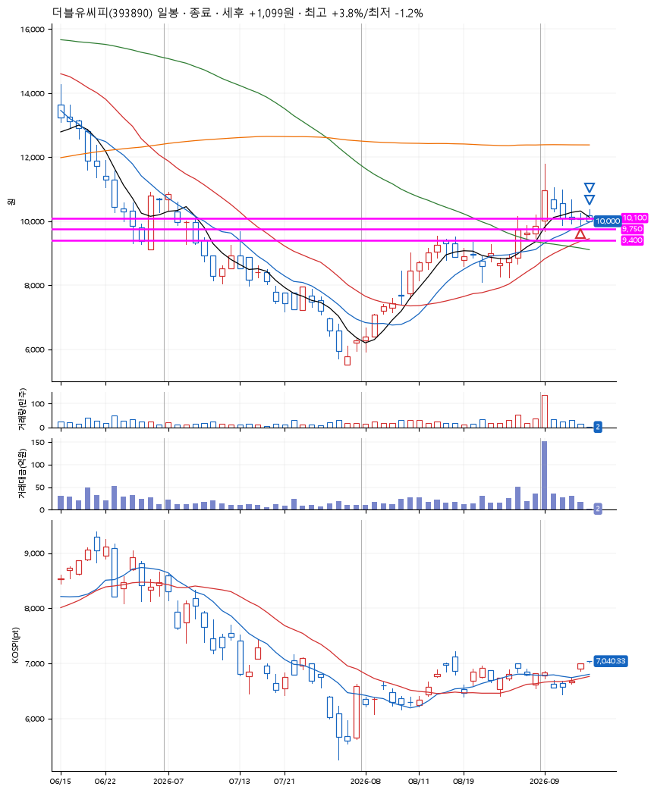
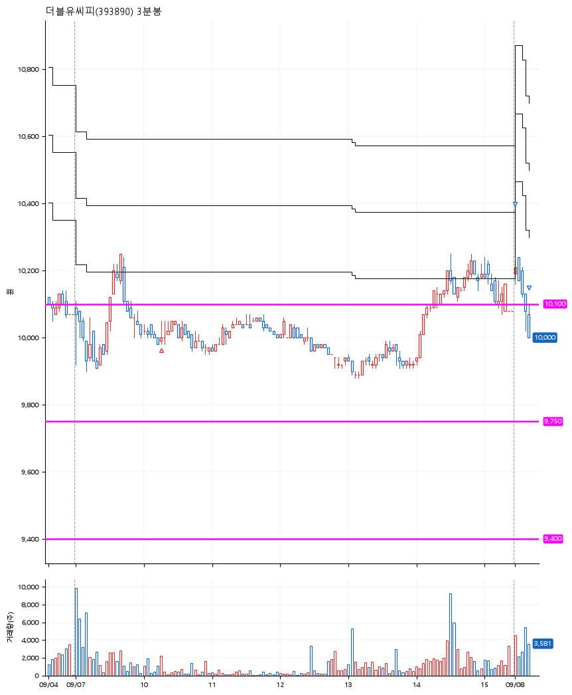

# 더블유씨피(393890) · 2026-09-08

**1차 매수 → 3% 익절 → 본절 이탈**

진입 2026-09-07 10:16 (D+4) · 청산 2026-09-08 09:13 (D+5) · 보유 2일차

| | |
|---|---|
| 결과 | 익절 |
| 평단 / 수량 | 10,000원 · 13주 |
| 투입 | 130,000원 |
| 세후 손익 | +1,099원 (+0.85%) |
| 최고 / 최저 | +3.8% / -1.2% |
| 당일 등락 | -8.73% |
| 보유기간 | 2일차 |

## 3선

| | |
|---|---|
| 1선 | 10,100원 |
| 2선 | 9,750원 |
| 3선 | 9,400원 |

기준봉 2026-09-01 (D+5)

`#KOSPI하락횡보장` `#시장을이기는종목` `#테마주`

> 2차전지 ESS

## 차트

**일봉**

**3분봉**

## 체결

| 시각 | 구분 | 수량 | 판정가 | 체결가 | 오차 |
|---|---|---|---|---|---|
| 10:16 | 매수 | 13주 | 10,000 | 10,000 | +0.00% |
| 09:00 | 매도 | 5주 | 10,300 | 10,280 | -0.19% |
| 09:13 | 매도 | 8주 | 10,000 | 10,000 | +0.00% |

## 잘한 점

부담스러운 자리였지만 잘 빠져나왔다

## 아쉬운 점

조금은 공격적이었고 확실하게 박스가 생긴건 아닌 것 같은 자리
