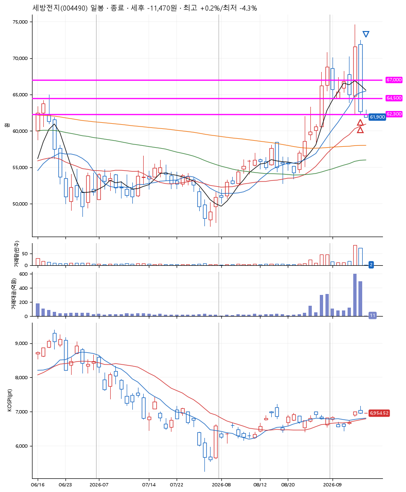
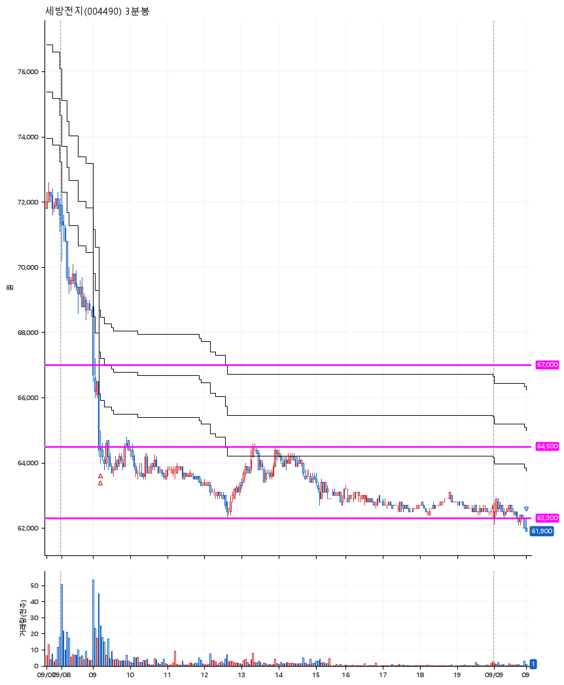

# 세방전지(004490) · 2026-09-09

**2차 매수 → 손절**

진입 2026-09-08 09:13 (D+1) · 청산 2026-09-09 09:00 (D+2) · 보유 2일차

| | |
|---|---|
| 결과 | 손절 |
| 평단 / 수량 | 64,650원 · 4주 |
| 투입 | 258,600원 |
| 세후 손익 | -11,470원 (-4.44%) |
| 최고 / 최저 | +0.2% / -4.3% |
| 당일 등락 | +3.87% |
| 보유기간 | 2일차 |

## 3선

| | |
|---|---|
| 1선 | 67,000원 |
| 2선 | 64,500원 |
| 3선 | 62,300원 |

기준봉 2026-09-07 (D+2)

`#KOSPI하락횡보장` `#시장을이기는종목`

## 차트

**일봉**

**3분봉**

## 체결

| 시각 | 구분 | 수량 | 판정가 | 체결가 | 오차 |
|---|---|---|---|---|---|
| 09:13 | 매수 | 2주 | 64,600 | 64,700 | +0.15% |
| 09:13 | 매수 | 2주 | 64,500 | 64,600 | +0.16% |
| 09:00 | 매도 | 4주 | 62,000 | 61,925 | -0.12% |

## 잘한 점

.

## 아쉬운 점

아직까지는 이런 공격적인 3선을 긋는데 익숙하지 않나보다. 확신을 가질 때까지 다소 보수적인 3선을 긋도록 하자.
