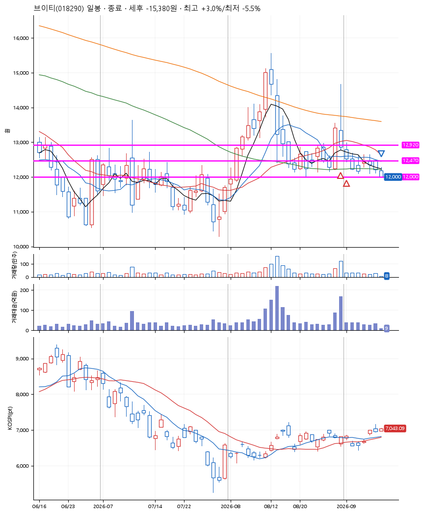
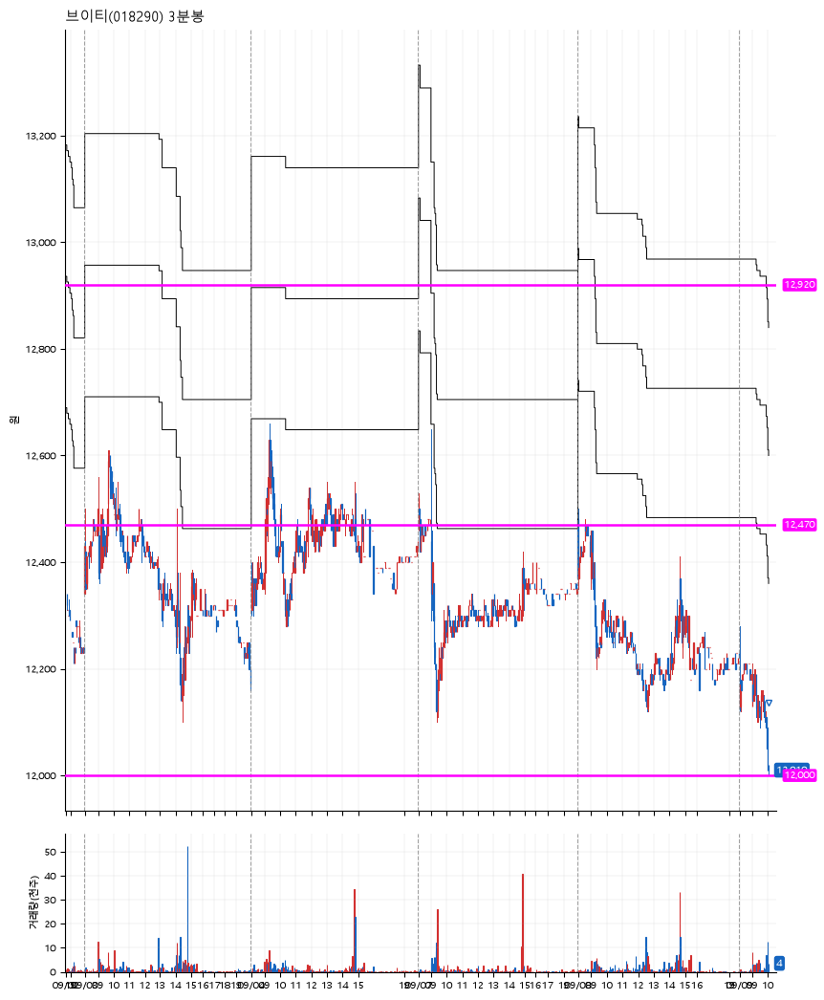

# 브이티(018290) · 2026-09-09

**2차 매수 → 손절**

진입 2026-08-31 10:01 (D+1) · 청산 2026-09-09 10:03 (D+8) · 보유 8일차

| | |
|---|---|
| 결과 | 손절 |
| 평단 / 수량 | 12,705원 · 21주 |
| 투입 | 266,800원 |
| 세후 손익 | -15,380원 (-5.76%) |
| 최고 / 최저 | +3.0% / -5.5% |
| 당일 등락 | -1.32% |
| 보유기간 | 10일차 |

## 3선

| | |
|---|---|
| 1선 | 12,920원 |
| 2선 | 12,470원 |
| 3선 | 12,000원 |

기준봉 2026-08-28 (D+8)

`#KOSPI하락횡보장` `#시장을이기는종목` `#테마주`

> 화장품

## 차트

**일봉**

**3분봉**

## 체결

| 시각 | 구분 | 수량 | 판정가 | 체결가 | 오차 |
|---|---|---|---|---|---|
| 10:01 | 매수 | 10주 | 12,920 | 12,930 | +0.08% |
| 09:54 | 매수 | 11주 | 12,470 | 12,500 | +0.24% |
| 10:03 | 매도 | 21주 | 12,000 | 12,000 | +0.00% |

## 잘한 점

없음

## 아쉬운 점

진입하고 3일째인데도 가지 않으면 저가에서 버티라고 배웠다. 진입하고 이렇게 지지부진한 적이 처음이라 머리론 알고있었지만 버텨봤다. 하지만 결과는 역시였다.
