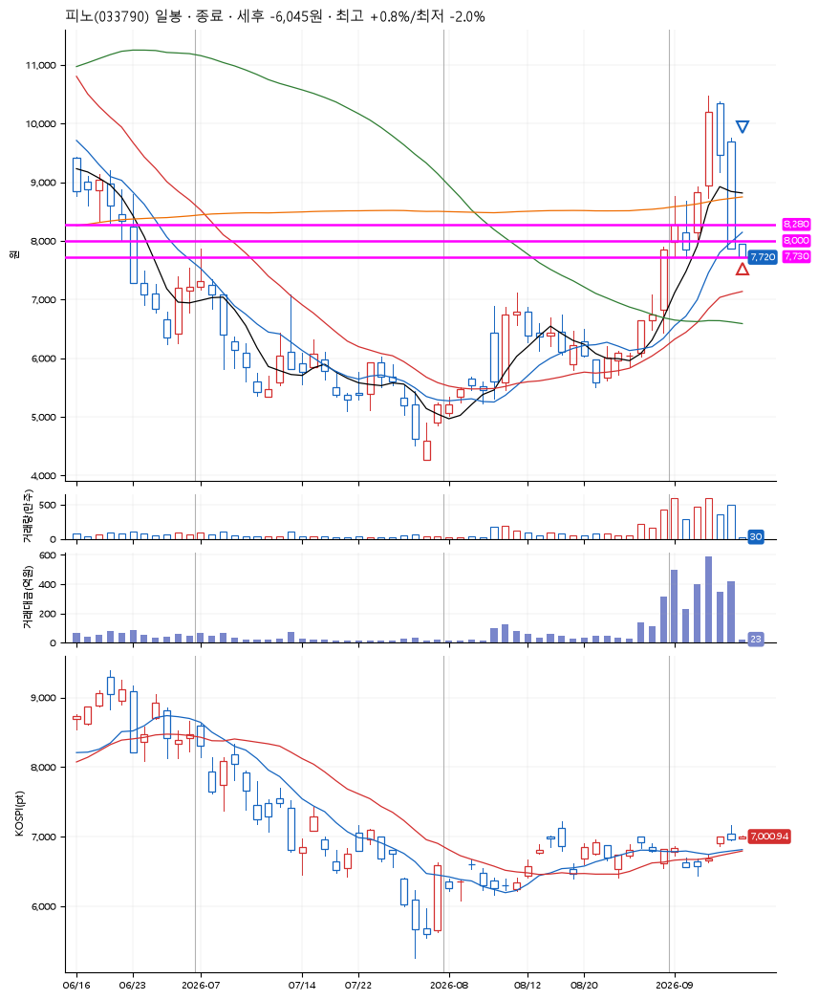
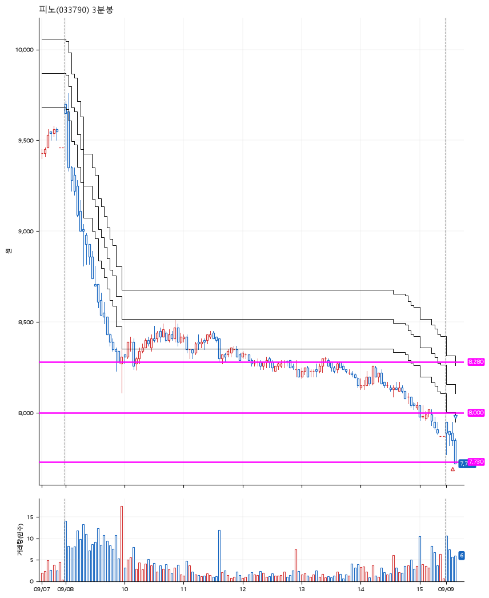

# 피노(033790) · 2026-09-09

**2차 매수 → 손절**

진입 2026-09-09 09:06 (D+3) · 청산 2026-09-09 09:10 (D+3) · 보유 3분

| | |
|---|---|
| 결과 | 손절 |
| 평단 / 수량 | 7,890원 · 34주 |
| 투입 | 268,260원 |
| 세후 손익 | -6,045원 (-2.25%) |
| 최고 / 최저 | +0.8% / -2.0% |
| 당일 등락 | +5.03% |
| 보유기간 | 3분 |

## 3선

| | |
|---|---|
| 1선 | 8,280원 |
| 2선 | 8,000원 |
| 3선 | 7,730원 |

기준봉 2026-09-04 (D+3)

`#KOSPI하락횡보장` `#시장을이기는종목` `#테마주`

> 2차전지

## 차트

**일봉**

**3분봉**

## 체결

| 시각 | 구분 | 수량 | 판정가 | 체결가 | 오차 |
|---|---|---|---|---|---|
| 09:06 | 매수 | 34주 | 7,890 | 7,890 | +0.00% |
| 09:10 | 매도 | 34주 | 7,730 | 7,730 | +0.00% |

## 잘한 점

.

## 아쉬운 점

3선을 설정할 때부터, "이게 되려나? 대표님은 이런 식으로 긋는 것 같던데.." 라는 내가 확신이 없는 자리였다. 내가 확신을 가지지 않으면 그것은 내 것이 아니다.
