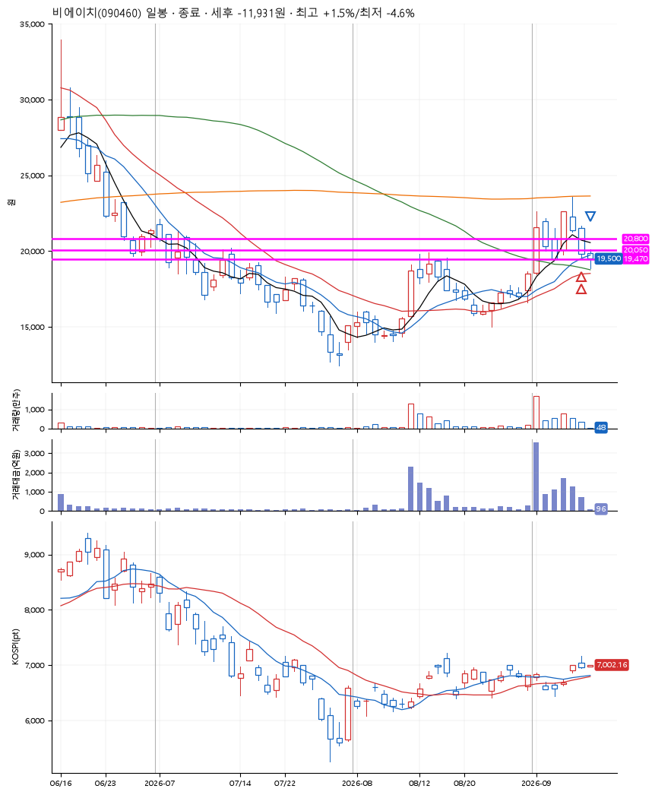
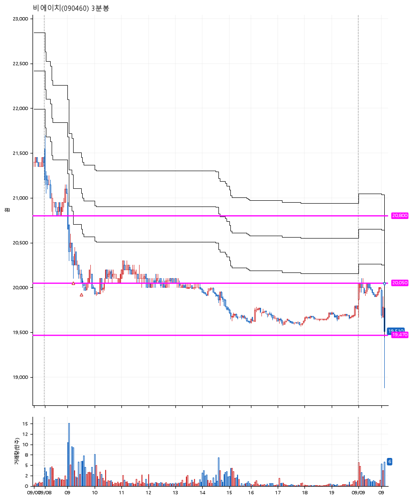

# 비에이치(090460) · 2026-09-09

**2차 매수 → 손절**

진입 2026-09-08 09:13 (D+2) · 청산 2026-09-09 09:06 (D+3) · 보유 2일차

| | |
|---|---|
| 결과 | 손절 |
| 평단 / 수량 | 20,150원 · 12주 |
| 투입 | 241,800원 |
| 세후 손익 | -11,931원 (-4.93%) |
| 최고 / 최저 | +1.5% / -4.6% |
| 당일 등락 | -0.15% |
| 보유기간 | 2일차 |

## 3선

| | |
|---|---|
| 1선 | 20,800원 |
| 2선 | 20,050원 |
| 3선 | 19,470원 |

기준봉 2026-09-04 (D+3)

`#KOSPI하락횡보장` `#시장을이기는종목` `#테마주`

> 로봇 휴머노이드

## 차트

**일봉**

**3분봉**

## 체결

| 시각 | 구분 | 수량 | 판정가 | 체결가 | 오차 |
|---|---|---|---|---|---|
| 09:13 | 매수 | 6주 | 20,200 | 20,200 | +0.00% |
| 09:31 | 매수 | 6주 | 20,050 | 20,100 | +0.25% |
| 09:06 | 매도 | 12주 | 19,470 | 19,200 | -1.39% |

## 잘한 점

.

## 아쉬운 점

기준봉이 만들어질 때, 압도적으로 만들어지지 않았음. 확신도 없으면서 너무 모험적인 도전이었다.
