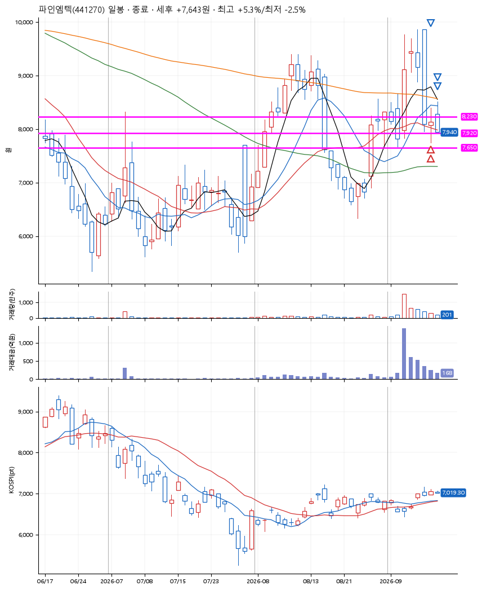
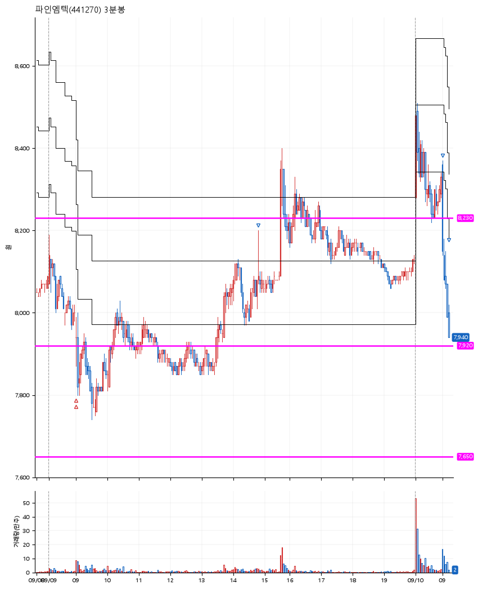

# 파인엠텍(441270) · 2026-09-10

**2차 매수 → 3% 익절 → 5% 익절 → 본절 이탈**

진입 2026-09-09 09:00 (D+4) · 청산 2026-09-10 09:12 (D+5) · 보유 2일차

| | |
|---|---|
| 결과 | 익절 |
| 평단 / 수량 | 7,945원 · 34주 |
| 투입 | 270,130원 |
| 세후 손익 | +7,643원 (+2.83%) |
| 최고 / 최저 | +5.3% / -2.5% |
| 당일 등락 | -3.11% |
| 보유기간 | 2일차 |

## 3선

| | |
|---|---|
| 1선 | 8,230원 |
| 2선 | 7,920원 |
| 3선 | 7,650원 |

기준봉 2026-09-03 (D+5)

`#KOSPI하락횡보장` `#시장을이기는종목`

## 차트

**일봉**

**3분봉**

## 체결

| 시각 | 구분 | 수량 | 판정가 | 체결가 | 오차 |
|---|---|---|---|---|---|
| 09:00 | 매수 | 17주 | 7,930 | 7,960 | +0.38% |
| 09:00 | 매수 | 17주 | 7,920 | 7,930 | +0.13% |
| 14:48 | 매도 | 13주 | 8,190 | 8,080 | -1.34% |
| 09:00 | 매도 | 17주 | 8,360 | 8,330 | -0.36% |
| 09:12 | 매도 | 4주 | 7,940 | 7,940 | +0.00% |

## 잘한 점

이건 최대종목수 때문에 보류되어 나중에 저렴하게 진입했던 종목.

## 아쉬운 점

청산조건은 진입 후 평단가 기준으로 3%,5%,7% 였기에, 예상했던 시점보다 낮은 가에서 청산되었음. 청산가격을 평단가 기준이 아닌 처음 그어놨던 3선으로 변경할 고민할 필요가 있다.
