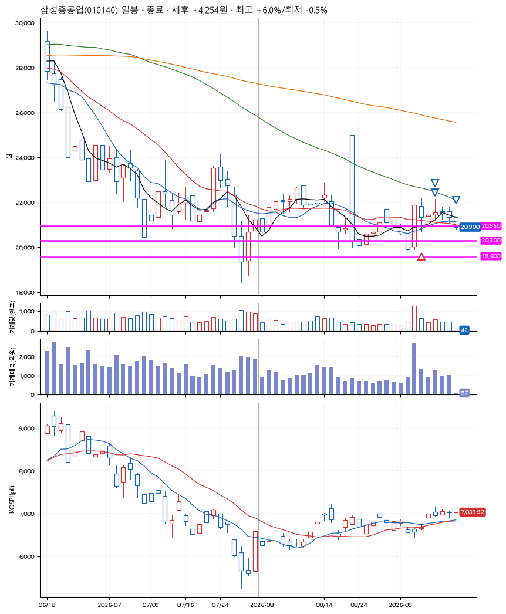
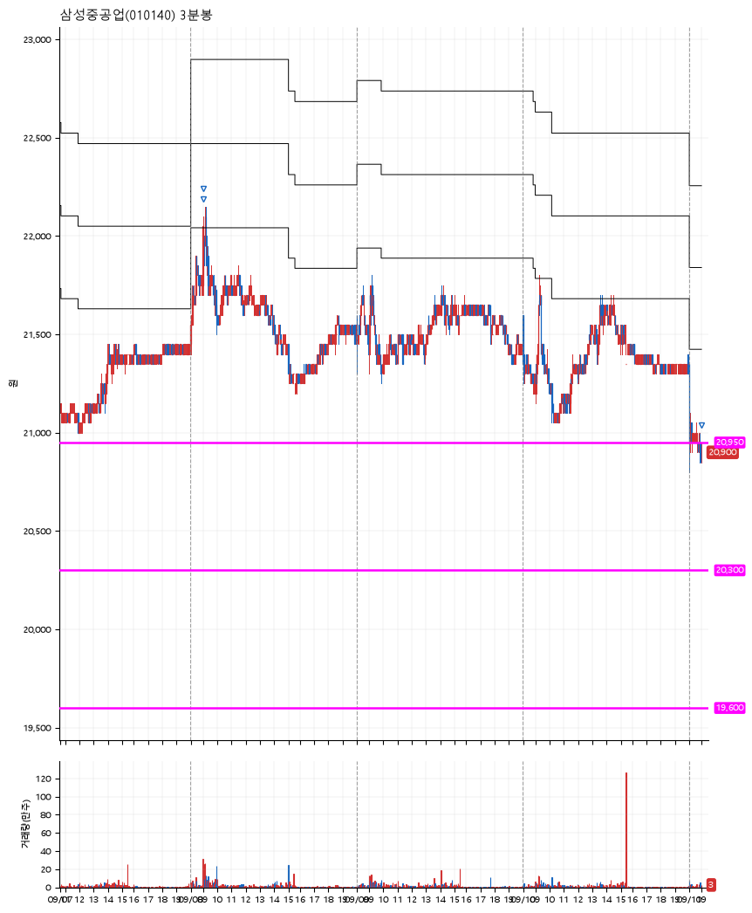

# 삼성중공업(010140) · 2026-09-11

**1차 매수 → 3% 익절 → 5% 익절 → 본절 이탈**

진입 2026-09-04 09:58 (D+1) · 청산 2026-09-11 09:00 (D+6) · 보유 6일차

| | |
|---|---|
| 결과 | 익절 |
| 평단 / 수량 | 20,900원 · 6주 |
| 투입 | 125,400원 |
| 세후 손익 | +4,254원 (+3.39%) |
| 최고 / 최저 | +6.0% / -0.5% |
| 당일 등락 | +2.39% |
| 보유기간 | 8일차 |

## 3선

| | |
|---|---|
| 1선 | 20,950원 |
| 2선 | 20,300원 |
| 3선 | 19,600원 |

기준봉 2026-09-03 (D+6)

`#KOSPI하락횡보장` `#시장을이기는종목` `#테마주`

> 조선 LNG

## 차트

**일봉**

**3분봉**

## 체결

| 시각 | 구분 | 수량 | 판정가 | 체결가 | 오차 |
|---|---|---|---|---|---|
| 09:58 | 매수 | 6주 | 20,900 | 20,900 | +0.00% |
| 09:00 | 매도 | 2주 | 21,750 | 21,700 | -0.23% |
| 09:01 | 매도 | 3주 | 21,950 | 21,900 | -0.23% |
| 09:00 | 매도 | 1주 | 20,900 | 20,850 | -0.24% |

## 잘한 점

안정적으로 수익 낸 3선

## 아쉬운 점

보유가 6일이나 되었는데, 이 동안 다른종목이 진입못한 기회비용이 조금 아쉽다. 수익 상태에서 며칠 지속된 것이지만 이럴 땐 어떤 대응이 최선일지?
