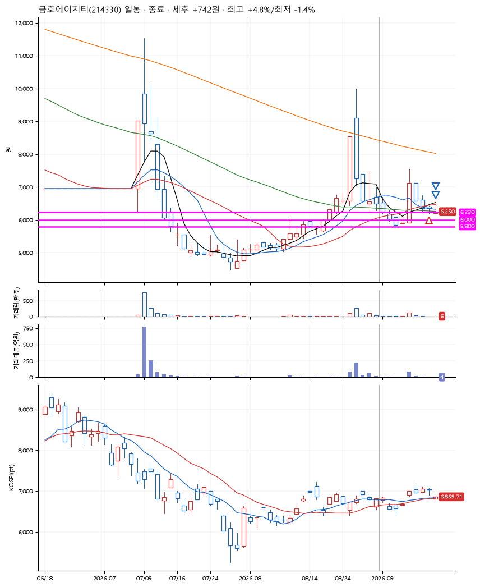
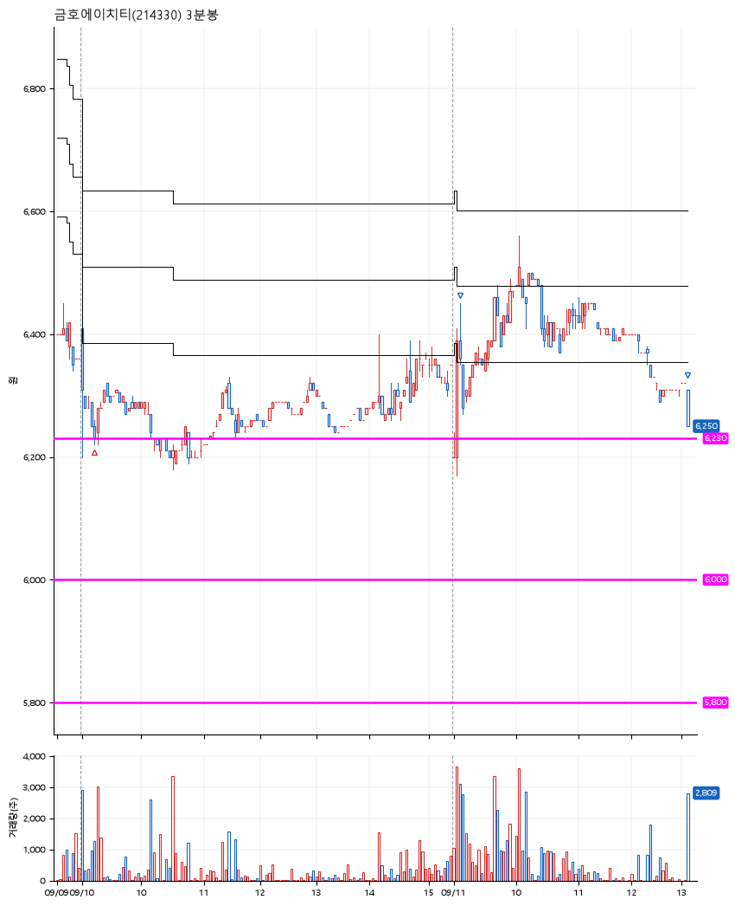

# 금호에이치티(214330) · 2026-09-11

**1차 매수 → 3% 익절 → 본절 이탈**

진입 2026-09-10 09:12 (D+3) · 청산 2026-09-11 13:10 (D+4) · 보유 2일차

| | |
|---|---|
| 결과 | 익절 |
| 평단 / 수량 | 6,260원 · 22주 |
| 투입 | 137,720원 |
| 세후 손익 | +742원 (+0.54%) |
| 최고 / 최저 | +4.8% / -1.4% |
| 당일 등락 | +4.84% |
| 보유기간 | 2일차 |

## 3선

| | |
|---|---|
| 1선 | 6,230원 |
| 2선 | 6,000원 |
| 3선 | 5,800원 |

기준봉 2026-09-07 (D+4)

`#KOSPI하락횡보장` `#시장을이기는종목`

## 차트

**일봉**

**3분봉**

## 체결

| 시각 | 구분 | 수량 | 판정가 | 체결가 | 오차 |
|---|---|---|---|---|---|
| 09:12 | 매수 | 22주 | 6,230 | 6,260 | +0.48% |
| 09:08 | 매도 | 8주 | 6,450 | 6,410 | -0.62% |
| 13:10 | 매도 | 14주 | 6,260 | 6,250 | -0.16% |

## 잘한 점

_(미작성)_

## 아쉬운 점

_(미작성)_
