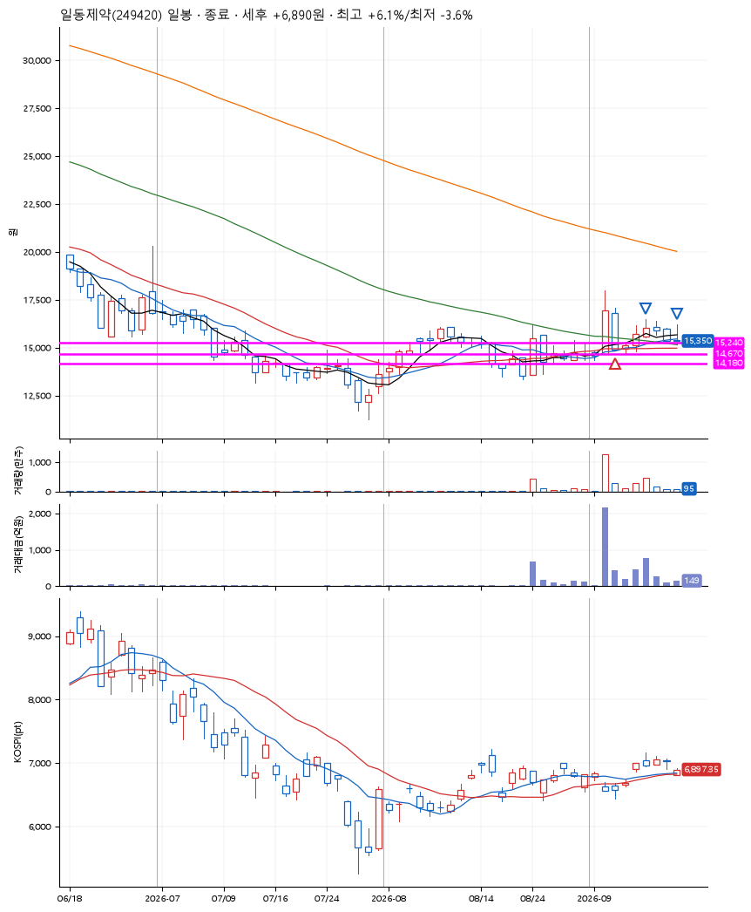
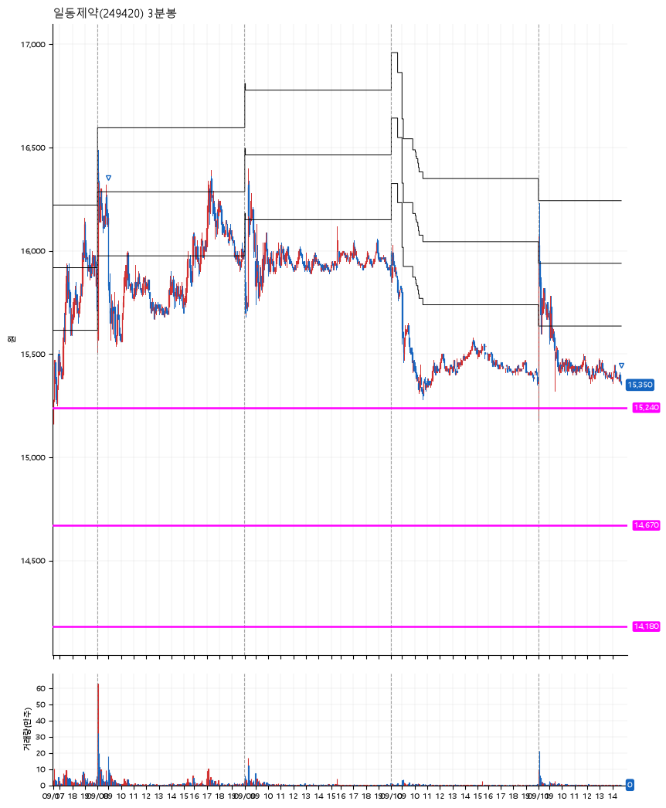

# 일동제약(249420) · 2026-09-11

**1차 매수 → 5% 익절 → 수동 청산**

진입 2026-09-03 11:16 (D+1) · 청산 2026-09-11 14:43 (D+7) · 보유 7일차

| | |
|---|---|
| 결과 | 익절 |
| 평단 / 수량 | 15,250원 · 9주 |
| 투입 | 137,250원 |
| 세후 손익 | +6,890원 (+5.02%) |
| 최고 / 최저 | +6.1% / -3.6% |
| 당일 등락 | -2.30% |
| 보유기간 | 9일차 |

## 3선

| | |
|---|---|
| 1선 | 15,240원 |
| 2선 | 14,670원 |
| 3선 | 14,180원 |

기준봉 2026-09-02 (D+7)

`#KOSPI하락횡보장` `#시장을이기는종목`

## 차트

**일봉**

**3분봉**

## 체결

| 시각 | 구분 | 수량 | 판정가 | 체결가 | 오차 |
|---|---|---|---|---|---|
| 11:16 | 매수 | 9주 | 15,240 | 15,250 | +0.07% |
| 09:00 | 매도 | 8주 | 16,160 | 16,140 | -0.12% |
| 14:43 | 매도 | 1주 | 15,350 | 15,350 | +0.00% |

## 잘한 점

_(미작성)_

## 아쉬운 점

_(미작성)_
