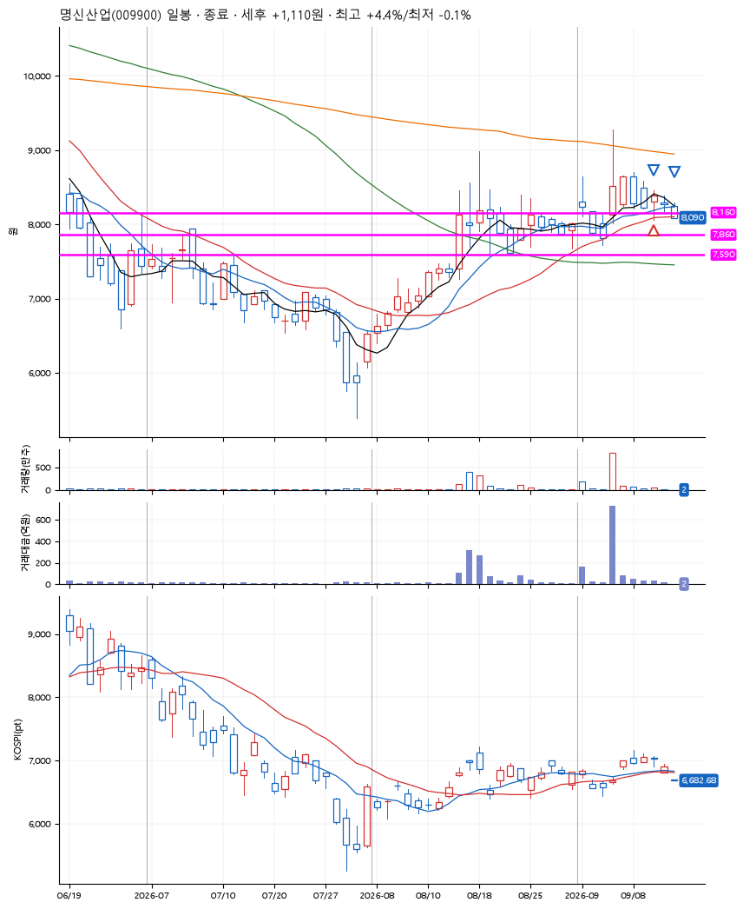
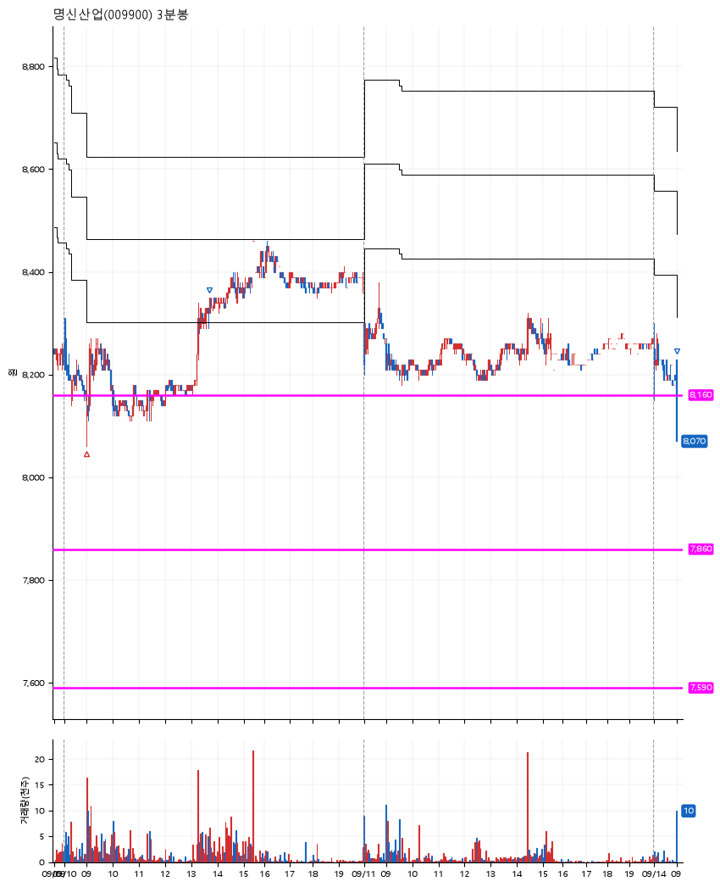

# 명신산업(009900) · 2026-09-14

**1차 매수 → 3% 익절 → 본절 이탈**

진입 2026-09-10 09:00 (D+4) · 청산 2026-09-14 09:01 (D+6) · 보유 3일차

| | |
|---|---|
| 결과 | 익절 |
| 평단 / 수량 | 8,100원 · 16주 |
| 투입 | 129,600원 |
| 세후 손익 | +1,110원 (+0.86%) |
| 최고 / 최저 | +4.4% / -0.1% |
| 당일 등락 | -0.97% |
| 보유기간 | 5일차 |

## 3선

| | |
|---|---|
| 1선 | 8,160원 |
| 2선 | 7,860원 |
| 3선 | 7,590원 |

기준봉 2026-09-04 (D+6)

`#KOSPI하락횡보장` `#시장을이기는종목`

## 차트

**일봉**

**3분봉**

## 체결

| 시각 | 구분 | 수량 | 판정가 | 체결가 | 오차 |
|---|---|---|---|---|---|
| 09:00 | 매수 | 16주 | 8,120 | 8,100 | -0.25% |
| 13:42 | 매도 | 6주 | 8,350 | 8,340 | -0.12% |
| 09:01 | 매도 | 10주 | 8,100 | 8,097 | -0.04% |

## 잘한 점

.

## 아쉬운 점

.
