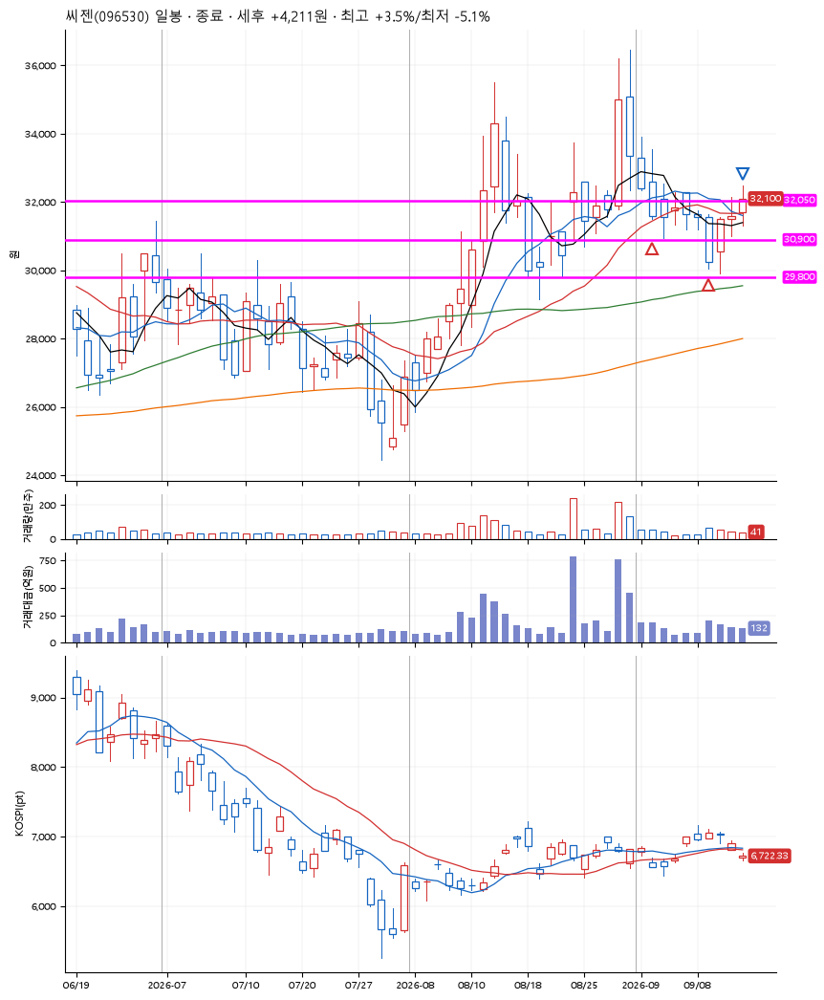
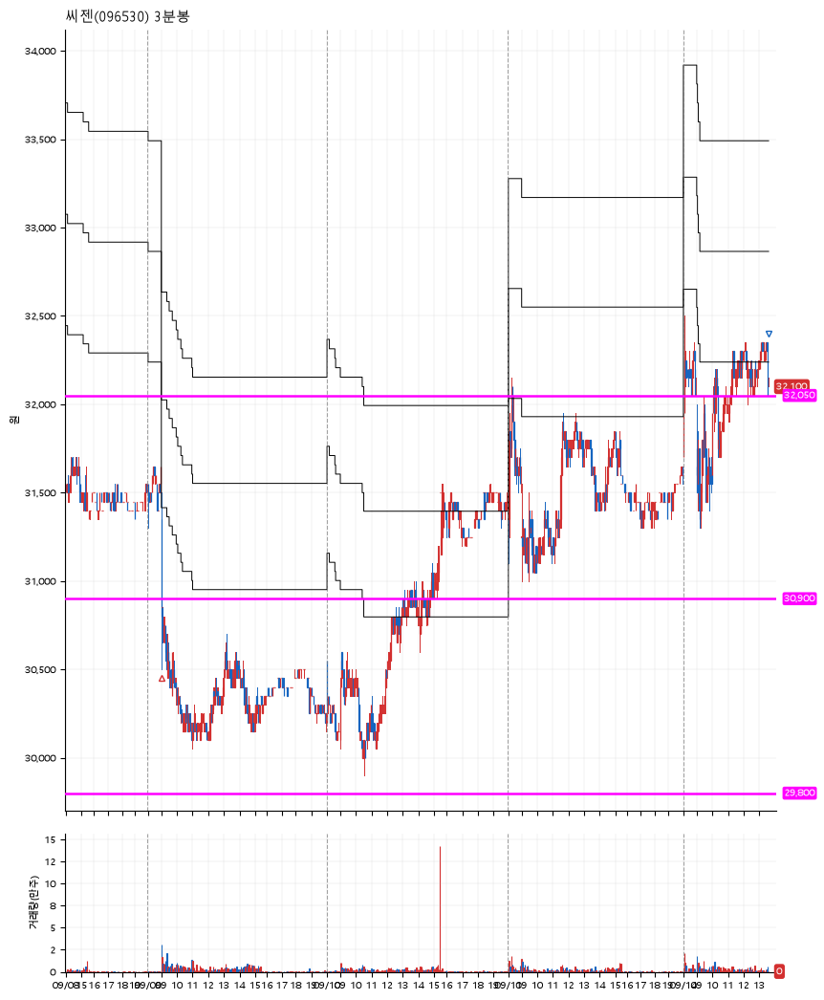

# 씨젠(096530) · 2026-09-14

**2차 매수 → 수동 청산**

진입 2026-09-02 10:51 (D+3) · 청산 2026-09-14 13:37 (D+11) · 보유 9일차

| | |
|---|---|
| 결과 | 익절 |
| 평단 / 수량 | 31,500원 · 8주 |
| 투입 | 252,000원 |
| 세후 손익 | +4,211원 (+1.67%) |
| 최고 / 최저 | +3.5% / -5.1% |
| 당일 등락 | +0.63% |
| 보유기간 | 13일차 |

## 3선

| | |
|---|---|
| 1선 | 32,050원 |
| 2선 | 30,900원 |
| 3선 | 29,800원 |

기준봉 2026-08-28 (D+11)

`#KOSPI하락횡보장` `#시장을이기는종목` `#테마주`

> 코로나19

## 차트

**일봉**

**3분봉**

## 체결

| 시각 | 구분 | 수량 | 판정가 | 체결가 | 오차 |
|---|---|---|---|---|---|
| 10:51 | 매수 | 4주 | 32,050 | 32,100 | +0.16% |
| 09:00 | 매수 | 4주 | 30,900 | 30,900 | +0.00% |
| 13:37 | 매도 | 8주 | 32,150 | 32,100 | -0.16% |

## 잘한 점

2차 매수 이후 오랫동안 가지를 않아서 직접 잘라내었음.

## 아쉬운 점

잘라내는 시점이 좀 더 빨랐어도 될 듯 하다. 안 갈 놈은 안가고 갈 놈은 진작에 간다. 이때문에 최대보유개수를 잡아먹고 있었음.
