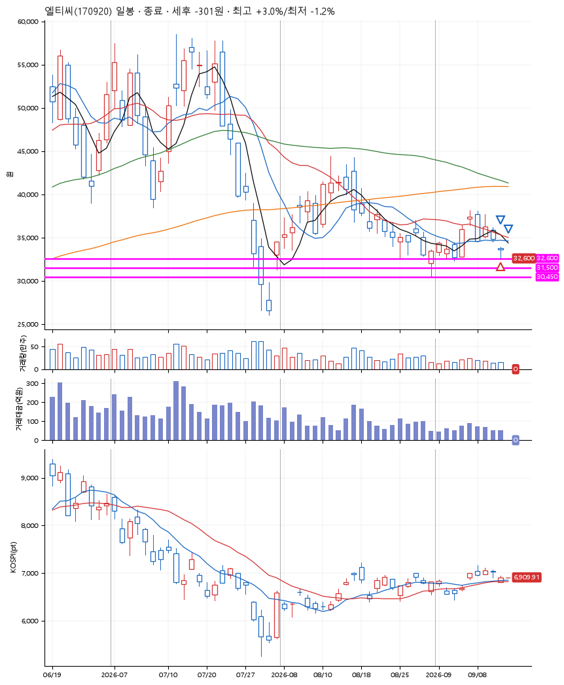
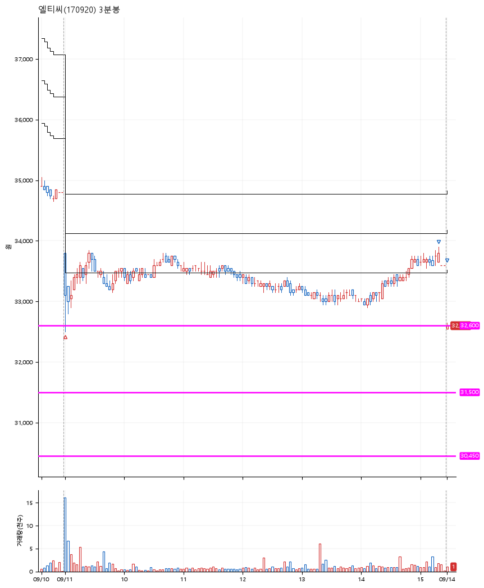

# 엘티씨(170920) · 2026-09-14

**1차 매수 → 3% 익절 → 본절 이탈**

진입 2026-09-11 09:00 (D+5) · 청산 2026-09-14 09:00 (D+6) · 보유 2일차

| | |
|---|---|
| 결과 | 손절 |
| 평단 / 수량 | 32,900원 · 4주 |
| 투입 | 131,600원 |
| 세후 손익 | -301원 (-0.23%) |
| 최고 / 최저 | +3.0% / -1.2% |
| 당일 등락 | -1.23% |
| 보유기간 | 4일차 |

## 3선

| | |
|---|---|
| 1선 | 32,600원 |
| 2선 | 31,500원 |
| 3선 | 30,450원 |

기준봉 2026-09-04 (D+6)

`#KOSPI하락횡보장` `#시장을이기는종목`

## 차트

**일봉**

**3분봉**

## 체결

| 시각 | 구분 | 수량 | 판정가 | 체결가 | 오차 |
|---|---|---|---|---|---|
| 09:00 | 매수 | 4주 | 32,600 | 32,900 | +0.92% |
| 15:19 | 매도 | 1주 | 33,900 | 33,800 | -0.29% |
| 09:00 | 매도 | 3주 | 32,550 | 32,600 | +0.15% |

## 잘한 점

1차 익절을 한 이후에 진입가 아래로 떨어지면 바로 모두 청산.

## 아쉬운 점

슬리피지 때문에 예상보다 높았던 진입가와 낮았던 청산가. 3% 익절하고 본절에서 나왔지만 결과는 약손실.
