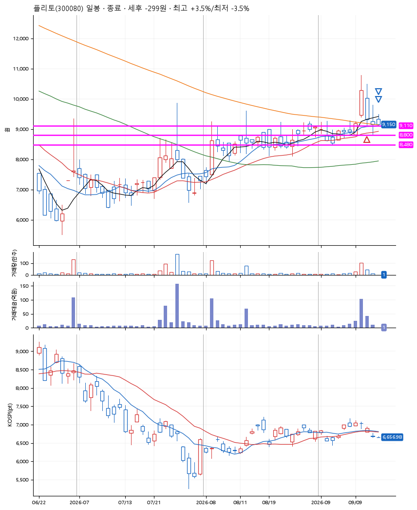
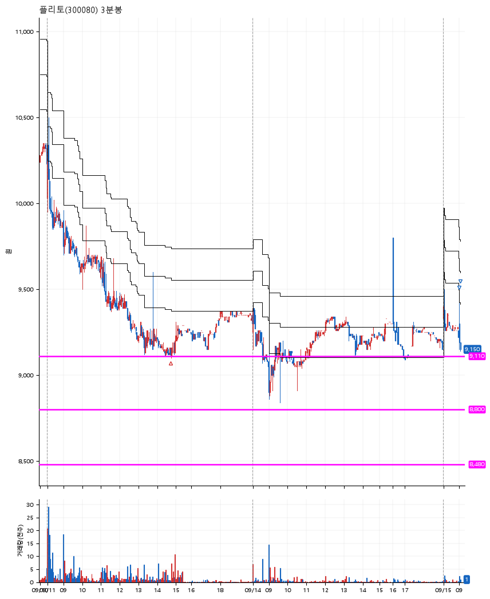

# 플리토(300080) · 2026-09-15

**1차 매수 → 3% 익절 → 본절 이탈**

진입 2026-09-11 14:43 (D+1) · 청산 2026-09-15 09:03 (D+3) · 보유 3일차

| | |
|---|---|
| 결과 | 손절 |
| 평단 / 수량 | 9,159원 · 15주 |
| 투입 | 137,385원 |
| 세후 손익 | -299원 (-0.22%) |
| 최고 / 최저 | +3.5% / -3.5% |
| 당일 등락 | -2.26% |
| 보유기간 | 5일차 |

## 3선

| | |
|---|---|
| 1선 | 9,110원 |
| 2선 | 8,800원 |
| 3선 | 8,480원 |

기준봉 2026-09-10 (D+3)

`#KOSPI하락횡보장` `#시장을이기는종목`

> 산업재해 예방 AI 통번역

## 차트

**일봉**

**3분봉**

## 체결

| 시각 | 구분 | 수량 | 판정가 | 체결가 | 오차 |
|---|---|---|---|---|---|
| 14:43 | 매수 | 15주 | 9,110 | 9,159 | +0.54% |
| 09:01 | 매도 | 6주 | 9,440 | 9,190 | -2.65% |
| 09:03 | 매도 | 9주 | 9,150 | 9,140 | -0.11% |

## 잘한 점

_(미작성)_

## 아쉬운 점

_(미작성)_
