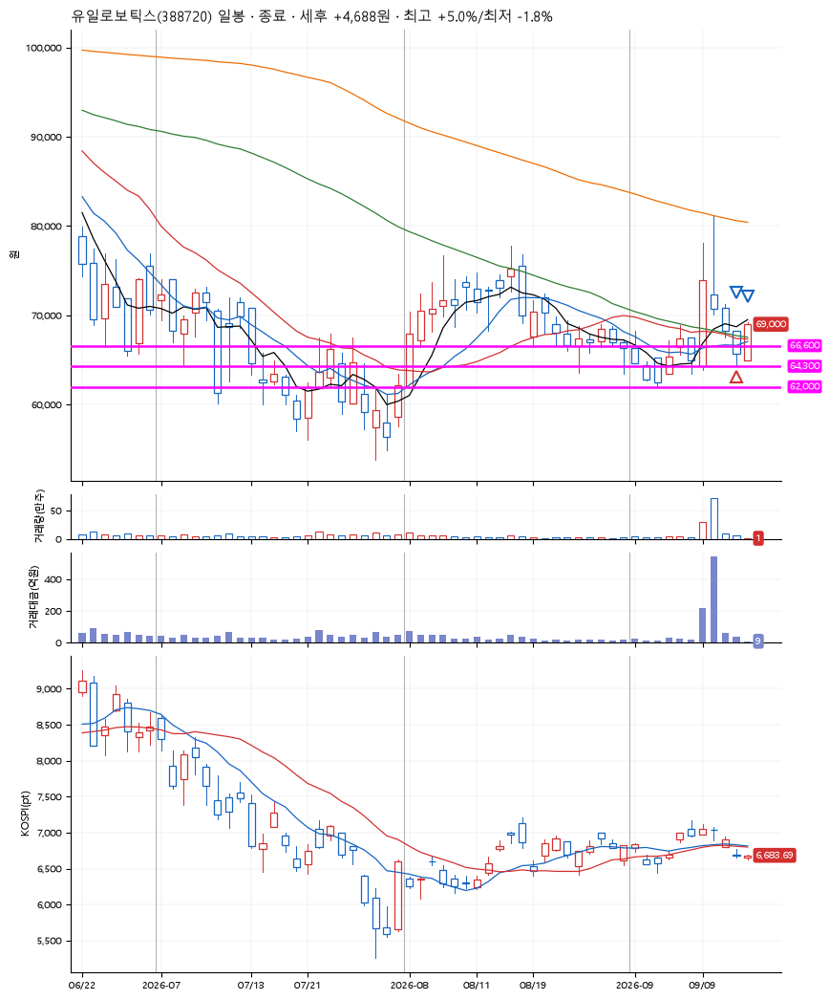
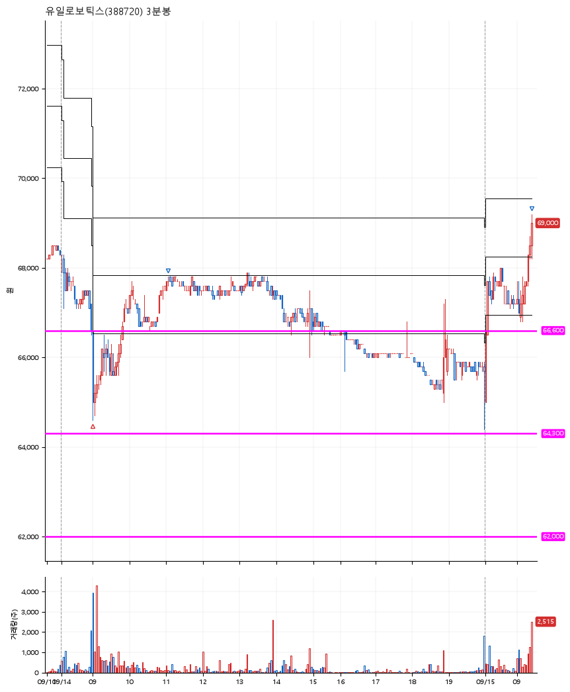

# 유일로보틱스(388720) · 2026-09-15

**1차 매수 → 3% 익절 → 5% 익절**

진입 2026-09-14 09:00 (D+3) · 청산 2026-09-15 09:26 (D+4) · 보유 2일차

| | |
|---|---|
| 결과 | 익절 |
| 평단 / 수량 | 65,800원 · 2주 |
| 투입 | 131,600원 |
| 세후 손익 | +4,688원 (+3.56%) |
| 최고 / 최저 | +5.0% / -1.8% |
| 당일 등락 | +3.42% |
| 보유기간 | 2일차 |

## 3선

| | |
|---|---|
| 1선 | 66,600원 |
| 2선 | 64,300원 |
| 3선 | 62,000원 |

기준봉 2026-09-09 (D+4)

`#KOSPI하락횡보장` `#시장을이기는종목`

## 차트

**일봉**

**3분봉**

## 체결

| 시각 | 구분 | 수량 | 판정가 | 체결가 | 오차 |
|---|---|---|---|---|---|
| 09:00 | 매수 | 2주 | 65,800 | 65,800 | +0.00% |
| 11:04 | 매도 | 1주 | 67,800 | 67,600 | -0.29% |
| 09:26 | 매도 | 1주 | 69,100 | 69,000 | -0.14% |

## 잘한 점

_(미작성)_

## 아쉬운 점

_(미작성)_
