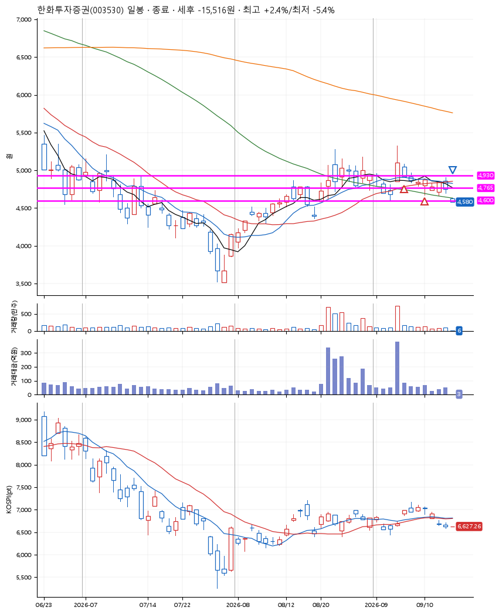
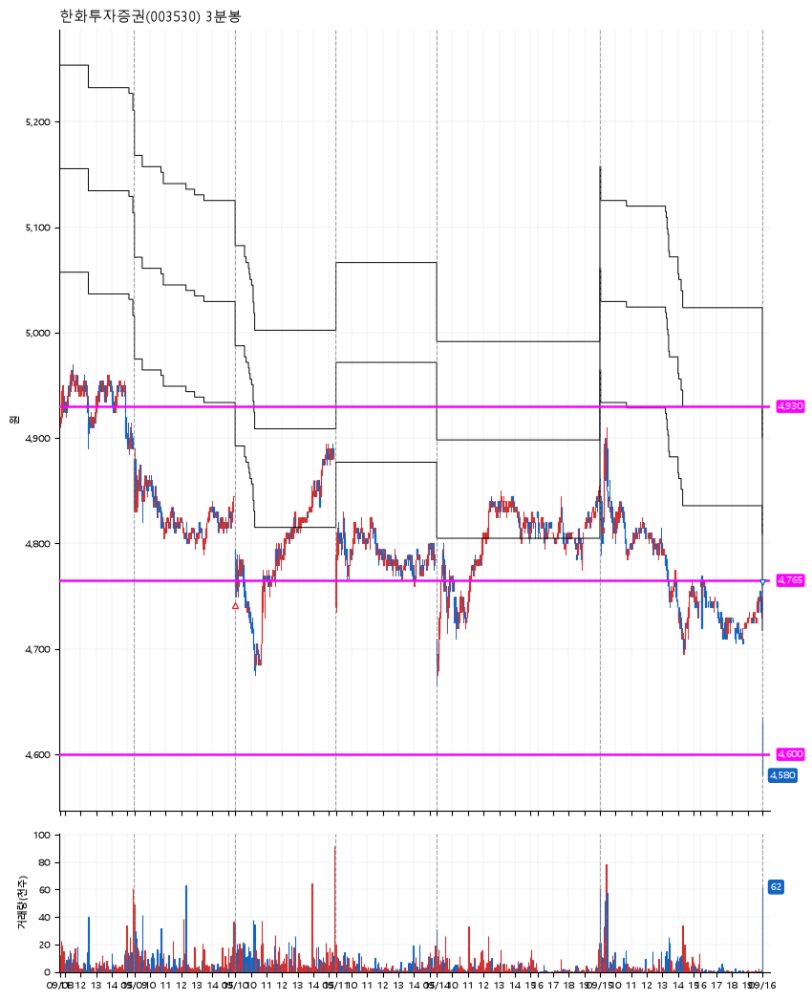

# 한화투자증권(003530) · 2026-09-16

**2차 매수 → 손절**

진입 2026-09-07 15:12 (D+1) · 청산 2026-09-16 09:00 (D+8) · 보유 8일차

| | |
|---|---|
| 결과 | 손절 |
| 평단 / 수량 | 4,856원 · 56주 |
| 투입 | 271,908원 |
| 세후 손익 | -15,516원 (-5.71%) |
| 최고 / 최저 | +2.4% / -5.4% |
| 당일 등락 | -0.86% |
| 보유기간 | 10일차 |

## 3선

| | |
|---|---|
| 1선 | 4,930원 |
| 2선 | 4,765원 |
| 3선 | 4,600원 |

기준봉 2026-09-04 (D+8)

`#KOSPI하락횡보장` `#시장을이기는종목`

## 차트

**일봉**

**3분봉**

## 체결

| 시각 | 구분 | 수량 | 판정가 | 체결가 | 오차 |
|---|---|---|---|---|---|
| 15:12 | 매수 | 28주 | 4,920 | 4,920 | +0.00% |
| 09:00 | 매수 | 28주 | 4,765 | 4,791 | +0.55% |
| 09:00 | 매도 | 56주 | 4,600 | 4,589 | -0.24% |

## 잘한 점

.

## 아쉬운 점

역시나 갈 놈은 며칠 안에 금방 가야하는데, 3일 이상 질질 끌고있는 종목이라 가지를 않는다. 기회비용이 너무 아깝다.
