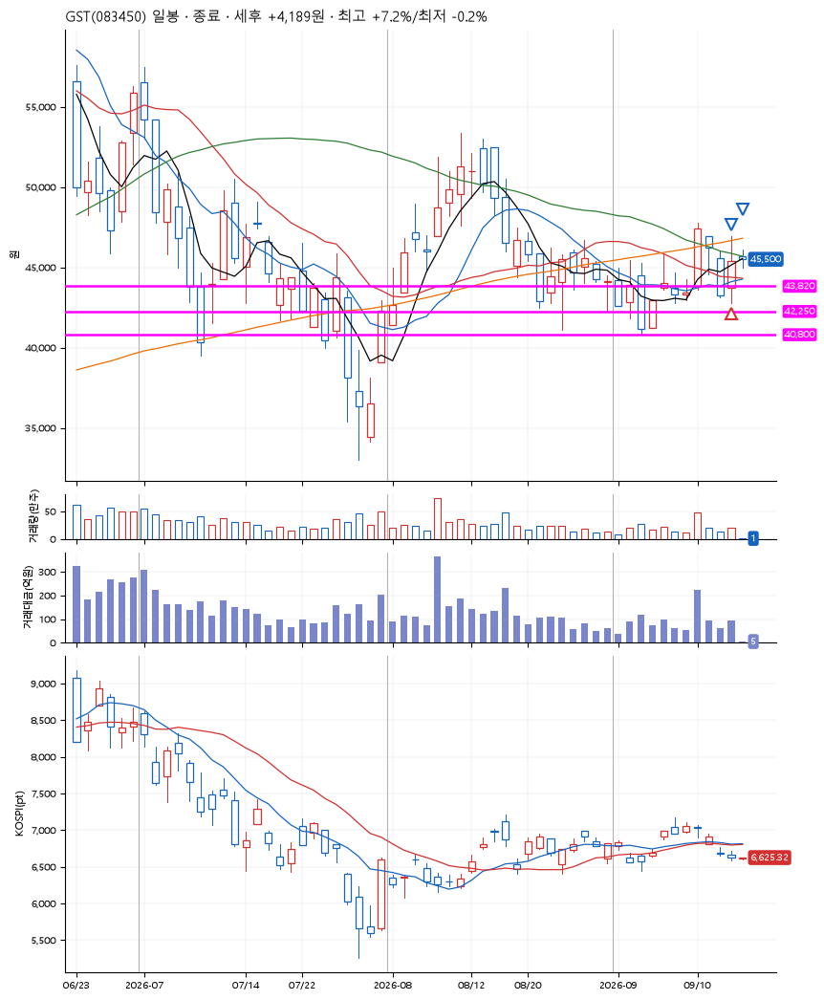
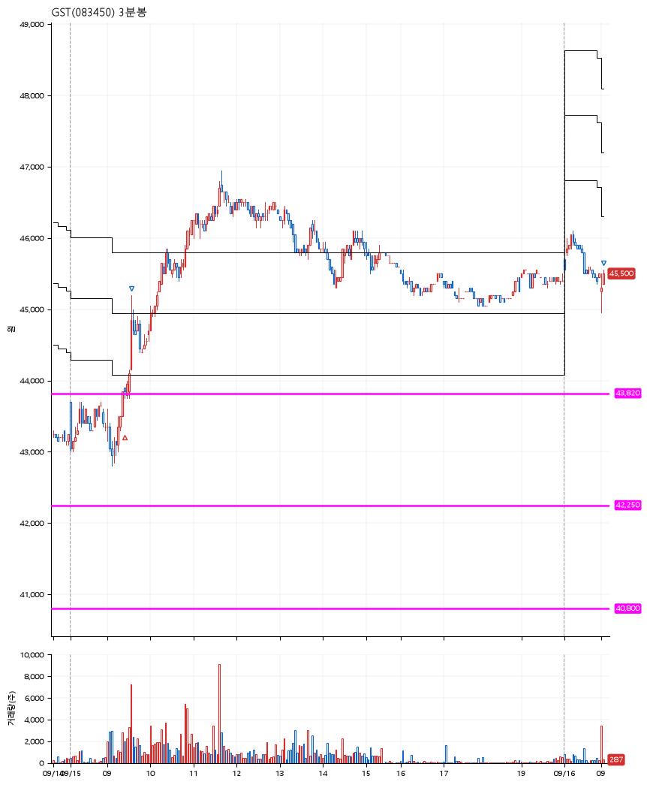

# GST(083450) · 2026-09-16

**1차 매수 → 3% 익절 → 수동 청산**

진입 2026-09-15 09:26 (D+3) · 청산 2026-09-16 09:03 (D+4) · 보유 2일차

| | |
|---|---|
| 결과 | 익절 |
| 평단 / 수량 | 43,817원 · 3주 |
| 투입 | 131,451원 |
| 세후 손익 | +4,189원 (+3.19%) |
| 최고 / 최저 | +7.2% / -0.2% |
| 당일 등락 | +2.54% |
| 보유기간 | 2일차 |

## 3선

| | |
|---|---|
| 1선 | 43,820원 |
| 2선 | 42,250원 |
| 3선 | 40,800원 |

기준봉 2026-09-10 (D+4)

`#KOSPI하락횡보장` `#시장을이기는종목`

## 차트

**일봉**

**3분봉**

## 체결

| 시각 | 구분 | 수량 | 판정가 | 체결가 | 오차 |
|---|---|---|---|---|---|
| 09:26 | 매수 | 3주 | 43,800 | 43,817 | +0.04% |
| 09:34 | 매도 | 1주 | 45,150 | 44,950 | -0.44% |
| 09:03 | 매도 | 2주 | 45,550 | 45,500 | -0.11% |

## 잘한 점

안정적인 3선.

## 아쉬운 점

전날 조금 더 크게 익절했어야 했지만, 프로그램 에러때문에 그러지 못한게 너무 아쉽다.
