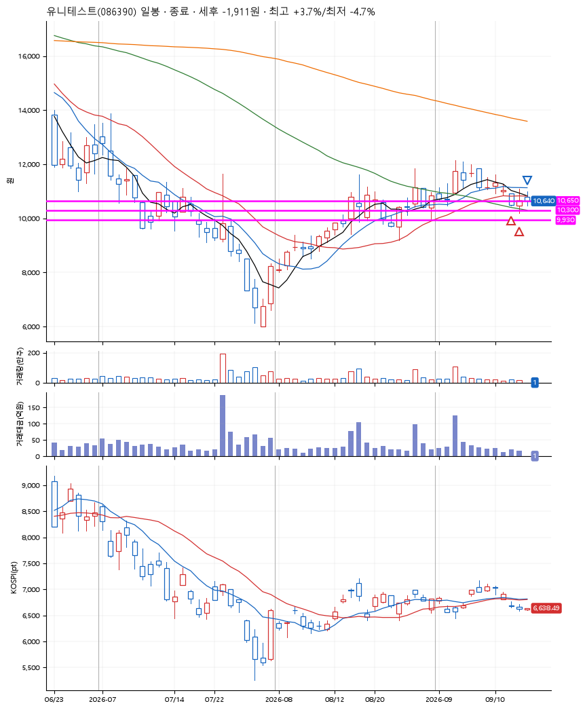
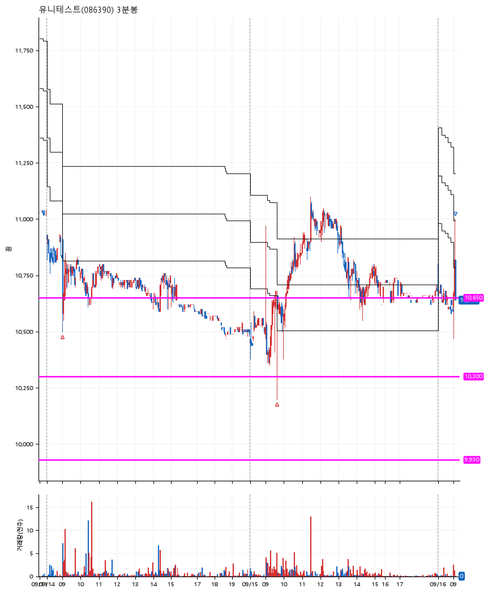

# 유니테스트(086390) · 2026-09-16

**2차 매수 → 수동 청산**

진입 2026-09-14 09:01 (D+7) · 청산 2026-09-16 09:06 (D+9) · 보유 3일차

| | |
|---|---|
| 결과 | 손절 |
| 평단 / 수량 | 10,702원 · 25주 |
| 투입 | 267,550원 |
| 세후 손익 | -1,911원 (-0.71%) |
| 최고 / 최저 | +3.7% / -4.7% |
| 당일 등락 | +9.71% |
| 보유기간 | 3일차 |

## 3선

| | |
|---|---|
| 1선 | 10,650원 |
| 2선 | 10,300원 |
| 3선 | 9,930원 |

기준봉 2026-09-03 (D+9)

`#KOSPI하락횡보장` `#시장을이기는종목`

## 차트

**일봉**

**3분봉**

## 체결

| 시각 | 구분 | 수량 | 판정가 | 체결가 | 오차 |
|---|---|---|---|---|---|
| 09:01 | 매수 | 12주 | 10,640 | 10,780 | +1.32% |
| 09:37 | 매수 | 13주 | 10,300 | 10,630 | +3.20% |
| 09:06 | 매도 | 25주 | 10,820 | 10,650 | -1.57% |

## 잘한 점

.

## 아쉬운 점

전날 익절했어야 했지만, 프로그램 에러때문에 익절하고 빠져나오지 못한게 너무 아쉽다.
