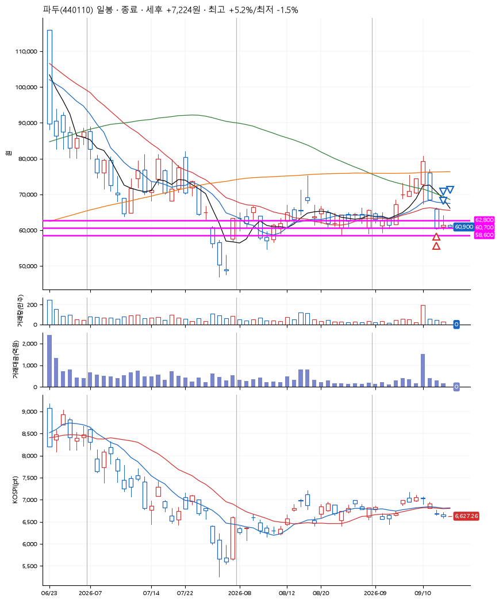
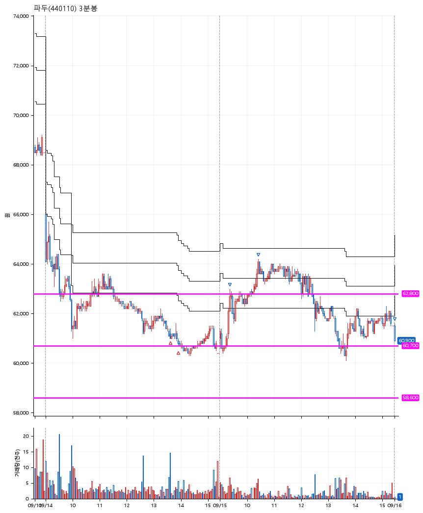

# 파두(440110) · 2026-09-16

**2차 매수 → 3% 익절 → 5% 익절 → 본절 이탈**

진입 2026-09-14 13:37 (D+6) · 청산 2026-09-16 09:00 (D+8) · 보유 3일차

| | |
|---|---|
| 결과 | 익절 |
| 평단 / 수량 | 61,000원 · 4주 |
| 투입 | 244,000원 |
| 세후 손익 | +7,224원 (+2.96%) |
| 최고 / 최저 | +5.2% / -1.5% |
| 당일 등락 | -3.58% |
| 보유기간 | 3일차 |

## 3선

| | |
|---|---|
| 1선 | 62,800원 |
| 2선 | 60,700원 |
| 3선 | 58,600원 |

기준봉 2026-09-04 (D+8)

`#KOSPI하락횡보장` `#시장을이기는종목`

## 차트

**일봉**

**3분봉**

## 체결

| 시각 | 구분 | 수량 | 판정가 | 체결가 | 오차 |
|---|---|---|---|---|---|
| 13:37 | 매수 | 2주 | 61,000 | 61,200 | +0.33% |
| 13:55 | 매수 | 2주 | 60,700 | 60,800 | +0.16% |
| 09:21 | 매도 | 1주 | 62,900 | 62,900 | +0.00% |
| 10:26 | 매도 | 2주 | 64,100 | 64,000 | -0.16% |
| 09:00 | 매도 | 1주 | 61,000 | 60,900 | -0.16% |

## 잘한 점

.

## 아쉬운 점

전날 익절했어야 했지만, 프로그램 에러때문에 익절하고 빠져나오지 못한게 너무 아쉽다.
