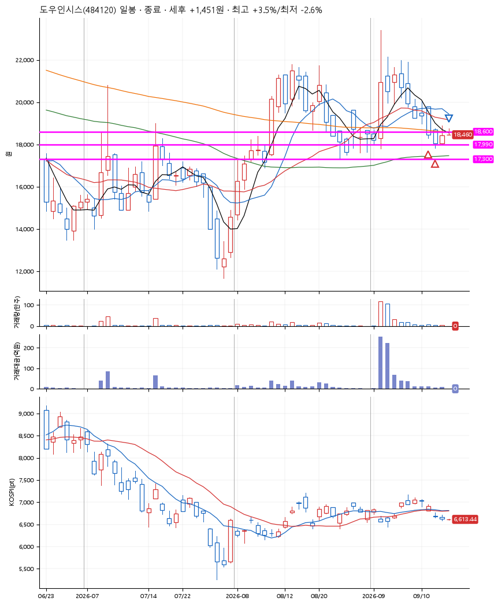
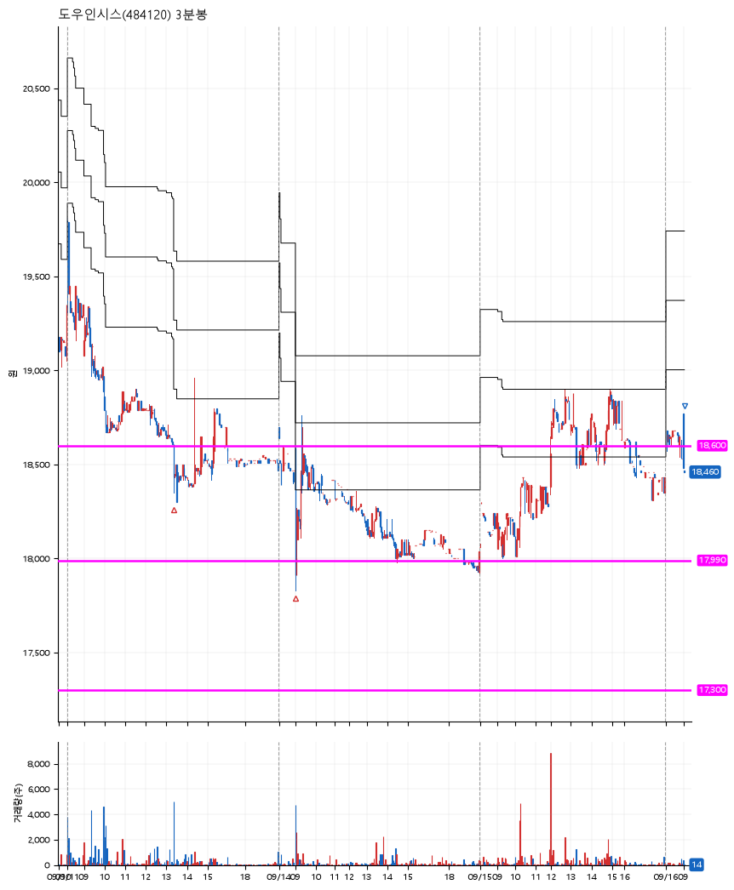

# 도우인시스(484120) · 2026-09-16

**2차 매수 → 수동 청산**

진입 2026-09-11 13:21 (D+7) · 청산 2026-09-16 09:03 (D+10) · 보유 4일차

| | |
|---|---|
| 결과 | 익절 |
| 평단 / 수량 | 18,315원 · 14주 |
| 투입 | 256,410원 |
| 세후 손익 | +1,451원 (+0.57%) |
| 최고 / 최저 | +3.5% / -2.6% |
| 당일 등락 | -3.20% |
| 보유기간 | 6일차 |

## 3선

| | |
|---|---|
| 1선 | 18,600원 |
| 2선 | 17,990원 |
| 3선 | 17,300원 |

기준봉 2026-09-02 (D+10)

`#KOSPI하락횡보장` `#시장을이기는종목`

## 차트

**일봉**

**3분봉**

## 체결

| 시각 | 구분 | 수량 | 판정가 | 체결가 | 오차 |
|---|---|---|---|---|---|
| 13:21 | 매수 | 7주 | 18,600 | 18,530 | -0.38% |
| 09:02 | 매수 | 7주 | 17,990 | 18,100 | +0.61% |
| 09:03 | 매도 | 14주 | 18,480 | 18,461 | -0.10% |

## 잘한 점

.

## 아쉬운 점

전날 익절했어야 했지만, 프로그램 에러때문에 익절하고 빠져나오지 못한게 너무 아쉽다.
