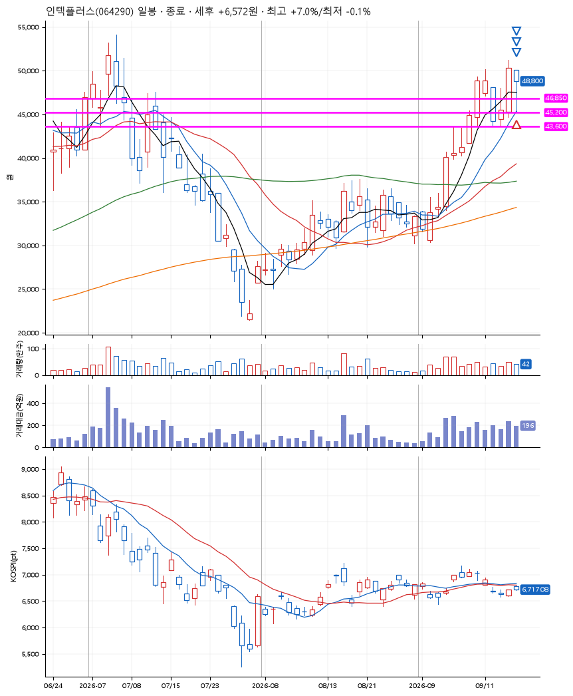
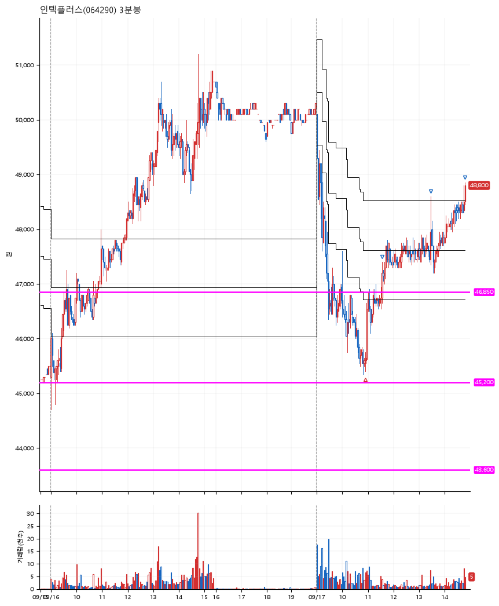

# 인텍플러스(064290) · 2026-09-17

**1차 매수 → 3% 익절 → 5% 익절 → 7% 익절**

진입 2026-09-17 10:56 (D+1) · 청산 2026-09-17 14:50 (D+1) · 보유 3시간 54분

| | |
|---|---|
| 결과 | 익절 |
| 평단 / 수량 | 45,650원 · 3주 |
| 투입 | 136,950원 |
| 세후 손익 | +6,572원 (+4.80%) |
| 최고 / 최저 | +7.0% / -0.1% |
| 당일 등락 | -3.69% |
| 보유기간 | 3시간 54분 |

## 3선

| | |
|---|---|
| 1선 | 46,850원 |
| 2선 | 45,200원 |
| 3선 | 43,600원 |

기준봉 2026-09-16 (D+1)

`#KOSPI하락횡보장` `#시장을이기는종목` `#테마주`

> SK하이닉스 인텔과 협업

## 차트

**일봉**

**3분봉**

## 체결

| 시각 | 구분 | 수량 | 판정가 | 체결가 | 오차 |
|---|---|---|---|---|---|
| 10:56 | 매수 | 3주 | 45,650 | 45,650 | +0.00% |
| 11:34 | 매도 | 1주 | 47,050 | 47,050 | +0.00% |
| 13:28 | 매도 | 1주 | 47,950 | 48,000 | +0.10% |
| 14:50 | 매도 | 1주 | 48,850 | 48,800 | -0.10% |

## 잘한 점

기준봉이 나온 다음날 정석적인 반등 움직임. 박스 2선을 정확히 지켜줬다.

## 아쉬운 점

.
