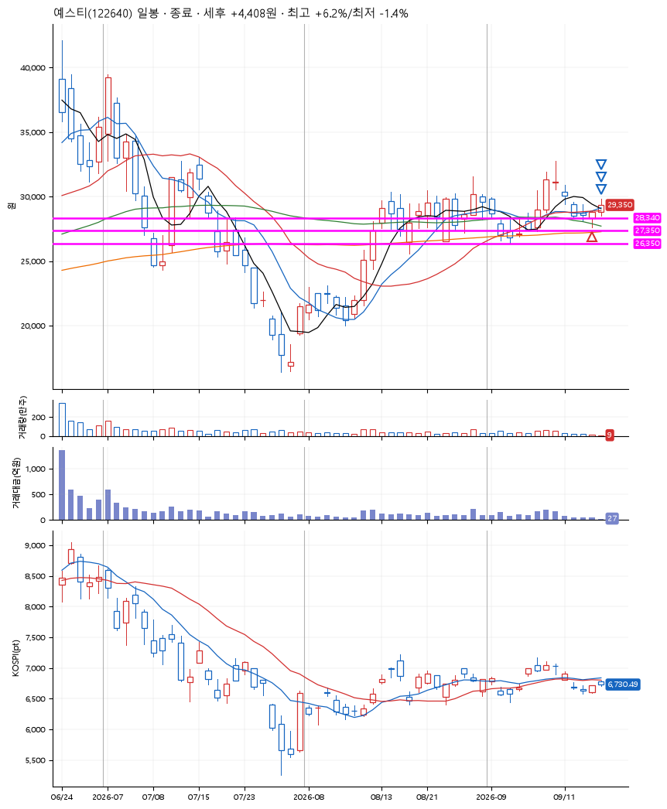
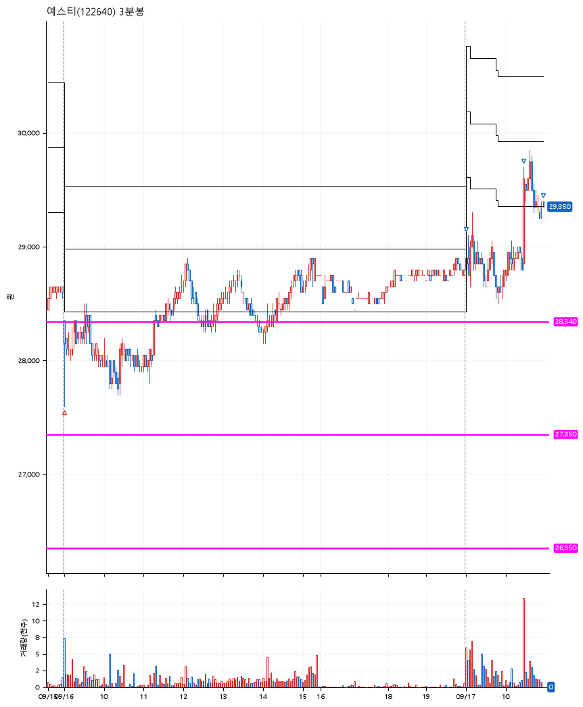

# 예스티(122640) · 2026-09-17

**1차 매수 → 3% 익절 → 5% 익절 → 수동 청산**

진입 2026-09-16 09:00 (D+5) · 청산 2026-09-17 10:57 (D+6) · 보유 2일차

| | |
|---|---|
| 결과 | 익절 |
| 평단 / 수량 | 28,100원 · 4주 |
| 투입 | 112,400원 |
| 세후 손익 | +4,408원 (+3.92%) |
| 최고 / 최저 | +6.2% / -1.4% |
| 당일 등락 | +0.69% |
| 보유기간 | 2일차 |

## 3선

| | |
|---|---|
| 1선 | 28,340원 |
| 2선 | 27,350원 |
| 3선 | 26,350원 |

기준봉 2026-09-09 (D+6)

`#KOSPI하락횡보장` `#시장을이기는종목`

## 차트

**일봉**

**3분봉**

## 체결

| 시각 | 구분 | 수량 | 판정가 | 체결가 | 오차 |
|---|---|---|---|---|---|
| 09:00 | 매수 | 4주 | 28,150 | 28,100 | -0.18% |
| 09:00 | 매도 | 1주 | 28,950 | 28,925 | -0.09% |
| 10:29 | 매도 | 2주 | 29,550 | 29,400 | -0.51% |
| 10:57 | 매도 | 1주 | 29,400 | 29,350 | -0.17% |

## 잘한 점

.

## 아쉬운 점

매수하고 나서 다소 지지부진했던 반등 움직임. 보유 3일차 저점을 깨면 나와야 하지만 그것을 지켰을지는 의문.
