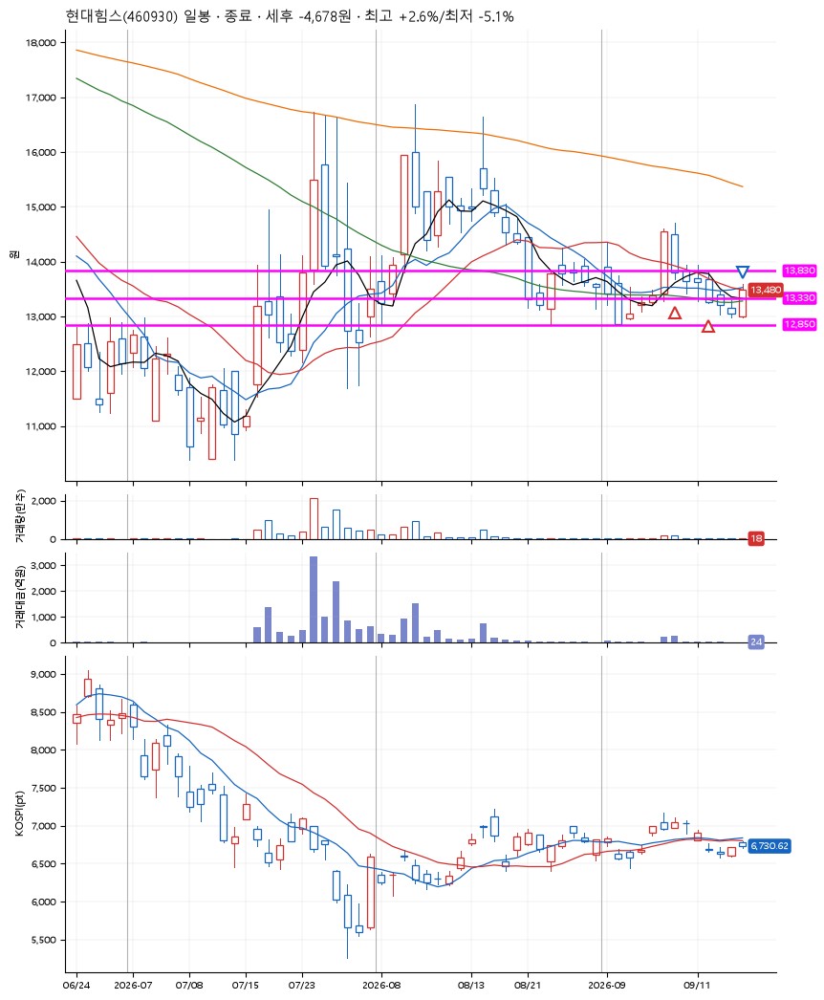
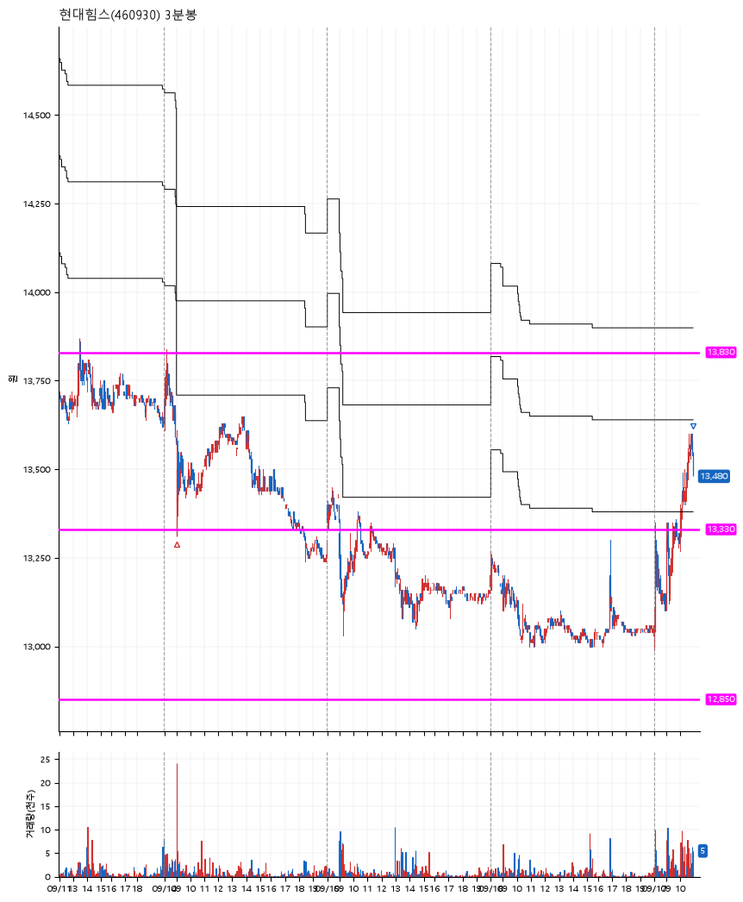

# 현대힘스(460930) · 2026-09-17

**2차 매수 → 수동 청산**

진입 2026-09-09 09:10 (D+1) · 청산 2026-09-17 10:56 (D+7) · 보유 7일차

| | |
|---|---|
| 결과 | 손절 |
| 평단 / 수량 | 13,695원 · 19주 |
| 투입 | 260,210원 |
| 세후 손익 | -4,678원 (-1.80%) |
| 최고 / 최저 | +2.6% / -5.1% |
| 당일 등락 | +2.98% |
| 보유기간 | 9일차 |

## 3선

| | |
|---|---|
| 1선 | 13,830원 |
| 2선 | 13,330원 |
| 3선 | 12,850원 |

기준봉 2026-09-08 (D+7)

`#KOSPI하락횡보장` `#시장을이기는종목`

## 차트

**일봉**

**3분봉**

## 체결

| 시각 | 구분 | 수량 | 판정가 | 체결가 | 오차 |
|---|---|---|---|---|---|
| 09:10 | 매수 | 9주 | 13,790 | 13,790 | +0.00% |
| 09:00 | 매수 | 10주 | 13,310 | 13,610 | +2.25% |
| 10:56 | 매도 | 19주 | 13,490 | 13,480 | -0.07% |

## 잘한 점

2차매수 이후 3일동안 가지 않으며, 저점을 이탈하면 청산할 생각이었음. 다행히 살짝 반등할 때 약손절하고 탈출.

## 아쉬운 점

갈 놈과 안 갈 놈을 구분하는 방법을 알고싶다.
