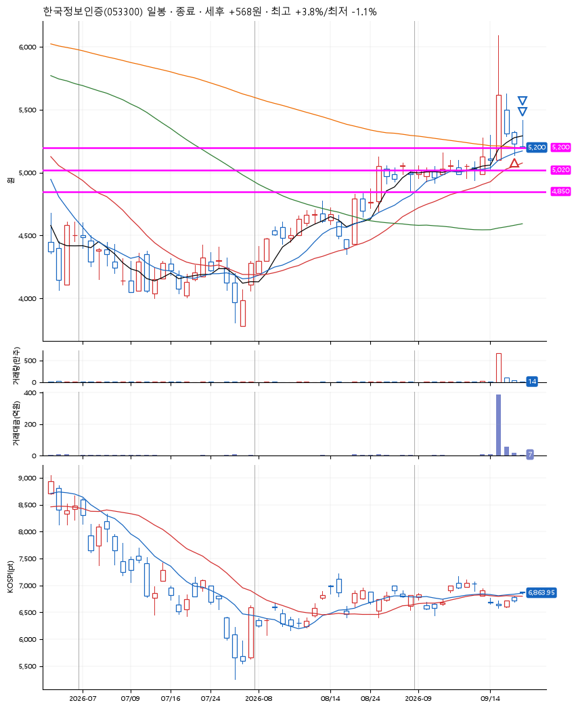
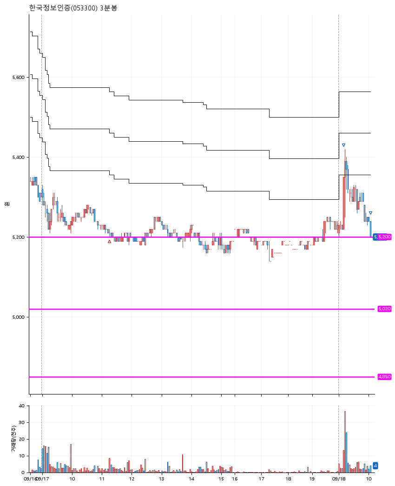

# 한국정보인증(053300) · 2026-09-18

**1차 매수 → 3% 익절 → 본절 이탈**

진입 2026-09-17 11:15 (D+2) · 청산 2026-09-18 10:03 (D+3) · 보유 2일차

| | |
|---|---|
| 결과 | 익절 |
| 평단 / 수량 | 5,220원 · 26주 |
| 투입 | 135,720원 |
| 세후 손익 | +568원 (+0.42%) |
| 최고 / 최저 | +3.8% / -1.1% |
| 당일 등락 | -0.19% |
| 보유기간 | 2일차 |

## 3선

| | |
|---|---|
| 1선 | 5,200원 |
| 2선 | 5,020원 |
| 3선 | 4,850원 |

기준봉 2026-09-15 (D+3)

`#KOSPI하락횡보장` `#시장을이기는종목`

## 차트

**일봉**

**3분봉**

## 체결

| 시각 | 구분 | 수량 | 판정가 | 체결가 | 오차 |
|---|---|---|---|---|---|
| 11:15 | 매수 | 26주 | 5,200 | 5,220 | +0.38% |
| 09:11 | 매도 | 10주 | 5,380 | 5,340 | -0.74% |
| 10:03 | 매도 | 16주 | 5,220 | 5,200 | -0.38% |

## 잘한 점

작은 수익을 줄 때 일부 청산하고 본절가에서 이탈하는 시나리오대로의 대응.

## 아쉬운 점

1차 3% 청산을 하였지만, 슬리피지 때문인지 예상보다는 작은 수익.
