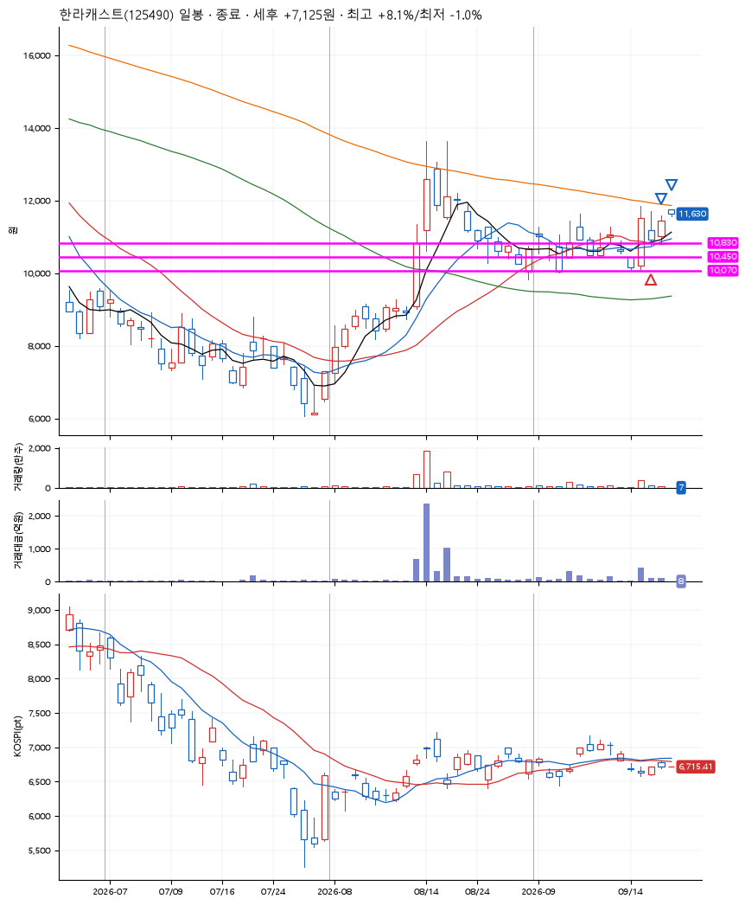
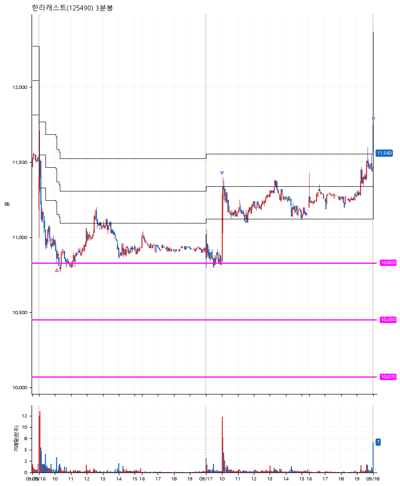

# 한라캐스트(125490) · 2026-09-18

**1차 매수 → 3% 익절 → 7% 익절**

진입 2026-09-16 10:07 (D+1) · 청산 2026-09-18 09:00 (D+3) · 보유 3일차

| | |
|---|---|
| 결과 | 익절 |
| 평단 / 수량 | 10,880원 · 12주 |
| 투입 | 130,560원 |
| 세후 손익 | +7,125원 (+5.46%) |
| 최고 / 최저 | +8.1% / -1.0% |
| 당일 등락 | +2.55% |
| 보유기간 | 3일차 |

## 3선

| | |
|---|---|
| 1선 | 10,830원 |
| 2선 | 10,450원 |
| 3선 | 10,070원 |

기준봉 2026-09-15 (D+3)

`#KOSPI하락횡보장` `#시장을이기는종목` `#테마주` `#섹터주`

> 로봇 피지컬AI 휴머노이드 로봇

## 차트

**일봉**

**3분봉**

## 체결

| 시각 | 구분 | 수량 | 판정가 | 체결가 | 오차 |
|---|---|---|---|---|---|
| 10:07 | 매수 | 12주 | 10,830 | 10,880 | +0.46% |
| 10:01 | 매도 | 4주 | 11,210 | 11,180 | -0.27% |
| 09:00 | 매도 | 8주 | 11,750 | 11,660 | -0.77% |

## 잘한 점

장 시작할 때 갭상승으로 인한 5%익절 생략 -> 7% 익절. 기준봉 이후 설정해놓은 박스와 예상대로 박스 위에서 지지받는 움직임.

## 아쉬운 점

.
