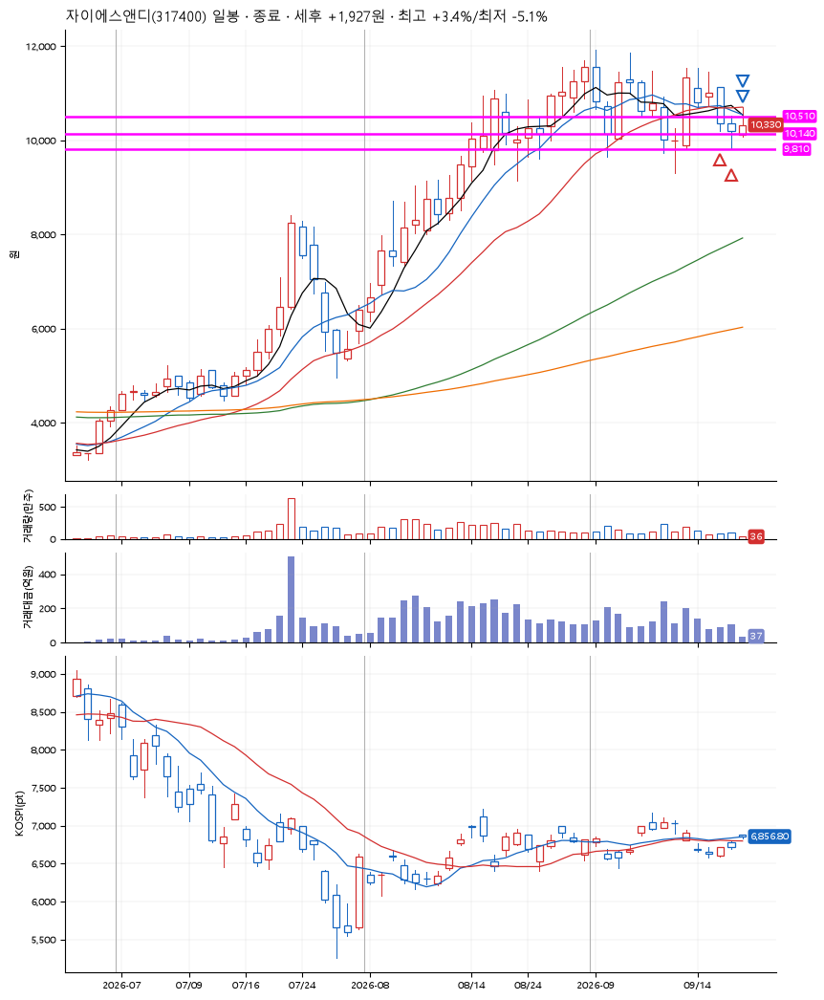
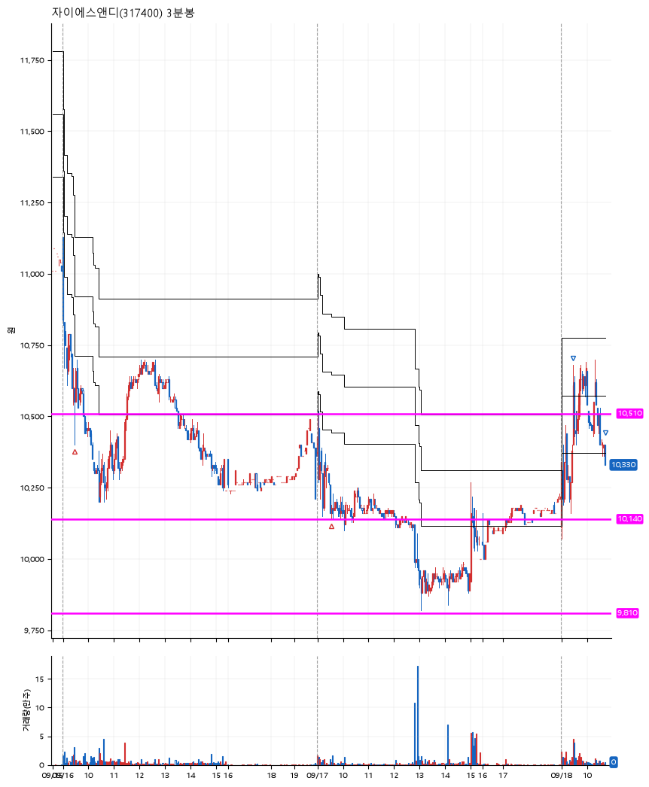

# 자이에스앤디(317400) · 2026-09-18

**2차 매수 → 3% 익절 → 본절 이탈**

진입 2026-09-16 09:27 (D+3) · 청산 2026-09-18 10:44 (D+5) · 보유 3일차

| | |
|---|---|
| 결과 | 익절 |
| 평단 / 수량 | 10,344원 · 26주 |
| 투입 | 268,931원 |
| 세후 손익 | +1,927원 (+0.72%) |
| 최고 / 최저 | +3.4% / -5.1% |
| 당일 등락 | -1.48% |
| 보유기간 | 3일차 |

## 3선

| | |
|---|---|
| 1선 | 10,510원 |
| 2선 | 10,140원 |
| 3선 | 9,810원 |

기준봉 2026-09-11 (D+5)

`#KOSPI하락횡보장` `#시장을이기는종목`

> 시흥배곧 복합문화중심도시

## 차트

**일봉**

**3분봉**

## 체결

| 시각 | 구분 | 수량 | 판정가 | 체결가 | 오차 |
|---|---|---|---|---|---|
| 09:27 | 매수 | 13주 | 10,510 | 10,510 | +0.00% |
| 09:34 | 매수 | 13주 | 10,140 | 10,177 | +0.36% |
| 09:29 | 매도 | 10주 | 10,660 | 10,620 | -0.38% |
| 10:44 | 매도 | 16주 | 10,340 | 10,330 | -0.10% |

## 잘한 점

나의 성향에 도전하는 아주 약간의 공격적 3선 설정. 빠른 치고빠지기.

## 아쉬운 점

.
