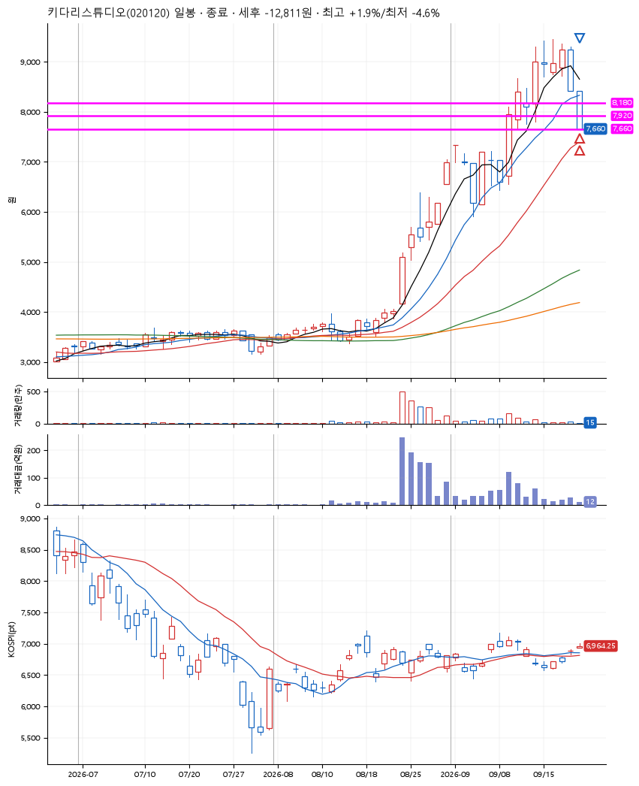
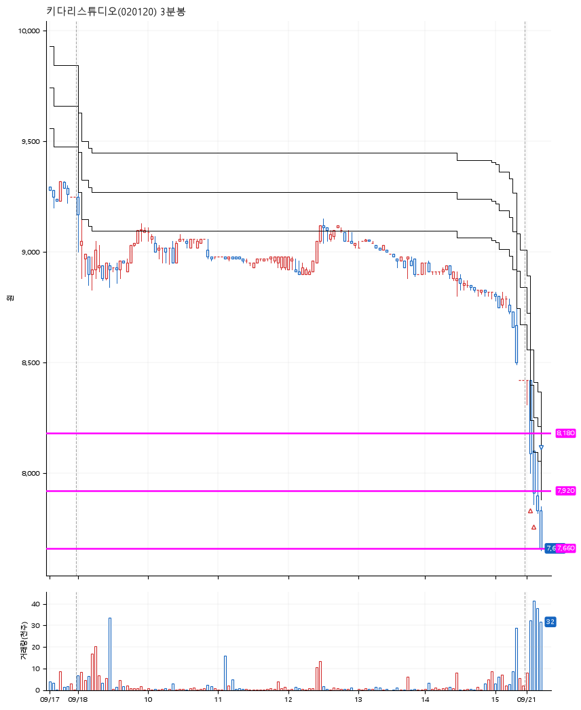

# 키다리스튜디오(020120) · 2026-09-21

**2차 매수 → 손절**

진입 2026-09-21 09:04 (D+5) · 청산 2026-09-21 09:12 (D+5) · 보유 7분

| | |
|---|---|
| 결과 | 손절 |
| 평단 / 수량 | 8,021원 · 33주 |
| 투입 | 264,680원 |
| 세후 손익 | -12,811원 (-4.84%) |
| 최고 / 최저 | +1.9% / -4.6% |
| 당일 등락 | -0.36% |
| 보유기간 | 7분 |

## 3선

| | |
|---|---|
| 1선 | 8,180원 |
| 2선 | 7,920원 |
| 3선 | 7,660원 |

기준봉 2026-09-14 (D+5)

`#KOSPI하락횡보장` `#시장을이기는종목`

> 웹툰

## 차트

**일봉**

**3분봉**

## 체결

| 시각 | 구분 | 수량 | 판정가 | 체결가 | 오차 |
|---|---|---|---|---|---|
| 09:04 | 매수 | 16주 | 8,180 | 8,170 | -0.12% |
| 09:06 | 매수 | 17주 | 7,910 | 7,880 | -0.38% |
| 09:12 | 매도 | 33주 | 7,660 | 7,650 | -0.13% |

## 잘한 점

_(미작성)_

## 아쉬운 점

_(미작성)_
