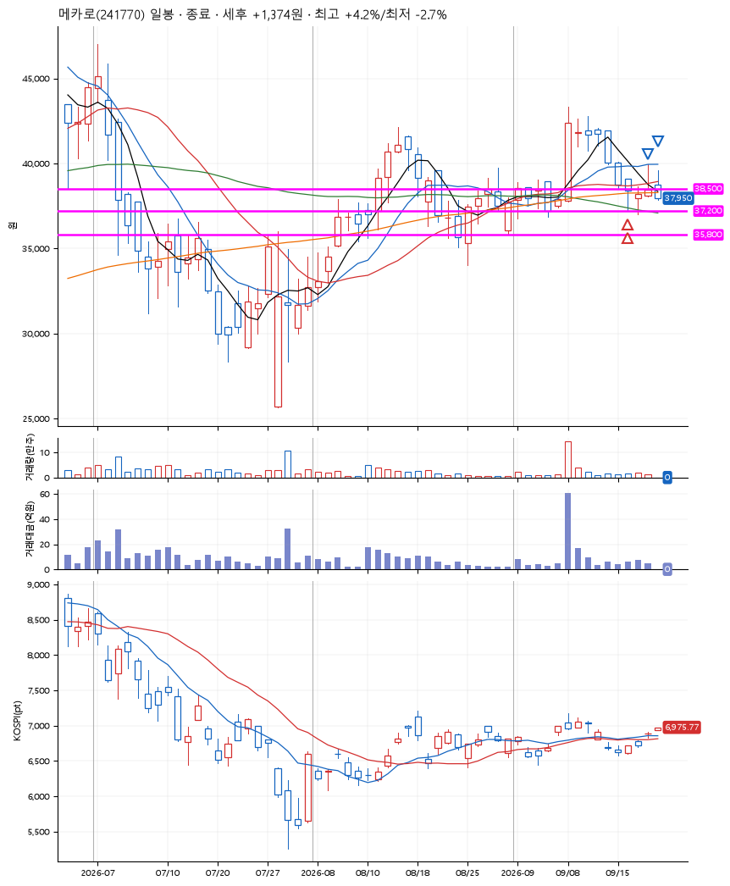
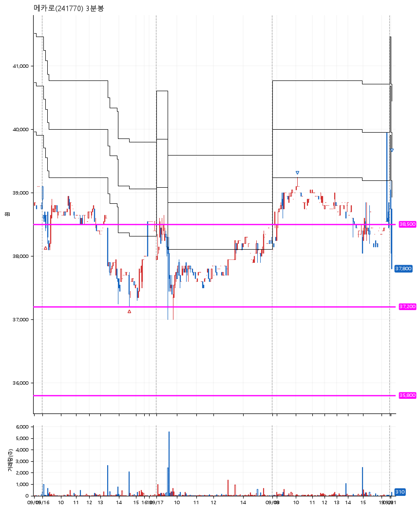

# 메카로(241770) · 2026-09-21

**2차 매수 → 3% 익절 → 본절 이탈**

진입 2026-09-16 09:10 (D+6) · 청산 2026-09-21 09:03 (D+9) · 보유 4일차

| | |
|---|---|
| 결과 | 익절 |
| 평단 / 수량 | 38,016원 · 6주 |
| 투입 | 228,099원 |
| 세후 손익 | +1,374원 (+0.60%) |
| 최고 / 최저 | +4.2% / -2.7% |
| 당일 등락 | +2.43% |
| 보유기간 | 6일차 |

## 3선

| | |
|---|---|
| 1선 | 38,500원 |
| 2선 | 37,200원 |
| 3선 | 35,800원 |

기준봉 2026-09-08 (D+9)

`#KOSPI하락횡보장` `#시장을이기는종목`

> 반도체

## 차트

**일봉**

**3분봉**

## 체결

| 시각 | 구분 | 수량 | 판정가 | 체결가 | 오차 |
|---|---|---|---|---|---|
| 09:10 | 매수 | 3주 | 38,500 | 38,583 | +0.22% |
| 14:35 | 매수 | 3주 | 37,200 | 37,450 | +0.67% |
| 10:04 | 매도 | 2주 | 39,250 | 39,100 | -0.38% |
| 09:03 | 매도 | 4주 | 38,000 | 37,950 | -0.13% |

## 잘한 점

매수 이후 평단가로 내려오면 전부 청산.

## 아쉬운 점

청산된 이후, 종가 근처에서 많이 상승하여 익절로 끝남. 하지만 이것은 나의 시나리오 밖의 일.
