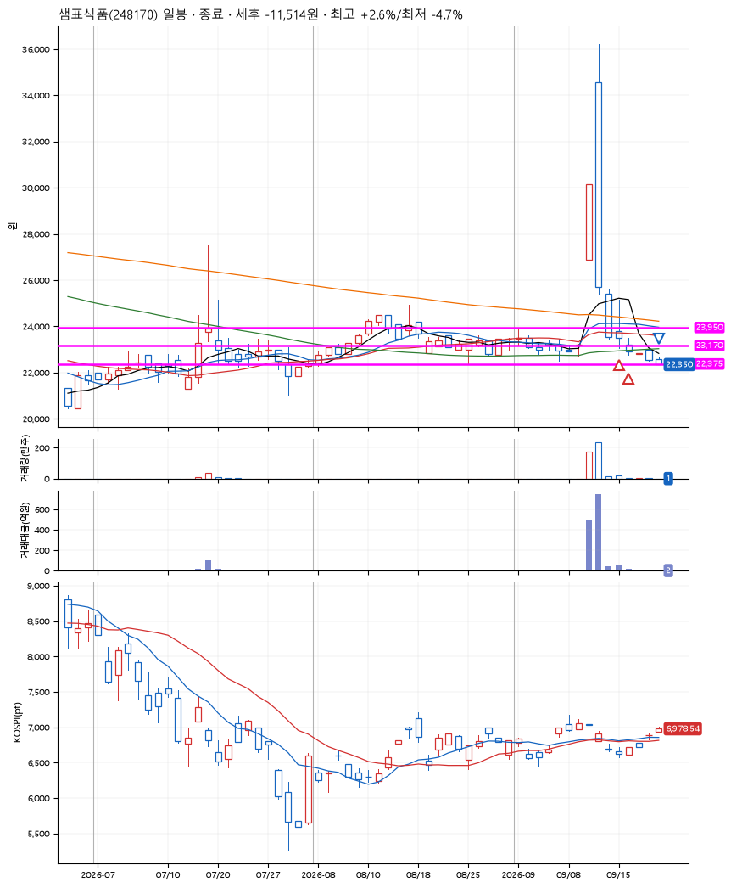
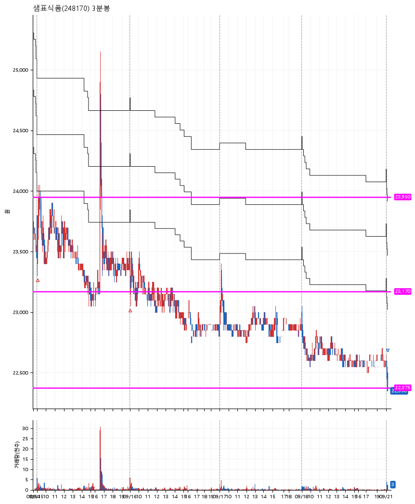

# 샘표식품(248170) · 2026-09-21

**2차 매수 → 손절**

진입 2026-09-15 09:03 (D+3) · 청산 2026-09-21 09:09 (D+7) · 보유 5일차

| | |
|---|---|
| 결과 | 손절 |
| 평단 / 수량 | 23,450원 · 10주 |
| 투입 | 234,500원 |
| 세후 손익 | -11,514원 (-4.91%) |
| 최고 / 최저 | +2.6% / -4.7% |
| 당일 등락 | -0.88% |
| 보유기간 | 7일차 |

## 3선

| | |
|---|---|
| 1선 | 23,950원 |
| 2선 | 23,170원 |
| 3선 | 22,375원 |

기준봉 2026-09-10 (D+7)

`#KOSPI하락횡보장` `#시장을이기는종목` `#상한가` `#테마주`

> 음식료

## 차트

**일봉**

**3분봉**

## 체결

| 시각 | 구분 | 수량 | 판정가 | 체결가 | 오차 |
|---|---|---|---|---|---|
| 09:03 | 매수 | 5주 | 23,450 | 23,500 | +0.21% |
| 09:00 | 매수 | 5주 | 23,150 | 23,400 | +1.08% |
| 09:09 | 매도 | 10주 | 22,350 | 22,350 | +0.00% |

## 잘한 점

_(미작성)_

## 아쉬운 점

_(미작성)_
