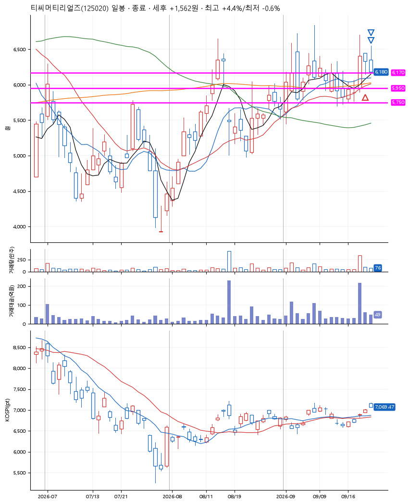
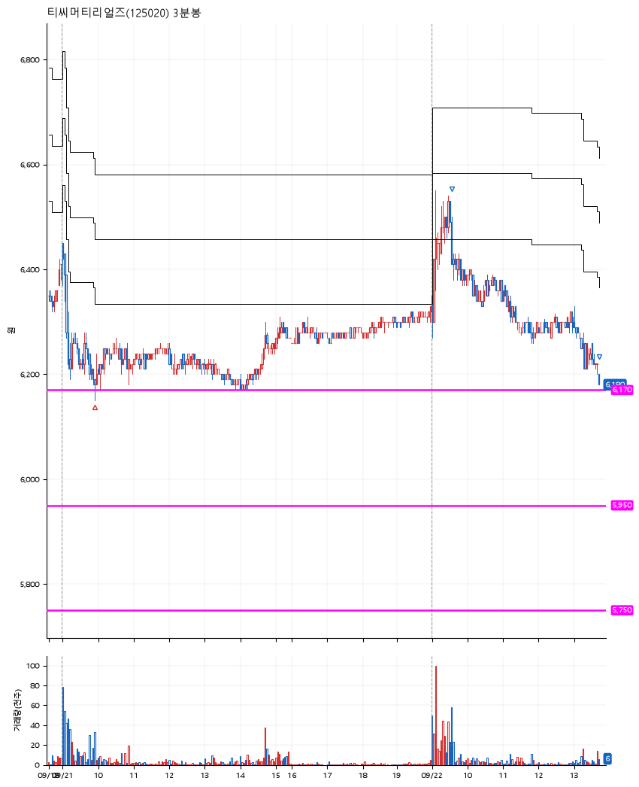

# 티씨머티리얼즈(125020) · 2026-09-22

**1차 매수 → 3% 익절 → 본절 이탈**

진입 2026-09-21 09:54 (D+1) · 청산 2026-09-22 13:42 (D+2) · 보유 2일차

| | |
|---|---|
| 결과 | 익절 |
| 평단 / 수량 | 6,190원 · 22주 |
| 투입 | 136,180원 |
| 세후 손익 | +1,562원 (+1.15%) |
| 최고 / 최저 | +4.4% / -0.6% |
| 당일 등락 | -4.35% |
| 보유기간 | 2일차 |

## 3선

| | |
|---|---|
| 1선 | 6,170원 |
| 2선 | 5,950원 |
| 3선 | 5,750원 |

기준봉 2026-09-18 (D+2)

`#KOSPI하락횡보장` `#시장을이기는종목` `#테마주`

> 전력설비

## 차트

**일봉**

**3분봉**

## 체결

| 시각 | 구분 | 수량 | 판정가 | 체결가 | 오차 |
|---|---|---|---|---|---|
| 09:54 | 매수 | 22주 | 6,170 | 6,190 | +0.32% |
| 09:34 | 매도 | 8주 | 6,440 | 6,430 | -0.16% |
| 13:42 | 매도 | 14주 | 6,190 | 6,187 | -0.05% |

## 잘한 점

_(미작성)_

## 아쉬운 점

_(미작성)_
