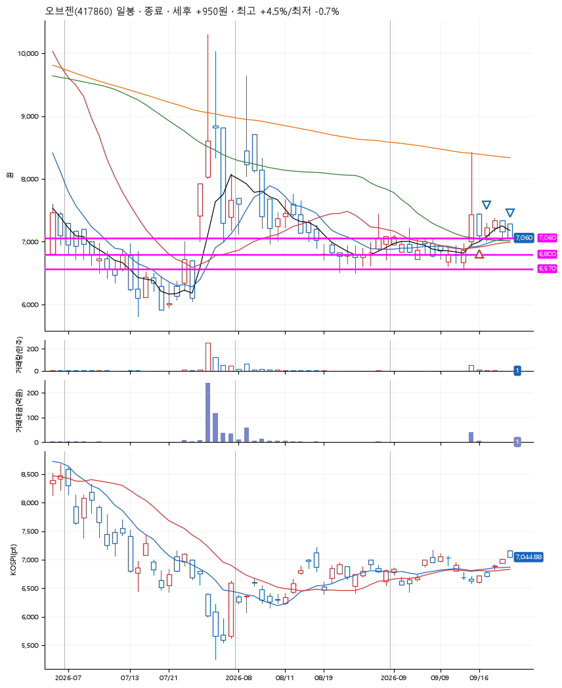
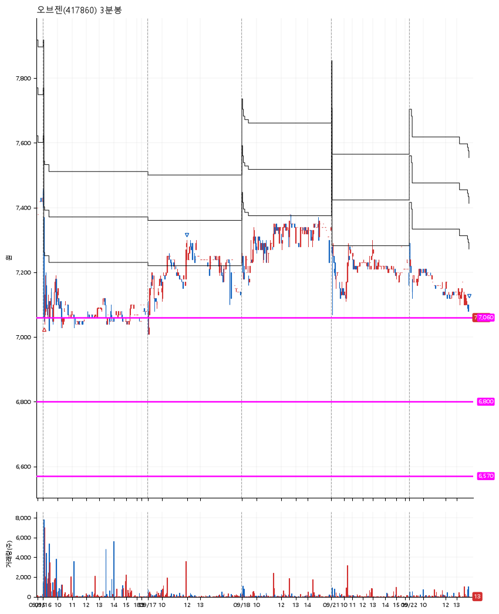

# 오브젠(417860) · 2026-09-22

**1차 매수 → 3% 익절 → 본절 이탈**

진입 2026-09-16 09:05 (D+1) · 청산 2026-09-22 13:57 (D+5) · 보유 5일차

| | |
|---|---|
| 결과 | 익절 |
| 평단 / 수량 | 7,060원 · 19주 |
| 투입 | 134,140원 |
| 세후 손익 | +950원 (+0.71%) |
| 최고 / 최저 | +4.5% / -0.7% |
| 당일 등락 | -0.98% |
| 보유기간 | 7일차 |

## 3선

| | |
|---|---|
| 1선 | 7,060원 |
| 2선 | 6,800원 |
| 3선 | 6,570원 |

기준봉 2026-09-15 (D+5)

`#KOSPI하락횡보장` `#시장을이기는종목` `#테마주`

> 지능형로봇 AI

## 차트

**일봉**

**3분봉**

## 체결

| 시각 | 구분 | 수량 | 판정가 | 체결가 | 오차 |
|---|---|---|---|---|---|
| 09:05 | 매수 | 19주 | 7,050 | 7,060 | +0.14% |
| 11:57 | 매도 | 7주 | 7,280 | 7,240 | -0.55% |
| 13:57 | 매도 | 12주 | 7,060 | 7,060 | +0.00% |

## 잘한 점

_(미작성)_

## 아쉬운 점

_(미작성)_
