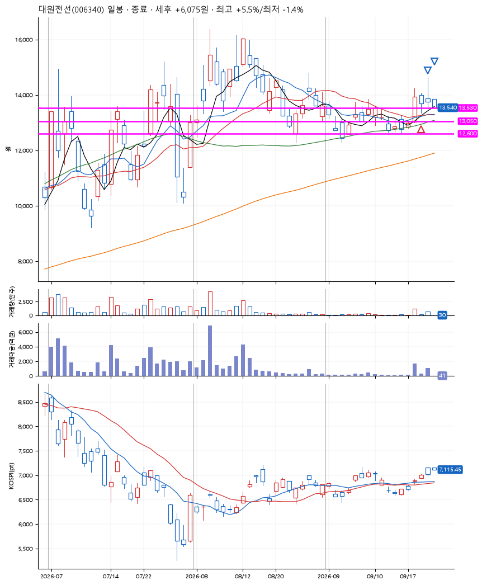
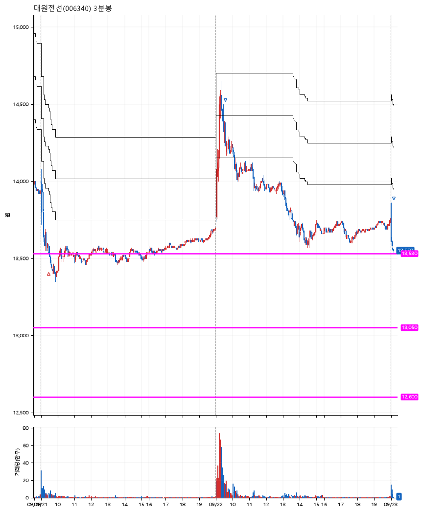

# 대원전선(006340) · 2026-09-23

**1차 매수 → 5% 익절 → 본절 이탈**

진입 2026-09-21 09:29 (D+1) · 청산 2026-09-23 09:09 (D+3) · 보유 3일차

| | |
|---|---|
| 결과 | 익절 |
| 평단 / 수량 | 13,540원 · 10주 |
| 투입 | 135,400원 |
| 세후 손익 | +6,075원 (+4.49%) |
| 최고 / 최저 | +5.5% / -1.4% |
| 당일 등락 | -2.67% |
| 보유기간 | 3일차 |

## 3선

| | |
|---|---|
| 1선 | 13,530원 |
| 2선 | 13,050원 |
| 3선 | 12,600원 |

기준봉 2026-09-18 (D+3)

`#KOSPI하락횡보장` `#시장을이기는종목`

## 차트

**일봉**

**3분봉**

## 체결

| 시각 | 구분 | 수량 | 판정가 | 체결가 | 오차 |
|---|---|---|---|---|---|
| 09:29 | 매수 | 10주 | 13,530 | 13,540 | +0.07% |
| 09:34 | 매도 | 9주 | 14,250 | 14,251 | +0.01% |
| 09:09 | 매도 | 1주 | 13,540 | 13,540 | +0.00% |

## 잘한 점

_(미작성)_

## 아쉬운 점

_(미작성)_
