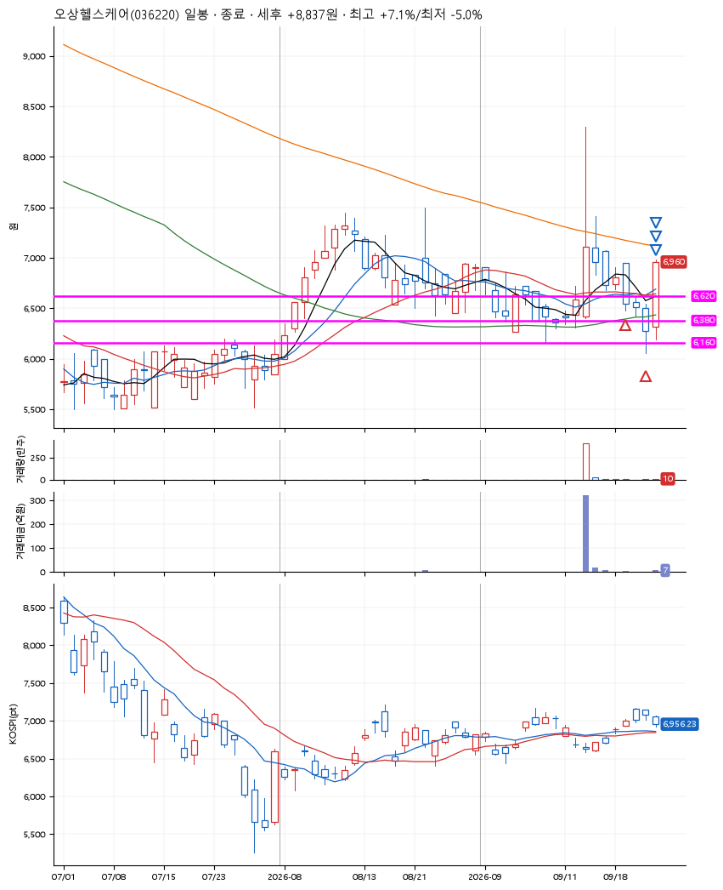
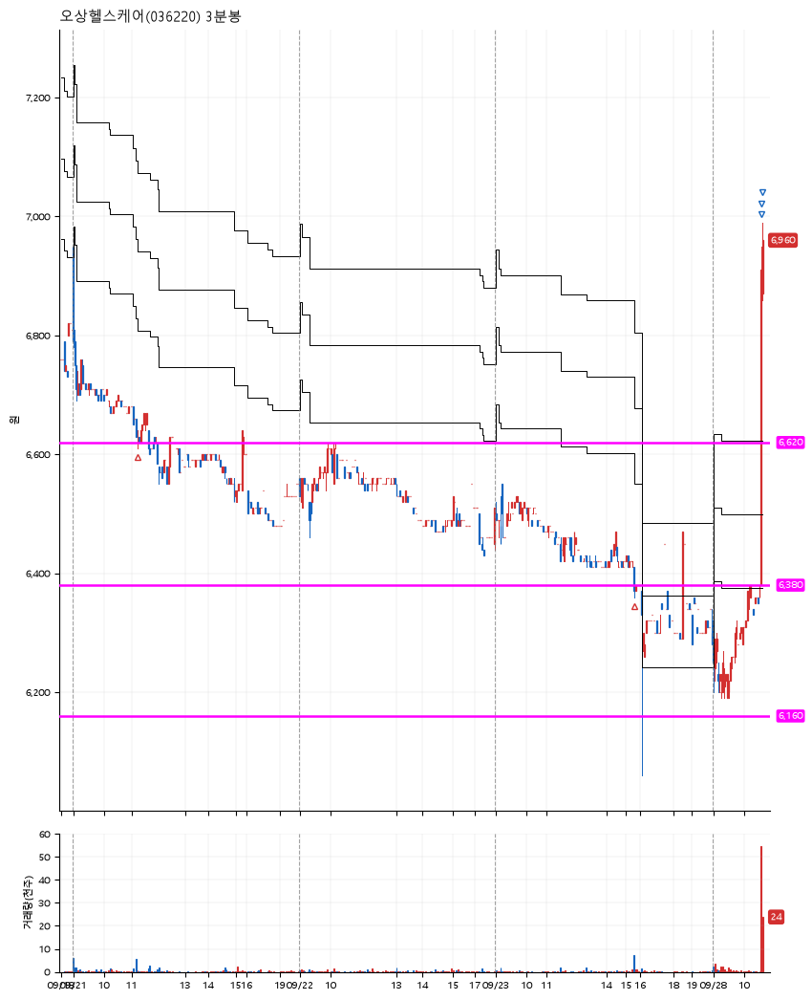

# 오상헬스케어(036220) · 2026-09-28

**2차 매수 → 3% 익절 → 5% 익절 → 7% 익절**

진입 2026-09-21 11:15 (D+4) · 청산 2026-09-28 10:38 (D+7) · 보유 4일차

| | |
|---|---|
| 결과 | 익절 |
| 평단 / 수량 | 6,517원 · 41주 |
| 투입 | 267,200원 |
| 세후 손익 | +8,837원 (+3.31%) |
| 최고 / 최저 | +7.1% / -5.0% |
| 당일 등락 | +6.01% |
| 보유기간 | 8일차 |

## 3선

| | |
|---|---|
| 1선 | 6,620원 |
| 2선 | 6,380원 |
| 3선 | 6,160원 |

기준봉 2026-09-15 (D+7)

`#KOSPI하락횡보장` `#시장을이기는종목`

## 차트

**일봉**

**3분봉**

## 체결

| 시각 | 구분 | 수량 | 판정가 | 체결가 | 오차 |
|---|---|---|---|---|---|
| 11:15 | 매수 | 20주 | 6,620 | 6,640 | +0.30% |
| 15:16 | 매수 | 21주 | 6,380 | 6,400 | +0.31% |
| 10:34 | 매도 | 16주 | 6,720 | 6,570 | -2.23% |
| 10:34 | 매도 | 20주 | 6,850 | 6,840 | -0.15% |
| 10:38 | 매도 | 5주 | 6,980 | 6,950 | -0.43% |

## 잘한 점

_(미작성)_

## 아쉬운 점

_(미작성)_
