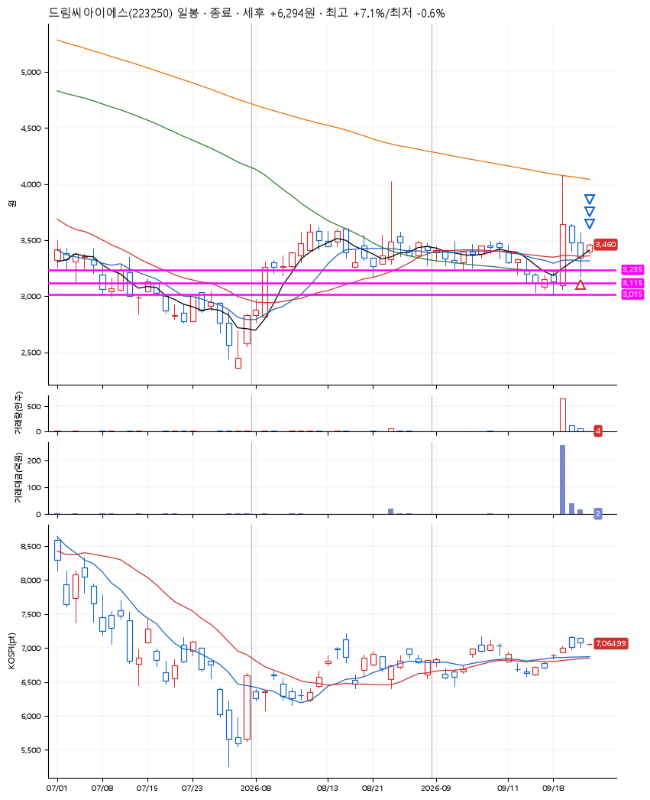
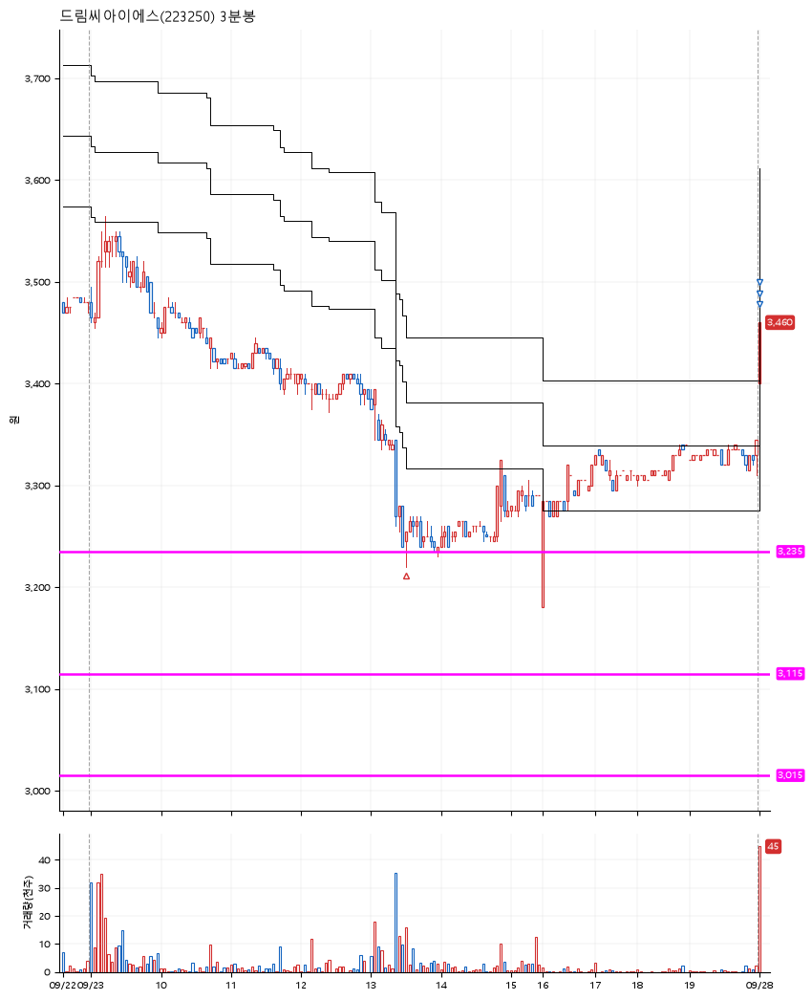

# 드림씨아이에스(223250) · 2026-09-28

**1차 매수 → 3% 익절 → 5% 익절 → 7% 익절**

진입 2026-09-23 13:30 (D+2) · 청산 2026-09-28 09:01 (D+3) · 보유 2일차

| | |
|---|---|
| 결과 | 익절 |
| 평단 / 수량 | 3,240원 · 42주 |
| 투입 | 136,080원 |
| 세후 손익 | +6,294원 (+4.63%) |
| 최고 / 최저 | +7.1% / -0.6% |
| 당일 등락 | +2.79% |
| 보유기간 | 6일차 |

## 3선

| | |
|---|---|
| 1선 | 3,235원 |
| 2선 | 3,115원 |
| 3선 | 3,015원 |

기준봉 2026-09-21 (D+3)

`#KOSPI하락횡보장` `#시장을이기는종목` `#테마주`

> 의료

## 차트

**일봉**

**3분봉**

## 체결

| 시각 | 구분 | 수량 | 판정가 | 체결가 | 오차 |
|---|---|---|---|---|---|
| 13:30 | 매수 | 42주 | 3,235 | 3,240 | +0.15% |
| 09:00 | 매도 | 16주 | 3,400 | 3,375 | -0.74% |
| 09:00 | 매도 | 21주 | 3,405 | 3,400 | -0.15% |
| 09:01 | 매도 | 5주 | 3,470 | 3,460 | -0.29% |

## 잘한 점

기준봉 이후 처음으로 나온 반등. 갭시작으로 시작하여 익절

## 아쉬운 점

.
