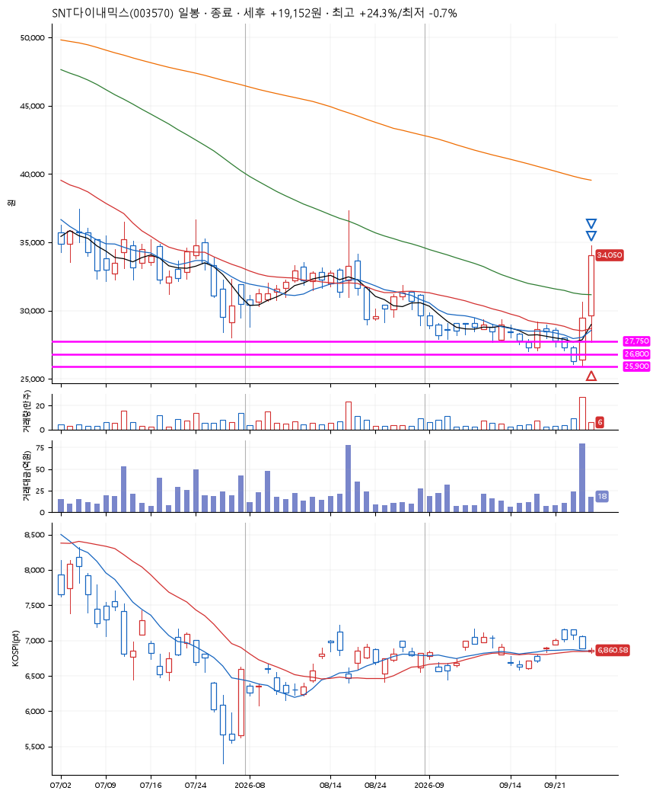
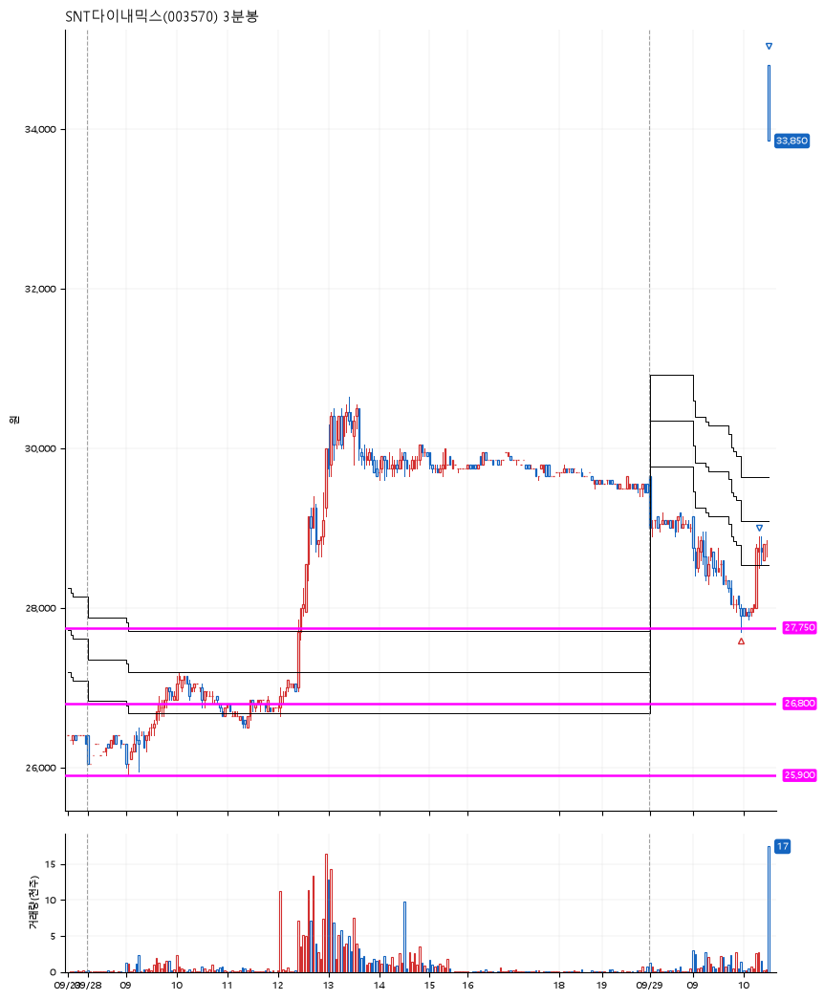

# SNT다이내믹스(003570) · 2026-09-29

**1차 매수 → 3% 익절 → 7% 익절**

진입 2026-09-29 09:58 (D+1) · 청산 2026-09-29 11:08 (D+1) · 보유 1시간 9분

| | |
|---|---|
| 결과 | 익절 |
| 평단 / 수량 | 28,000원 · 4주 |
| 투입 | 112,000원 |
| 세후 손익 | +19,152원 (+17.10%) |
| 최고 / 최저 | +24.3% / -0.7% |
| 당일 등락 | +6.35% |
| 보유기간 | 1시간 9분 |

## 3선

| | |
|---|---|
| 1선 | 27,750원 |
| 2선 | 26,800원 |
| 3선 | 25,900원 |

기준봉 2026-09-28 (D+1)

`#KOSPI하락횡보장` `#시장을이기는종목` `#테마주`

> 자동차부품

## 차트

**일봉**

**3분봉**

## 체결

| 시각 | 구분 | 수량 | 판정가 | 체결가 | 오차 |
|---|---|---|---|---|---|
| 09:58 | 매수 | 4주 | 27,750 | 28,000 | +0.90% |
| 10:18 | 매도 | 1주 | 28,850 | 28,550 | -1.04% |
| 11:08 | 매도 | 3주 | 34,800 | 34,300 | -1.44% |

## 잘한 점

3선을 그을 때, 박스가 완벽하게 그어졌나 싶었지만, 기준봉이 확실하게 돌파되었고 너무나도 확실히 시장을 이기는 중이라 진입함. 승리의 원인은 굉장히 보수적인 3선이었던 듯. 갭상승도 한몫.

## 아쉬운 점

.
