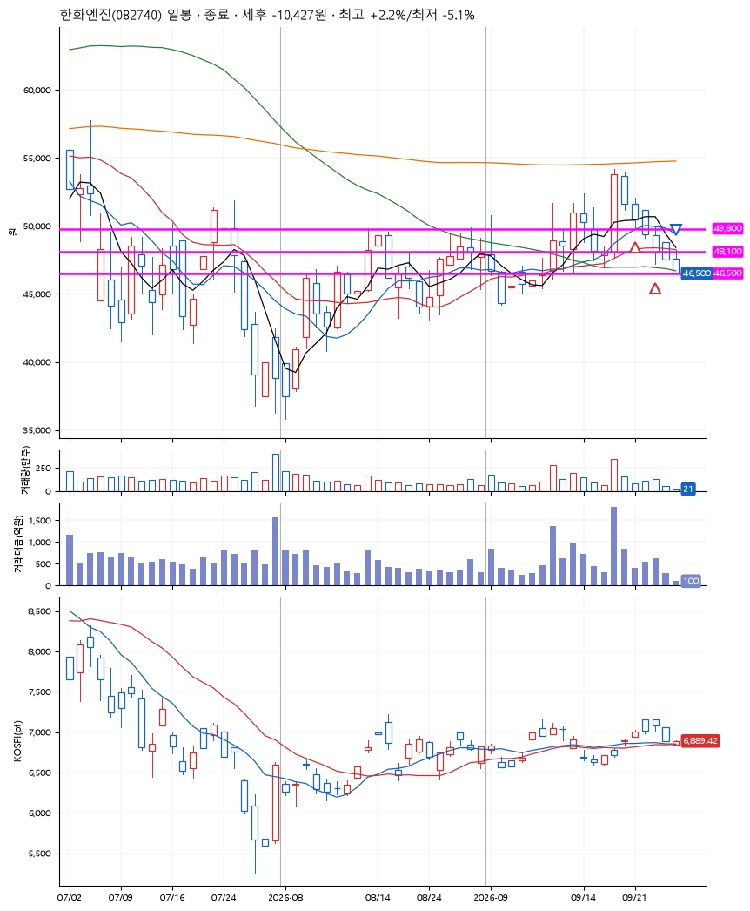
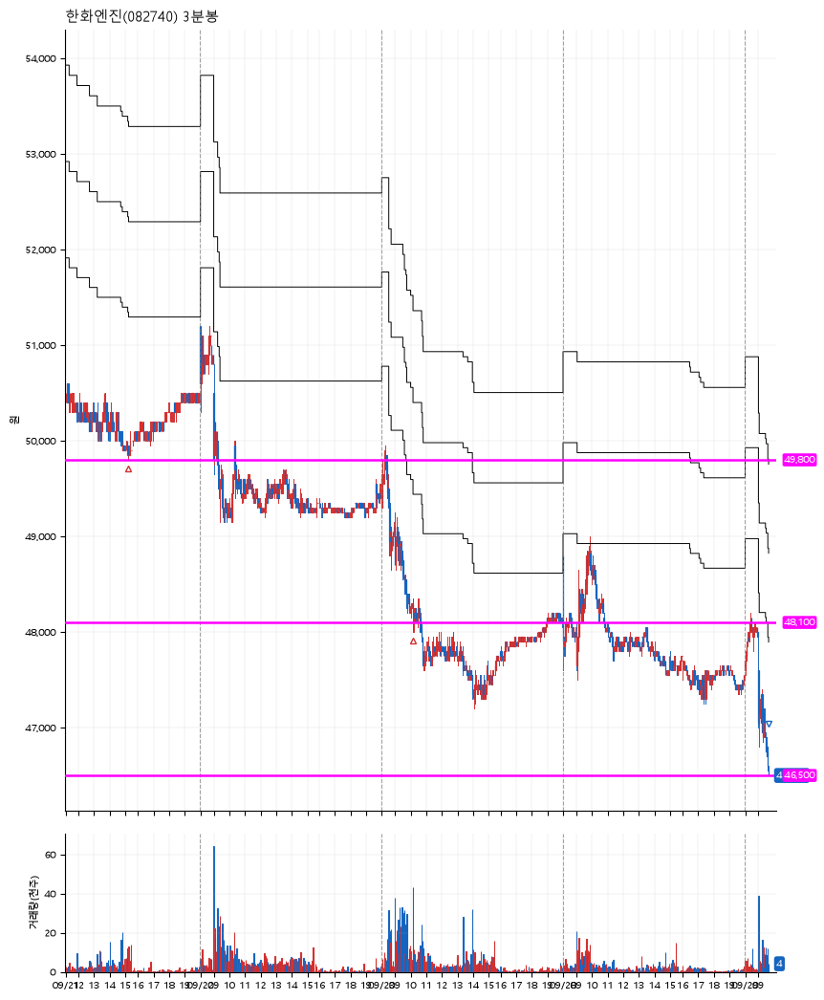

# 한화엔진(082740) · 2026-09-29

**2차 매수 → 손절**

진입 2026-09-21 15:13 (D+2) · 청산 2026-09-29 09:40 (D+6) · 보유 5일차

| | |
|---|---|
| 결과 | 손절 |
| 평단 / 수량 | 49,000원 · 4주 |
| 투입 | 196,000원 |
| 세후 손익 | -10,427원 (-5.32%) |
| 최고 / 최저 | +2.2% / -5.1% |
| 당일 등락 | -2.21% |
| 보유기간 | 9일차 |

## 3선

| | |
|---|---|
| 1선 | 49,800원 |
| 2선 | 48,100원 |
| 3선 | 46,500원 |

기준봉 2026-09-17 (D+6)

`#KOSPI하락횡보장` `#시장을이기는종목` `#테마주`

> 조선

## 차트

**일봉**

**3분봉**

## 체결

| 시각 | 구분 | 수량 | 판정가 | 체결가 | 오차 |
|---|---|---|---|---|---|
| 15:13 | 매수 | 2주 | 49,800 | 49,850 | +0.10% |
| 10:10 | 매수 | 2주 | 48,100 | 48,150 | +0.10% |
| 09:40 | 매도 | 4주 | 46,500 | 46,500 | +0.00% |

## 잘한 점

_(미작성)_

## 아쉬운 점

_(미작성)_
