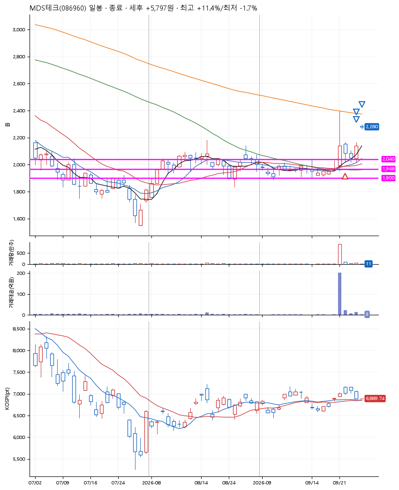
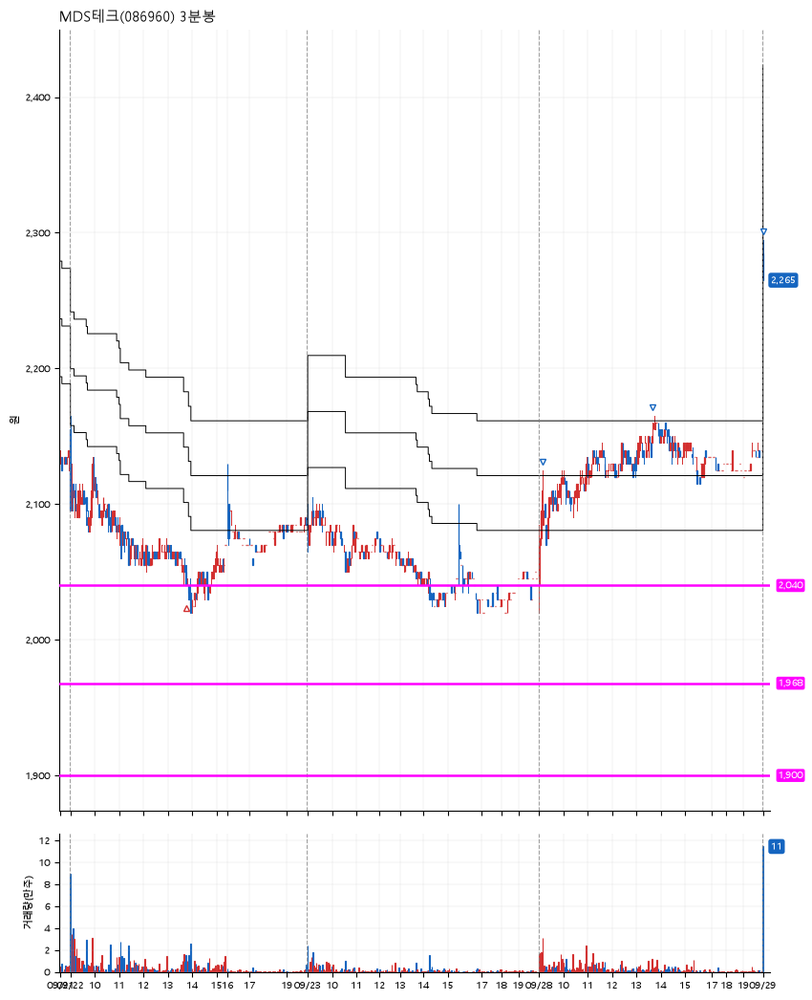

# MDS테크(086960) · 2026-09-29

**1차 매수 → 3% 익절 → 5% 익절 → 7% 익절**

진입 2026-09-22 13:46 (D+1) · 청산 2026-09-29 09:00 (D+4) · 보유 4일차

| | |
|---|---|
| 결과 | 익절 |
| 평단 / 수량 | 2,055원 · 67주 |
| 투입 | 137,685원 |
| 세후 손익 | +5,797원 (+4.21%) |
| 최고 / 최저 | +11.4% / -1.7% |
| 당일 등락 | +5.47% |
| 보유기간 | 8일차 |

## 3선

| | |
|---|---|
| 1선 | 2,040원 |
| 2선 | 1,968원 |
| 3선 | 1,900원 |

기준봉 2026-09-21 (D+4)

`#KOSPI하락횡보장` `#시장을이기는종목`

## 차트

**일봉**

**3분봉**

## 체결

| 시각 | 구분 | 수량 | 판정가 | 체결가 | 오차 |
|---|---|---|---|---|---|
| 13:46 | 매수 | 67주 | 2,040 | 2,055 | +0.74% |
| 09:09 | 매도 | 26주 | 2,120 | 2,115 | -0.24% |
| 13:40 | 매도 | 34주 | 2,160 | 2,145 | -0.69% |
| 09:00 | 매도 | 7주 | 2,285 | 2,270 | -0.66% |

## 잘한 점

_(미작성)_

## 아쉬운 점

_(미작성)_
