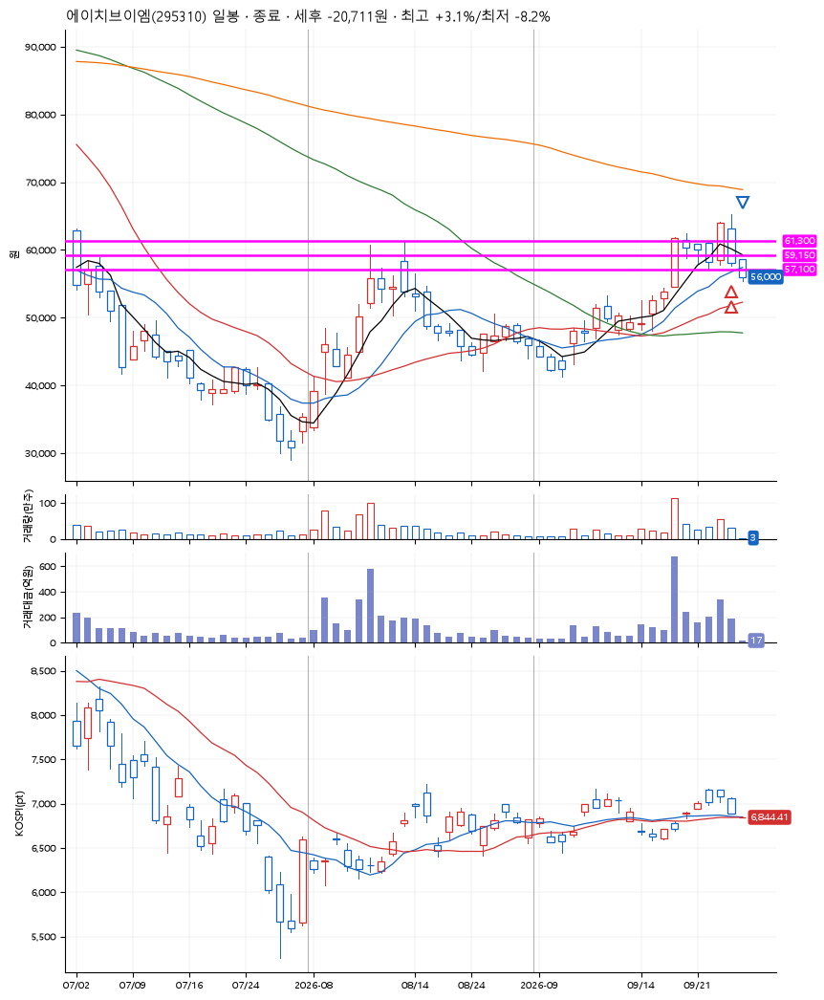
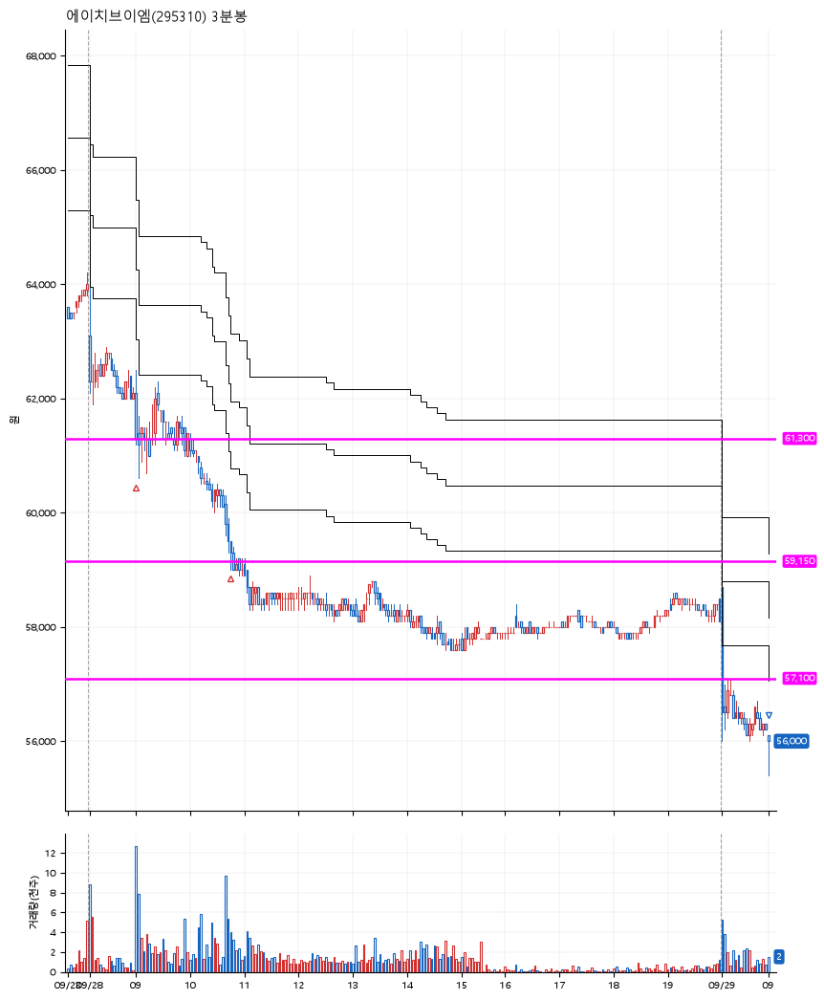

# 에이치브이엠(295310) · 2026-09-29

**2차 매수 → 손절**

진입 2026-09-28 09:02 (D+1) · 청산 2026-09-29 09:00 (D+2) · 보유 2일차

| | |
|---|---|
| 결과 | 손절 |
| 평단 / 수량 | 60,450원 · 4주 |
| 투입 | 241,800원 |
| 세후 손익 | -20,711원 (-8.57%) |
| 최고 / 최저 | +3.1% / -8.2% |
| 당일 등락 | +3.74% |
| 보유기간 | 2일차 |

## 3선

| | |
|---|---|
| 1선 | 61,300원 |
| 2선 | 59,150원 |
| 3선 | 57,100원 |

기준봉 2026-09-23 (D+2)

`#KOSPI하락횡보장` `#시장을이기는종목` `#테마주`

> 반도체 우주항공산업

## 차트

**일봉**

**3분봉**

## 체결

| 시각 | 구분 | 수량 | 판정가 | 체결가 | 오차 |
|---|---|---|---|---|---|
| 09:02 | 매수 | 2주 | 61,300 | 61,700 | +0.65% |
| 10:45 | 매수 | 2주 | 59,100 | 59,200 | +0.17% |
| 09:00 | 매도 | 4주 | 56,100 | 55,400 | -1.25% |

## 잘한 점

없음

## 아쉬운 점

3선을 그을 때부터 공격적이고 도전적으로 그었음. 나름 직전의 고점에서 3선의 박스가 형성된 것 같기도 했지만, 역시는 역시나였다. 안정적으로 하자.
