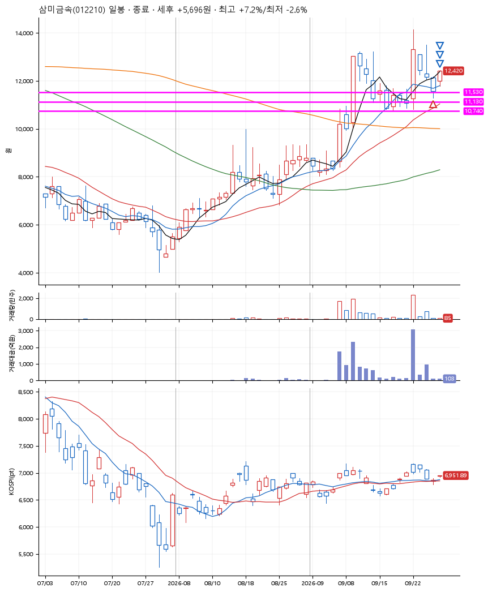
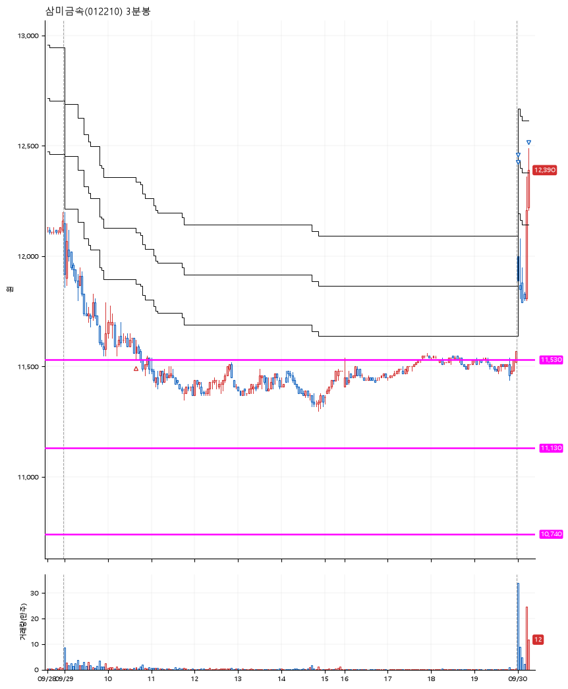

# 삼미금속(012210) · 2026-09-30

**1차 매수 → 3% 익절 → 5% 익절 → 7% 익절**

진입 2026-09-29 10:39 (D+3) · 청산 2026-09-30 09:15 (D+4) · 보유 2일차

| | |
|---|---|
| 결과 | 익절 |
| 평단 / 수량 | 11,600원 · 11주 |
| 투입 | 127,600원 |
| 세후 손익 | +5,696원 (+4.46%) |
| 최고 / 최저 | +7.2% / -2.6% |
| 당일 등락 | +1.58% |
| 보유기간 | 2일차 |

## 3선

| | |
|---|---|
| 1선 | 11,530원 |
| 2선 | 11,130원 |
| 3선 | 10,740원 |

기준봉 2026-09-22 (D+4)

`#KOSPI하락횡보장` `#시장을이기는종목` `#테마주`

> 원자력발전 조선기자재

## 차트

**일봉**

**3분봉**

## 체결

| 시각 | 구분 | 수량 | 판정가 | 체결가 | 오차 |
|---|---|---|---|---|---|
| 10:39 | 매수 | 11주 | 11,530 | 11,600 | +0.61% |
| 09:00 | 매도 | 4주 | 12,000 | 11,970 | -0.25% |
| 09:00 | 매도 | 5주 | 12,180 | 12,180 | +0.00% |
| 09:15 | 매도 | 2주 | 12,420 | 12,410 | -0.08% |

## 잘한 점

직전 박스 저점을 깨지않고 지켜주는 3선 설정. 갭시작과 급등으로 익절.

## 아쉬운 점

.
